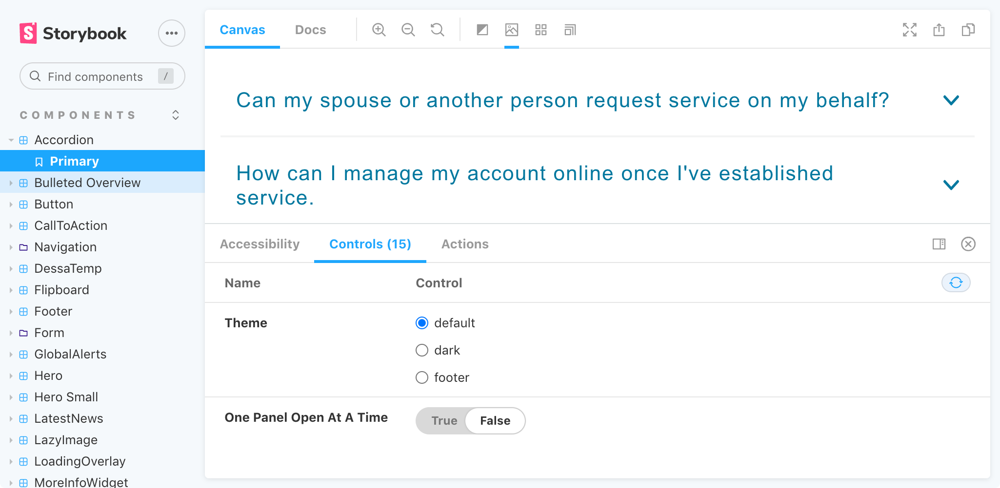
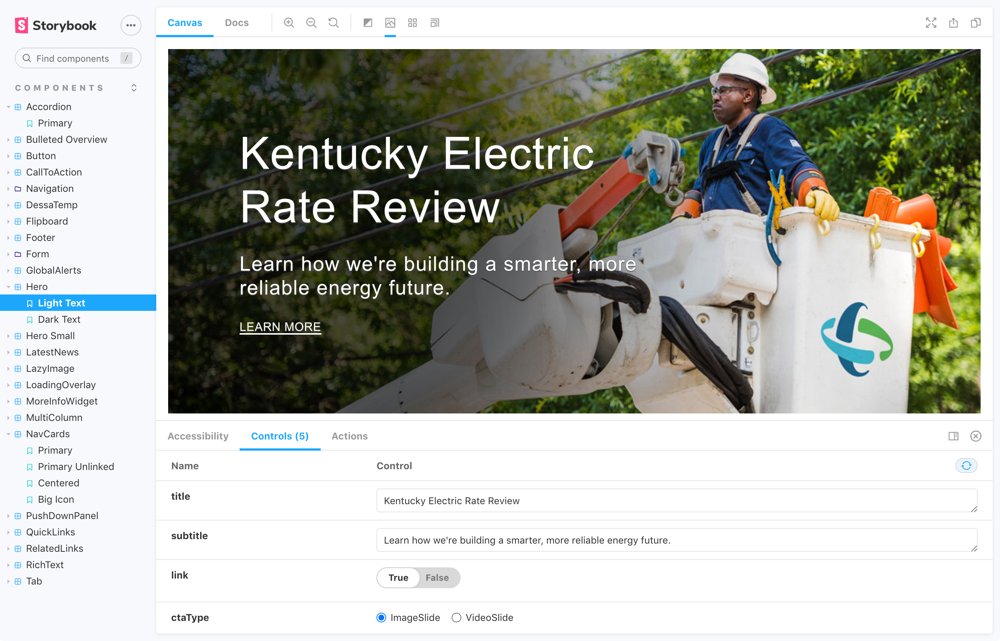
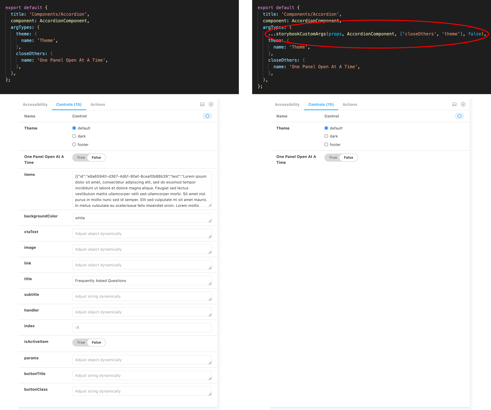

# Storybook

Storybook is an open source tool for developing UI components in isolation. It essentially gives us a sandbox to showcase and test the components we'll use throughout our app.

It allows us to [develop more efficiently](docs-component-creation-practical-overview) (we can develop our components in isolation within Storybook, rather than developing on the page of the app), and also allows the design and UI teams to interact with our components as we build them. They can also change the values of the component's props to see how the component will react as it receives different data.

To get it up and running navigate to the app repo and, from the command line, enter:

```bash
npm run storybook
```

Let's first discuss some of the core principles of Storybook (we'll use examples from our own app where possible), before then diving into the [anatomy](docs-storybook#anatomy-of-a-story) of a typical story.

## Stories

A story, much like a React component, is a function that describes how to render a component.

You can have multiple stories per component, meaning Storybook gives us the power to describe multiple rendered states.

For a very simple example using the PushDownPanel component from our own app, we might first describe the component with it's default state, but then add a story that describes a different rendered state.

So here's how the initial default PushDownPanel might look:

```js
export const NoIcons = Template.bind();
NoIcons.args = {
  items: itemsOptions["3"],
};
```

And then we can add variations based on different states, for example a version that uses icons:

```js
export const Icons = Template.bind({});
Icons.args = {
  items: itemsOptions["5"],
};
```

And the new stories will show up in the sidebar navigation, like so:


## Args

Story definitions can be further improved to take advantage of Storybook's "args" concept.

A story is a component with a set of arguments (props), and these arguments can be altered and composed dynamically. This gives Storybook its power (they even refer to this as a _superpower_ in their docs!), allowing us essentially to live edit our components.

Most of the time the type of arg will be [inferred automatically](https://storybook.js.org/docs/react/api/argtypes#automatic-argtype-inference), however we can use ArgTypes to further configure the behavior of our args, constraining the values they can take and generating relevant UI controls.

```js
export default {
  title: "Components/Accordion",
  component: AccordionComponent,
  argTypes: {
    theme: {
      name: "Theme",
    },
    closeOthers: {
      name: "One Panel Open At A Time",
    },
  },
};

const Template = (args) => <AccordionComponent {...args} />;

export const Primary = Template.bind({});

Primary.args = {
  ...props,
};
```

## Controls

Controls allow designers and developers to explore component behavior by mucking about with its arguments.

Storybook feeds the given args property into the story during render. Each of the args from the story function will now be live editable using Storybook's Controls panel, so we can dynamically change components in Storybook to see how they look with different settings and data:



This essentially evolves Storybook into an interactive documentation tool, allowing developers and stakeholders to stress test components, for example by adding huge strings of text that might help expose UI problems.

Controls can be configured to use UI elements that we deem most appropriate according to the data that we're trying to manipulate; some examples from our own components include a radio button for manipulating background color:

```js
argTypes: {
    backgroundColor: {
        control: {
            type: 'radio',
            options: ['white', 'gray'],
        },
        defaultValue: 'white',
    },
},
```

A select menu to control the number of items that render:

```js
argTypes: {
    items: {
        name: 'How many items?',
        control: {
            type: 'select',
            options: {
                ...itemsPrimary,
            },
        },
    },
},
```

And for our Hero component, a mixture of text inputs, boolean switch and radio group (screen shot of how these controls render follows the code):

```js
argTypes: {
    title: {
        control: {
            type: 'text',
        },
    },
    subtitle: {
        control: {
            type: 'text',
        },
    },
    link: {
        control: 'boolean',
    },
    ctaType: {
        control: {
            type: 'inline-radio',
            options: ['ImageSlide', 'VideoSlide'],
        },
    },
},
```



## A11y and Other Addons

Addons are plugins that extend Storybook's core functionality, packaged as NPM modules. Once [installed and registered](https://storybook.js.org/docs/react/addons/install-addons) they will appear in the addons panel, a reserved place in the Storybook UI below the main component.

One such addon we use is the Accessibility addon, which helps to make our UI components more accessible. Simply select the Accessibility tab from the aforementioned addons panel, and there you will see any Violations, Passes and Incomplete requirements pertaining to accessibility.

We also use the Viewport [toolbar](https://storybook.js.org/docs/react/get-started/browse-stories#toolbar) item, which allows us to adjust the dimensions of the iframe our stories are rendered in, making it nice to test responsive UIs.

## Anatomy of a Story

Stories exist alongside the other component files as `stories.js` .

Here's an example of how a typical story might take shape:

```js
import React from "react";
import MyComponent from "./index";
import { Data } from "./data";
import { MyComponent as MyComponentComposition } from "../../lib/composition";

const props = MyComponentComposition({
  fields: Data,
});

export default {
  title: "Components/MyComponent",
  component: MyComponent,
  argTypes: {
    backgroundColor: {
      control: {
        type: "radio",
        options: ["white", "gray"],
      },
      defaultValue: "white",
    },
  },
};

const Template = (args) => <MyComponent {...args} />;

export const Primary = Template.bind({});
Primary.args = {
  ...props,
};
```

Let's break this down line by line:

```js
import React from 'react';
import MyComponent from './index';
import {
    Data
} from './data';

...
```

**Component Setup:** So we start off with your normal component setup, standard stuff: importing React, importing your component and (if your component [gets data from Sitecore](docs-component-creation-technical-overview#datajs)) importing any data that might be required.

```js
...

import {
    MyComponent as MyComponentComposition
} from '../../lib/composition';

const props = MyComponentComposition({
    fields: Data
});

...
```

**Data Composition:** After the component setup, we next move on to the process of essentially distilling the data recieved from Sitecore into only the parts we need - you can read more about this process in not only one spot of our docs, but two! [Here](docs-react#composition-file) and [here](docs-component-creation-technical-overview#passing-down-data-via-composition).

```js
...

export default {
    title: 'Components/MyComponent',
    component: MyComponent,
    argTypes: {
        backgroundColor: {
            control: {
                type: 'radio',
                options: ['white', 'gray'],
            },
            defaultValue: 'white',
        },
    },
};

...
```

**Exporting Stories:** After composing the data, we move on to one of the key ingredients of a story: the _default export_ that describes the component. It's a function that returns a component's state given a set of arguments; it describes how to render a component.

It's a story! Behold. Don't get them wet, don't expose them to bright light, and most importantly _don't feed them after midnight!_

Were we to add any other stories beyond the default, we would then add _named exports_ that would describe the additional [stories](docs-storybook#stories).

We can also add [ArgTypes](docs-storybook#args) here if we need to configure our args beyond Storybook's automatically-generated UI controls.

In the example above, we're setting `backgroundColor` as a radio button so the user can choose between different background colors, and setting the default as white.

```js
...

const Template = args => < MyComponent {
    ...args
}
/>;

export const Primary = Template.bind({});
Primary.args = {
    ...props,
};
```

**Template Definition:** Now that our stories are exported, we move on to defining a master template ( `Template` ) for our component's stories, and passing in our args.

We can then reuse this template across stories. `Template.bind({})` makes a copy of the function, reducing code duplication. This is a [standard JavaScript technique](https://developer.mozilla.org/en-US/docs/Web/JavaScript/Reference/Global_Objects/Function/bind) for making a copy of a function, and allows each exported story to set its own properties.

And finally we spread in our component's props ( `...props` ), making data available to our component as it would be in the regular app.

## storybookCustomArgs

The way in which Storybook automatically infers a set of argTypes based on each component's props can often lead to a lot of unnecessary UI controls rendering.

We have a function for that! In the `lib/helpers/index.ts` file you can find a very cool function called storybookCustomArgs, which allows us to configure which props we would like to render controls for in the Storybook Controls panel.



## createStoryOptions

Oftentimes our component data will come through to us a single array, but in order for Storybook to render the controls in our desired way, we need that data to be a multi-dimenstional array.

Again we have a nifty function for that! Here's an example of both `storybookCustomArgs` and `createStoryOptions` Storybook helper functions at work:

```js
...

import {
    storybookCustomArgs,
    createStoryOptions
} from 'src/lib/helpers';

const props = BulletedOverviewComposition(Data);
const itemsToShow = createStoryOptions(props.items);

export default {
    title: 'Components/Bulleted Overview',
    component: BulletedOverview,
    argTypes: {
        ...storybookCustomArgs(props, BulletedOverview, [], false),
        items: {
            name: 'How many items?',
            control: {
                type: 'select',
                options: {
                    ...itemsToShow,
                },
            },
        },
    },
};

...
```

## Resources

- [Learn Storybook](https://www.learnstorybook.com/) - a guided tutorial through building a simple application with Storybook
- [Component Driven User Interfaces](https://www.componentdriven.org/) - learn more about the component-driven approach that Storybook enables
- [Storybook Addons](https://storybook.js.org/addons) - supercharge Storybook with advanced features and new workflows
- [Component Story Format](https://storybook.js.org/blog/component-story-format/) - read more about the Component Story Format (CSF), a new way to author stories based on ES6 modules
