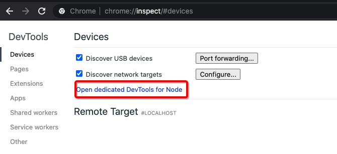
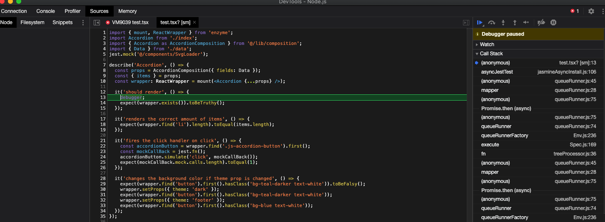

# Unit Tests

## Creating Unit Tests for the DXT Application

Our unit testing utilizes the [Jest Testing Framework](https://jestjs.io/) and [Enzyme](https://enzymejs.github.io/enzyme/).

This document is not intended to tell you how to use these technologies, but instead how we use them in our environment.

## Testing Methodology

Unit testing involves taking a single component and testing its behavior independently of the rest of the system. We want to break the application down into the smallest testable "units" that we can and verify they function correctly.

This means exporting the components in your `index.tsx` and importing them into your test file, and then testing each of them in as many different configurations as there are.

## Creating the Unit Tests

First begin by creating a .`/test.tsx` file next to your `index.tsx` file. This file will hold your unit tests.

A basic outline of that file would be:

```tsx
import React from "react";
import { mount } from "enzyme";
import { Data } from "./data";
import ComponentName, { ComponentParts } from "./index";

describe("ComponentName Tests", () => {
  it("Verify ComponentName will render", () => {
    const wrapper = mount(<ComponentName data={Data} />);
    expect(wrapper.exists()).toBeTruthy();
  });
});
```

### Unit Test Data

It is ideal to use your component-specific data from your `./data.js` file to populate your component for unit testing. Many times this will give you a start of base data, that you will need to expand on to ensure you are fully testing your components.

`lib/composition/index.js` contains the composition functions for the different components. These functions are run to munge the data before it is passed to the components. You will want to import the composition function for your component, and use it to manipulate your data, this will help test both your composition function and your component.

### Tests to Write

Deciding what to write tests for can be a challenge, some things to test include:

- Edge Cases
- Bad Input/Good Input
- Logic Branches - Is there a positive and negative path? Perhaps things are hidden or shown.
- Individual Methods - Especially when they contain specific logic

Practical examples: If your function takes numbers, what happens if you pass it strings? Do both the positive and negative path tests of your function produce the correct output? What happens if you pass in zero, negative numbers, undefined, or null?

In addition, any time a bug is fixed, if it is possible, a test should be added for that specific case. This helps prevent regression.

### Testing to Avoid

Unit tests should be testing the behavior of the component, not its implementation. Meaning, we want to test that our logic is correct, not that the framework or library we are using works correctly.

For example this would not be a good test, as all you are testing is if React is showing/hiding the div properly:

```tsx

const ComponentName(showDiv: boolean) {
  return (showDiv && <div class="js-test">Some Text</div>);
}

...

it('Test div Exists', () => {
	const wrapper = shallow(<ComponentName showDiv={true} />);
	expect(wrapper.find('.js-test').exists()).toBeTruthy();
}
```

Where as this would be a good test, as you are testing the logic in the isVisible, and not the React framework:

:white_check_mark: Good

```tsx
const isVisible(someData: MyType) {
  let visible = true;
  // Some logic here using someData
  // That changes the value of visible
  return visible;
}

const ComponentName({someData}: MyType) {
  const shouldShow = isVisible(someData);
  return (shouldShow && <div>Some Text</div>);
}

...

it('Test div Exists', () => {
	const wrapper = shallow(<ComponentName someData={...} />);
	expect(wrapper.find('.js-test').exists()).toBeTruthy();
}
```

## Test Classes

In some situations you will need to add test classes to your elements to be able to locate them in your unit tests. When you are adding a class that is only to be used during testing, that class should be prefixed with `js-` many times simply using `js-class` is sufficient.

## Running Tests

The full test suite can be run from the command line with:

```cmd
npm run test
```

or

```cmd
jest
```

An individual test file can be run using:

```cmd
npm run test components/MyComponent
```

### Test Before

You should always run the entire suite of unit tests when you first create a new branch - this ensures that you are starting from a known-working state.

### Test After

You should also run all of the tests, including the new tests you wrote for your component, before you push your code. When doing this you should verify all old tests, as well as your new tests all pass.

## Mocks

See: [Jest Mocks](https://jestjs.io/docs/en/jest-object#mock-modules)

Mocks can be used in situations where we have methods that are required for the component we are testing to function. Because we are writing unit tests, and not integration tests, these methods should be mocked with their expected results.

There are also some existing mocks that enable us to test components that would otherwise be troublesome.

### useMediaQuery & useIntersection

if useMediaQuery or useIntersection are used in your component, you will need to mock them in you tests using the following:

```tsx
jest.mock("@/lib/useIntersection");
jest.mock("@/lib/useMediaQuery");
```

### Router

The router can be mocked as follows:

```tsx
jest.mock("react-router-dom", () => ({
  useRouter: jest.fn(() => ({ asPath: "/home" })),
  useRouter: jest.fn(() => ({ query: { tab: mockTabQuery } })),
}));
```

This will set the path, and allow you to see the tab.

### Creating Mocks for Components

Creating your own mocks is also a rather straight-forward process. First go to the directory with your component, and create a new subdirectory called `__mocks__` and create a new file in that directory that has the same file name as the component you want to mock`

And put the following in the file:

```tsx
const ComponentName = () => <div>COMPONENTNAME MOCK</div>;

export default ComponentName;
```

**NOTE: This will create a basic working mock for your component, but you should add markup to simulate what the component will actually output for more accurate testing.**

Then simply import the mock into your `test.tsx` like so:

```jsx
jest.mock("@/components/ComponentName");
```

## Tips and Tricks

### Too Good to be True!

Usually if everything seems too good to be true, it is! For instance if all your tests magically pass the first time, this usually means you are testing the wrong thing. Try inverting your test and see if it still passes, many times you will find it passes both ways meaning your test is broken, and not that your code works!

### Shallow Mounting

When mounting your components in your unit tests, Enzyme will allow you to mount it regularly, or to shallow mount it.

#### Regular

```tsx
import { mount } from 'enzyme';
...
const wrapper = mount(<ComponenetName data={Data}/>);
```

This will mount the component regularly with all its subcomponents.

#### Shallow

```tsx
import { shallow } from 'enzyme';
...
const wrapper = shallow(<ComponenetName data={Data}/>);
```

This will mount the component alone, without any of its subcomponents, allowing for more siloed tests. Results with shallow mounting are varied, and they should be used with extreme caution as they have been known to cause problems, such as always returning true when checking if an element exists. If you are to use them, be sure to check both the positive and negative test case to verify that you aren't just always getting a positive result.

### Getting Wrapper Info

When running the tests getting the contents of the wrapper can be helpful, this can be done with:

```js
console.log(wrapper.debug());
```

### Running Tests with Chrome Debugger

Your unit tests can be run inside of the Chrome debugger, giving you the benefits you normally get from that experience, such as stepping through your code and viewing variables.

To run your code in the Chrome debugger, drop a `debugger;` statement in your tests, then open this URL in Chrome `chrome://inspect/#devices` and click the link labeled _Open dedicated DevTools for Node_.



This will bring up a debug window.

Then simply start your tests, from the root of the project directory with:

```cmd
node --inspect node_modules/.bin/jest --runInBand
```

The tests should run as normal, stopping when they hit your `debugger;` statement.



### Getting Data

Sometimes getting the data you need and building your test data objects can be frustrating. It can be helpful to use:

```js
console.log(JSON.stringify(data));
```

At the top of the methods you are testing while using it, to get a starting data input for your tests.

### Types

You will want to import and use the same types used in your component to create object that are passed to your components for your tests.

## Resources

- [React Testing](https://reactjs.org/docs/testing.html)
- [React Testing Recipes](https://reactjs.org/docs/testing-recipes.html)
- [Jest Testing Framework](https://jestjs.io/)
- [Jest Mocks](https://jestjs.io/docs/en/jest-object#mock-modules)
- [Jest Testing React](https://jestjs.io/docs/en/tutorial-react)
- [Enzyme](https://enzymejs.github.io/enzyme/)

[React](./React.md) | [Typescript](./Typescript.md) | [Tailwind](./Tailwind.md) | [Forms](./Forms.md) | [Unit Tests](./UnitTests.md)
