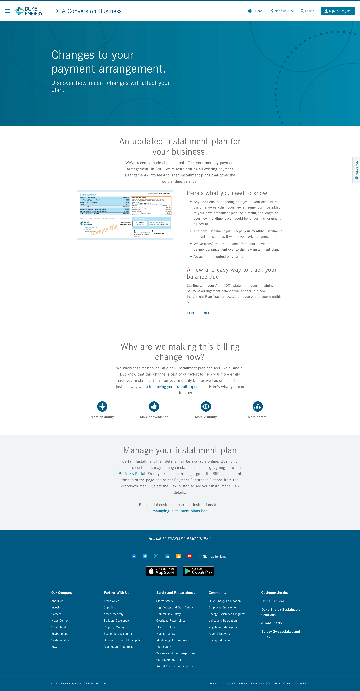

# 🎟 DNT-2785

<mark style="color:red;">/info/unindexed/dpa-conversion-business</mark>

The Image Slideshow component seems to have shrunk after JSS conversion. See it here: [https://scprod-cms.duke-energy.com/info/unindexed/dpa-conversion-business](https://scprod-cms.duke-energy.com/info/unindexed/dpa-conversion-business), compared to pre-JSS: [https://scdev28.duke-energy.com/info/unindexed/dpa-conversion-business](https://scdev28.duke-energy.com/info/unindexed/dpa-conversion-business). As you can see, it cuts off some of the image space and the description underneath is completely gone.&#x20;



<details>

<summary>Modal.tsx</summary>

```typoscript
import React, { useRef, PropsWithChildren } from 'react';
import { createPortal } from 'react-dom';
import { a11yAction } from 'src/lib/helpers';
import { Placeholder } from '@sitecore-jss/sitecore-jss-react';
import SvgLoader from 'src/components/SvgLoader';
import Transition from 'src/lib/Transition';
import { useBodyContext } from 'src/components/ContentWrapper/context';
import { useExperienceEditor } from 'src/lib/useExperienceEditor';
import useMediaQuery from 'src/lib/useMediaQuery';
import usePreventBodyScroll from 'src/lib/usePreventBodyScroll';
import { ModalComponentTypes, ModalTypes } from './types';
import { useFocusTrap } from 'src/lib/useFocusTrap';

const Portal = ({ children }: PropsWithChildren<{}>) => {
  if (typeof window === 'undefined') return null;
  // Create the root element that content is rendered into
  // Used for "Portal" or other functionality that querySelectors for the '#root'
  let portalRoot = document.getElementById('root');
  if (!portalRoot) {
    portalRoot = document.createElement('div');
    portalRoot.setAttribute('id', 'root');
    portalRoot = document.body.appendChild(portalRoot);
  }

  return createPortal(children, portalRoot);
};

const Modal = ({ id, rendering }: ModalTypes) => {
  const { dispatch, state } = useBodyContext();
  const { activeId, isOpen } = state.modal;
  const { isEEActive } = useExperienceEditor();
  const shouldDisplayModal = activeId === id && isOpen;

  return isEEActive ? (
    <div className="border">
      The Modal Container
      <Placeholder name="jss-public-modal-container" rendering={rendering} />
    </div>
  ) : (
    <ModalComponent
      isActive={shouldDisplayModal}
      onCloseHandler={() => dispatch({ type: 'modalClose' })}
      {...{ id }}
    >
      <Placeholder name="jss-public-modal-container" rendering={rendering} />
    </ModalComponent>
  );
};

const ModalComponent = ({
  children,
  controls,
  isActive,
  onCloseHandler = () => {},
}: React.PropsWithChildren<ModalComponentTypes>) => {
  const modalBackgroundRef = useRef<HTMLDivElement>(null);
  const modalContainerRef = useRef<HTMLDivElement>(null);
  const isMobile = !useMediaQuery('md');

  // when the modal is active, do not allow the body to scroll
  usePreventBodyScroll(isActive);

  // classes for the modal 'background' div
  const activeClass = isActive ? 'bg-black bg-opacity-80 pointer-events-auto z-modal' : '';

  // classes for the modal 'container' div
  const containerBackgroundClass = controls?.isTransparent ? '' : 'border border-gray bg-white';
  const containerScrollClass = controls?.preventScroll ? '' : 'overflow-auto';
  const containerClass = `${containerBackgroundClass} ${containerScrollClass}`;

  // closes the modal when clicking outside of the modal
  const handleClose = (event: React.MouseEvent<HTMLDivElement>) => {
    if (
      event &&
      event.target &&
      event.target instanceof Element &&
      event.target.contains(modalBackgroundRef.current) &&
      isActive
    ) {
      onCloseHandler();
    }
  };

  useFocusTrap({
    shouldTrap: isActive,
    container: modalBackgroundRef.current,
    onExit: () => onCloseHandler(),
    onEnter: ([first]) => first?.focus(),
  });

  return (
    <Portal>
      <div
        className={`js-modal fixed h-screen w-full top-0 left-0 flex flex-col items-center p-12 pointer-events-none ${activeClass}`}
        ref={modalBackgroundRef}
        {...a11yAction(handleClose)}
        role="dialog"
        aria-hidden={!isActive}
        tabIndex={-1}
      >
        <Transition.RevealDown
          active={isActive}
          className={`relative px-24 pt-32 pb-24 m-auto w-full max-w-3xl ${containerClass}`}
        >
          <div ref={modalContainerRef}>
            <button
              aria-label="close"
              className="visible absolute right-0 top-0 mr-24 md:mt-16 mt-0 z-overlay"
              onClick={onCloseHandler}
            >
              <SvgLoader
                aria-hidden={true}
                focusable={false}
                color={controls?.isTransparent ? 'text-white' : 'text-teal-dark'}
                name="X"
                size={isMobile ? 20 : 24}
              />
            </button>
            {children}
          </div>
        </Transition.RevealDown>
      </div>
    </Portal>
  );
};

export { Modal as default, ModalComponent };

```

</details>
