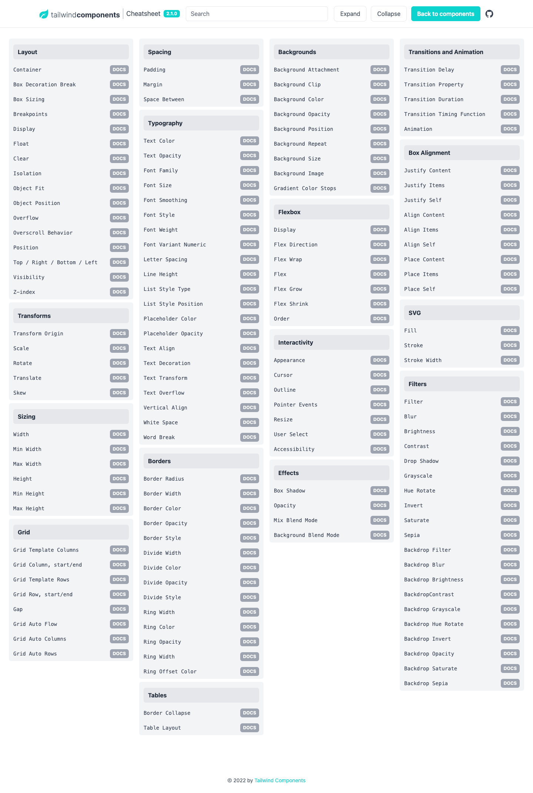

# 🌪 Tailwind Cheatsheet

Tailwind Docs (DUKE)

\-\
Created by Anonymous, last modified on [Dec 10, 2020](https://confluence.duke-energy.com/pages/diffpagesbyversion.action?pageId=77497818&selectedPageVersions=2&selectedPageVersions=3)

Tailwind CSS is a utility-based styling library. In order to streamline and standardize things like colors and spacing within our application, an Electron theme has been created to extend Tailwind's functionality, thus making it easy for us to access some standard Duke colors, fonts, etc. As a result, you will get most of the magic of Tailwind, but with most of the colors, text, and sizing options overwritten to reflect Duke's design aesthetic.

We won't talk too much about the decisions behind why we are using this implementation here, but Chris Greufe has already done an incredible job documenting the ins-and-outs of it [here](https://electron.duke-energy.com/foundation/utilities/utility-first). If you want to know more of the granular aspects and philosophy to our approach, you are encouraged to give it a read.

Instead, this doc will mostly focus on how the dev team actually uses this implementation and a bit about our approach, as well as a proposed style guide.

#### Philosophy and Approach

Tailwind CSS is our _primary_ way of styling within the DXT-JSS-Public React/Nuxt App. A lot of effort and resources have been put into making Tailwind and Electron do as much of the heavy lifting for us as possible, so for maintainability's sake, every effort should be made to find a solution to style your work with Tailwind. If you're hitting a wall trying to figure out an approach that works within Tailwind, don't hesitate to reach out to a teammate. If you find yourself in the rare situation where you encounter something that simply cannot be resolved using Tailwind, we use [Styled Components](https://styled-components.com/) as our fallback. If you find that you are creating a styled component often to deal with an edge case, it's probably worth documenting [here](https://confluence.duke-energy.com/display/DEPW/Tailwind+requests).

#### Tooling

There's not a lot of tooling required for Tailwind but the [TailwindCSS Intellisense VSCode plugin](https://marketplace.visualstudio.com/items?itemName=bradlc.vscode-tailwindcss) can be pretty helpful. Once installed, it gives suggestions for Tailwind classes as well as Electron-specific ones. It also shows a preview of the CSS rules that the utility class utilizes.

#### Enabling Tailwind Properties

Although Tailwind provides the flexibility to apply a wide range of modifiers to a variety of CSS rules, you may occasionally find that a Tailwind class is not behaving the way you expect in a responsive context, or upon hover. This may mean that you will need edit the Tailwind config. [You can find more info about that here.](https://tailwindcss.com/docs/configuring-variants) Please be careful to [_extend_ the values](https://v1.tailwindcss.com/docs/configuring-variants), rather than simply adding them to the variant object, which will overwrite all the defaults.

#### Key Differences

The main difference you'll find between Tailwind's approach and Electron's is that Duke doesn't need an extensive color library. As a result, you'll find that something like `text-blue-800` or `bg-yellow-200` does not behave as you'd expect. Most likely you will be looking for something like `text-blue-dark` or `bg-yellow`. So the color palette will be limited, and rather than a number to modify the color, there will either be no modifier, or a modifier of -`light`, -`lighter`, -`dark`, or -`darker.`

#### Style Guide

Because almost all of our styles exist within utility classes, there is often no need for traditional CSS classes to style a block. It's fairly unusual to need to add a class like `wrapper` or large BEM classes. Occasionally, you may need to add a class to make it easier for unit tests to search for a selector. In such a case, we suggest that you use a `js-` prefix, and that you place it at the beginning of your utility classes.

example:

|

1

|

` <``div ` ` class``=``"js-form text-blue-dark ..."``> `

|

Often, the amount of classes you need to style a complex element can be rather long. In this case, it is suggested that you group your classes conceptually. Since Tailwind is a mobile-first framework, it makes sense to start with "base" styles that will be present across all sizes of the component. Of the base styles, start with sizing (height, width, padding, margin) and other fiddly rules so that they are easily accessible to you and anyone who may need to maintain your code in the future. Utility classes that represent rules that are easily identifiable at a glance, such as text color or background color, should come secondary.

**🚫 Bad**

|

` 
`

|

**✅ Good**

|

` 
`

|

From there, group your `className`s into responsive clusters in order from smallest to largest.

**🚫 Bad**

|

` 
`

|

**✅ Good**

|

` 
`

|

And lastly, add your non-responsive variants, such as hover states, and transitions. So ultimately, your styles should look something like this:

|

` 
`

|

#### Resources

[Electron Docs](https://electron.duke-energy.com/foundation/utilities/utility-first)

[Tailwind VSCode Intellisense Plugin](https://marketplace.visualstudio.com/items?itemName=bradlc.vscode-tailwindcss)

[Nerdcave Cheatsheet](https://nerdcave.com/tailwind-cheat-sheet) - some random guy made a really handy cheatsheet for Tailwind CSS. Obviously, our rules won't be on it, but it's a nice quick reference for a lot of the classes.

[Tailwind CSS Docs](https://tailwindcss.com/docs) - their official docs are better than most

Cheatsheet MD

**Tailwind CSS Cheat Sheet**

**Excerpt**

Cheat sheet that provides a quick, interactive reference for all utility classes and CSS properties provided by Tailwind CSS, a utility-first CSS framework.

---

**Layout**

- Breakpoints (screen sizes) that wrap utility classes.
- Sets rendering of an element's fragments when broken across multiple lines, columns, or pages.
- Sets max-width to match min-width of the current breakpoint.
- Sets how the total width and height of an element is calculated.
- Sets the display box type of an element.
- Sets an element's placement to a side of its container and allows content to wrap around it.
- Sets whether an element is moved below preceding floated elements.
- Sets whether an element creates a stacking context.
- Sets how the content of a replaced element (img or video tag) should be resized.
- Sets the alignment of the selected replaced element.
- Sets how to handle content that's too big for its container.
- Sets browser behavior upon reaching the boundary of a scrolling area.
- Sets an element's position.
- Sets the placement of a positioned element.
- Show or hide without affecting the layout of the document.
- Sets the z-order ("stack order") of a positioned element.

**Spacing**

- Controls padding in 0.25rem increments.
- Controls margin (and negative margin) in 0.25rem increments.
- Sets left or top (x or y) margin between child elements, but skips the first element.

**Backgrounds**

- Sets behavior of background images when scrolling.
- Sets where a background extends.
- Sets background opacity when used with bg-\[color].
- Sets the background origin position.
- Sets position of a background image.
- Sets repetition of a background image.
- Sets background size of a background image.
- Sets the background color gradients and where to stop.

**Tables**

- Collapse or separate table borders.
- Defines the algorithm used to lay out table cells, rows, and columns.

**Transforms**

- Scales an element that has transform applied.
- Rotates an element that has transform applied.
- Translates an element that has transform applied.
- Skews an element that has transform applied.
- Sets the origin of an element's transforms. Think of the origin as pushing a thumbtack into the element at the specified position.
- Sets the transform of an element.

**Effects**

- Sets the shadow around an element.
- Sets the transparency of an element.
- Sets how an element blends with the background.
- Sets how an element's background images blend with its background color.

**Flexbox**

- Sets element to be a flex container.
- Sets direction of flex items.
- Creates how flex items wrap.
- Controls how flex items grow and shrink.
- Controls how flex items grow.
- Controls how flex items shrink.
- Controls how flex items are ordered.

**Sizing**

- Sets the width of an element.
- Sets the minimum width of an element.
- Sets the maxiumum width of an element.
- Sets the height of an element.
- Sets the minimum height of an element.
- Sets the maxiumum height of an element.

**Borders**

- Sets border width in increments of 1px.
- Sets border opacity when used with border-\[color].
- Sets left or top (x or y) border width between child elements, but skips the first element.
- Sets border color between child elements when using divide width.
- Sets border opacity between elements when used with divide-\[color].
- Sets border style between elements when using divide width.
- Sets the width of outline rings using box shadows.
- Sets the color of the outline ring.
- Sets the opacity of the outline ring.
- Sets an offset for outline rings.
- Sets the color of the outline ring offset.

**Transitions and Animation**

- Sets the CSS properties affected by transition animations.
- Sets the length of time for a transition animations to complete.
- transition-timing-function

  Sets the easing function of transition animations.

- Sets the delay for transitions.

**Interactivity**

- Disables native styling based on the operating system's theme.
- Changes the cursor when hovering over an element.
- Sets the outline of the element.
- Specifies whether an element is the target of mouse events.
- Sets whether an element is resizable, along with direction.
- Controls whether the user can select text.
- Controls whether an element is visually hidden but still accessible to screen readers.

**SVG**

- Sets the color to paint an SVG.
- Sets the outline color of an SVG.
- Sets the outline width of an SVG.

**Grid**

- Defines columns for grid layout.
- Sets a grid item size and location within the grid column.
- Defines rows for grid layout.
- Sets a grid item size and location within the grid row.
- Controls the auto placement of grid elements.
- Controls the size of auto-generated (implicit) grid columns.
- Controls the size of auto-generated (implicit) grid rows.
- Sets the gaps (gutters) between rows and columns.

**Box Alignment**

- Controls how flex items are positioned along container's main axis.

  | .justify-start   | justify-content: flex-start;    |     |
  | ---------------- | ------------------------------- | --- |
  | .justify-end     | justify-content: flex-end;      |     |
  | .justify-center  | justify-content: center;        |     |
  | .justify-between | justify-content: space-between; |     |
  | .justify-around  | justify-content: space-around;  |     |
  | .justify-evenly  | justify-content: space-evenly;  |     |

- Controls default alignment for items on the inline axis for grids.
- Controls element alignment on the inline axis for a grid item.
- Controls how lines are positioned in multi-line flex containers.

  | .content-start   | align-content: flex-start;    |     |
  | ---------------- | ----------------------------- | --- |
  | .content-center  | align-content: center;        |     |
  | .content-end     | align-content: flex-end;      |     |
  | .content-between | align-content: space-between; |     |
  | .content-around  | align-content: space-around;  |     |
  | .content-evenly  | align-content: space-evenly;  |     |

- Sets flex items position along a contrainer's cross axis.
- Controls how an individual flex item is positioned along container's cross axis.
- Controls alignment in both directions at once for grid or flexbox.

  | .place-content-center  | place-content: center;        |     |
  | ---------------------- | ----------------------------- | --- |
  | .place-content-start   | place-content: start;         |     |
  | .place-content-end     | place-content: end;           |     |
  | .place-content-between | place-content: space-between; |     |
  | .place-content-around  | place-content: space-around;  |     |
  | .place-content-evenly  | place-content: space-evenly;  |     |
  | .place-content-stretch | place-content: stretch;       |     |

- Controls alignment of items in both directions at once for grid or flexbox.
- Controls alignment of individual element in both directions at once for grid or flexbox.

**Typography**

- | .text-transparent | color: transparent;                                                       |
  | ----------------- | ------------------------------------------------------------------------- |
  | .text-current     | color: currentColor;                                                      |
  | .text-black       | --tw-text-opacity: 1; color: rgba(0, 0, 0, var(--tw-text-opacity));       |
  | .text-white       | --tw-text-opacity: 1; color: rgba(255, 255, 255, var(--tw-text-opacity)); |
  | .text-gray-50     | --tw-text-opacity: 1; color: rgba(249, 250, 251, var(--tw-text-opacity)); |
  | .text-gray-100    | --tw-text-opacity: 1; color: rgba(243, 244, 246, var(--tw-text-opacity)); |
  | .text-gray-200    | --tw-text-opacity: 1; color: rgba(229, 231, 235, var(--tw-text-opacity)); |
  | .text-gray-300    | --tw-text-opacity: 1; color: rgba(209, 213, 219, var(--tw-text-opacity)); |
  | .text-gray-400    | --tw-text-opacity: 1; color: rgba(156, 163, 175, var(--tw-text-opacity)); |
  | .text-gray-500    | --tw-text-opacity: 1; color: rgba(107, 114, 128, var(--tw-text-opacity)); |
  | .text-gray-600    | --tw-text-opacity: 1; color: rgba(75, 85, 99, var(--tw-text-opacity));    |
  | .text-gray-700    | --tw-text-opacity: 1; color: rgba(55, 65, 81, var(--tw-text-opacity));    |
  | .text-gray-800    | --tw-text-opacity: 1; color: rgba(31, 41, 55, var(--tw-text-opacity));    |
  | .text-gray-900    | --tw-text-opacity: 1; color: rgba(17, 24, 39, var(--tw-text-opacity));    |
  | .text-red-50      | --tw-text-opacity: 1; color: rgba(254, 242, 242, var(--tw-text-opacity)); |
  | .text-red-100     | --tw-text-opacity: 1; color: rgba(254, 226, 226, var(--tw-text-opacity)); |
  | .text-red-200     | --tw-text-opacity: 1; color: rgba(254, 202, 202, var(--tw-text-opacity)); |
  | .text-red-300     | --tw-text-opacity: 1; color: rgba(252, 165, 165, var(--tw-text-opacity)); |
  | .text-red-400     | --tw-text-opacity: 1; color: rgba(248, 113, 113, var(--tw-text-opacity)); |
  | .text-red-500     | --tw-text-opacity: 1; color: rgba(239, 68, 68, var(--tw-text-opacity));   |
  | .text-red-600     | --tw-text-opacity: 1; color: rgba(220, 38, 38, var(--tw-text-opacity));   |
  | .text-red-700     | --tw-text-opacity: 1; color: rgba(185, 28, 28, var(--tw-text-opacity));   |
  | .text-red-800     | --tw-text-opacity: 1; color: rgba(153, 27, 27, var(--tw-text-opacity));   |
  | .text-red-900     | --tw-text-opacity: 1; color: rgba(127, 29, 29, var(--tw-text-opacity));   |
  | .text-yellow-50   | --tw-text-opacity: 1; color: rgba(255, 251, 235, var(--tw-text-opacity)); |
  | .text-yellow-100  | --tw-text-opacity: 1; color: rgba(254, 243, 199, var(--tw-text-opacity)); |
  | .text-yellow-200  | --tw-text-opacity: 1; color: rgba(253, 230, 138, var(--tw-text-opacity)); |
  | .text-yellow-300  | --tw-text-opacity: 1; color: rgba(252, 211, 77, var(--tw-text-opacity));  |
  | .text-yellow-400  | --tw-text-opacity: 1; color: rgba(251, 191, 36, var(--tw-text-opacity));  |
  | .text-yellow-500  | --tw-text-opacity: 1; color: rgba(245, 158, 11, var(--tw-text-opacity));  |
  | .text-yellow-600  | --tw-text-opacity: 1; color: rgba(217, 119, 6, var(--tw-text-opacity));   |
  | .text-yellow-700  | --tw-text-opacity: 1; color: rgba(180, 83, 9, var(--tw-text-opacity));    |
  | .text-yellow-800  | --tw-text-opacity: 1; color: rgba(146, 64, 14, var(--tw-text-opacity));   |
  | .text-yellow-900  | --tw-text-opacity: 1; color: rgba(120, 53, 15, var(--tw-text-opacity));   |
  | .text-green-50    | --tw-text-opacity: 1; color: rgba(236, 253, 245, var(--tw-text-opacity)); |
  | .text-green-100   | --tw-text-opacity: 1; color: rgba(209, 250, 229, var(--tw-text-opacity)); |
  | .text-green-200   | --tw-text-opacity: 1; color: rgba(167, 243, 208, var(--tw-text-opacity)); |
  | .text-green-300   | --tw-text-opacity: 1; color: rgba(110, 231, 183, var(--tw-text-opacity)); |
  | .text-green-400   | --tw-text-opacity: 1; color: rgba(52, 211, 153, var(--tw-text-opacity));  |
  | .text-green-500   | --tw-text-opacity: 1; color: rgba(16, 185, 129, var(--tw-text-opacity));  |
  | .text-green-600   | --tw-text-opacity: 1; color: rgba(5, 150, 105, var(--tw-text-opacity));   |
  | .text-green-700   | --tw-text-opacity: 1; color: rgba(4, 120, 87, var(--tw-text-opacity));    |
  | .text-green-800   | --tw-text-opacity: 1; color: rgba(6, 95, 70, var(--tw-text-opacity));     |
  | .text-green-900   | --tw-text-opacity: 1; color: rgba(6, 78, 59, var(--tw-text-opacity));     |
  | .text-blue-50     | --tw-text-opacity: 1; color: rgba(239, 246, 255, var(--tw-text-opacity)); |
  | .text-blue-100    | --tw-text-opacity: 1; color: rgba(219, 234, 254, var(--tw-text-opacity)); |
  | .text-blue-200    | --tw-text-opacity: 1; color: rgba(191, 219, 254, var(--tw-text-opacity)); |
  | .text-blue-300    | --tw-text-opacity: 1; color: rgba(147, 197, 253, var(--tw-text-opacity)); |
  | .text-blue-400    | --tw-text-opacity: 1; color: rgba(96, 165, 250, var(--tw-text-opacity));  |
  | .text-blue-500    | --tw-text-opacity: 1; color: rgba(59, 130, 246, var(--tw-text-opacity));  |
  | .text-blue-600    | --tw-text-opacity: 1; color: rgba(37, 99, 235, var(--tw-text-opacity));   |
  | .text-blue-700    | --tw-text-opacity: 1; color: rgba(29, 78, 216, var(--tw-text-opacity));   |
  | .text-blue-800    | --tw-text-opacity: 1; color: rgba(30, 64, 175, var(--tw-text-opacity));   |
  | .text-blue-900    | --tw-text-opacity: 1; color: rgba(30, 58, 138, var(--tw-text-opacity));   |
  | .text-indigo-50   | --tw-text-opacity: 1; color: rgba(238, 242, 255, var(--tw-text-opacity)); |
  | .text-indigo-100  | --tw-text-opacity: 1; color: rgba(224, 231, 255, var(--tw-text-opacity)); |
  | .text-indigo-200  | --tw-text-opacity: 1; color: rgba(199, 210, 254, var(--tw-text-opacity)); |
  | .text-indigo-300  | --tw-text-opacity: 1; color: rgba(165, 180, 252, var(--tw-text-opacity)); |
  | .text-indigo-400  | --tw-text-opacity: 1; color: rgba(129, 140, 248, var(--tw-text-opacity)); |
  | .text-indigo-500  | --tw-text-opacity: 1; color: rgba(99, 102, 241, var(--tw-text-opacity));  |
  | .text-indigo-600  | --tw-text-opacity: 1; color: rgba(79, 70, 229, var(--tw-text-opacity));   |
  | .text-indigo-700  | --tw-text-opacity: 1; color: rgba(67, 56, 202, var(--tw-text-opacity));   |
  | .text-indigo-800  | --tw-text-opacity: 1; color: rgba(55, 48, 163, var(--tw-text-opacity));   |
  | .text-indigo-900  | --tw-text-opacity: 1; color: rgba(49, 46, 129, var(--tw-text-opacity));   |
  | .text-purple-50   | --tw-text-opacity: 1; color: rgba(245, 243, 255, var(--tw-text-opacity)); |
  | .text-purple-100  | --tw-text-opacity: 1; color: rgba(237, 233, 254, var(--tw-text-opacity)); |
  | .text-purple-200  | --tw-text-opacity: 1; color: rgba(221, 214, 254, var(--tw-text-opacity)); |
  | .text-purple-300  | --tw-text-opacity: 1; color: rgba(196, 181, 253, var(--tw-text-opacity)); |
  | .text-purple-400  | --tw-text-opacity: 1; color: rgba(167, 139, 250, var(--tw-text-opacity)); |
  | .text-purple-500  | --tw-text-opacity: 1; color: rgba(139, 92, 246, var(--tw-text-opacity));  |
  | .text-purple-600  | --tw-text-opacity: 1; color: rgba(124, 58, 237, var(--tw-text-opacity));  |
  | .text-purple-700  | --tw-text-opacity: 1; color: rgba(109, 40, 217, var(--tw-text-opacity));  |
  | .text-purple-800  | --tw-text-opacity: 1; color: rgba(91, 33, 182, var(--tw-text-opacity));   |
  | .text-purple-900  | --tw-text-opacity: 1; color: rgba(76, 29, 149, var(--tw-text-opacity));   |
  | .text-pink-50     | --tw-text-opacity: 1; color: rgba(253, 242, 248, var(--tw-text-opacity)); |
  | .text-pink-100    | --tw-text-opacity: 1; color: rgba(252, 231, 243, var(--tw-text-opacity)); |
  | .text-pink-200    | --tw-text-opacity: 1; color: rgba(251, 207, 232, var(--tw-text-opacity)); |
  | .text-pink-300    | --tw-text-opacity: 1; color: rgba(249, 168, 212, var(--tw-text-opacity)); |
  | .text-pink-400    | --tw-text-opacity: 1; color: rgba(244, 114, 182, var(--tw-text-opacity)); |
  | .text-pink-500    | --tw-text-opacity: 1; color: rgba(236, 72, 153, var(--tw-text-opacity));  |
  | .text-pink-600    | --tw-text-opacity: 1; color: rgba(219, 39, 119, var(--tw-text-opacity));  |
  | .text-pink-700    | --tw-text-opacity: 1; color: rgba(190, 24, 93, var(--tw-text-opacity));   |
  | .text-pink-800    | --tw-text-opacity: 1; color: rgba(157, 23, 77, var(--tw-text-opacity));   |
  | .text-pink-900    | --tw-text-opacity: 1; color: rgba(131, 24, 67, var(--tw-text-opacity));   |
- Sets text opacity when used with text-\[color].

  | .text-opacity-0   | --tw-text-opacity: 0;    |     |
  | ----------------- | ------------------------ | --- |
  | .text-opacity-5   | --tw-text-opacity: 0.05; |     |
  | .text-opacity-10  | --tw-text-opacity: 0.1;  |     |
  | .text-opacity-20  | --tw-text-opacity: 0.2;  |     |
  | .text-opacity-25  | --tw-text-opacity: 0.25; |     |
  | .text-opacity-30  | --tw-text-opacity: 0.3;  |     |
  | .text-opacity-40  | --tw-text-opacity: 0.4;  |     |
  | .text-opacity-50  | --tw-text-opacity: 0.5;  |     |
  | .text-opacity-60  | --tw-text-opacity: 0.6;  |     |
  | .text-opacity-70  | --tw-text-opacity: 0.7;  |     |
  | .text-opacity-75  | --tw-text-opacity: 0.75; |     |
  | .text-opacity-80  | --tw-text-opacity: 0.8;  |     |
  | .text-opacity-90  | --tw-text-opacity: 0.9;  |     |
  | .text-opacity-95  | --tw-text-opacity: 0.95; |     |
  | .text-opacity-100 | --tw-text-opacity: 1;    |     |

- Sets the antialiasing of the font.
- Sets the style of the font.
- Sets the font number variant.
- Sets the spacing between letters.
- Sets the bullet style of a list.
- Sets the position of a list's bullets.
- Sets the placeholder color using the ::placeholder pseudo element.
- Sets the placeholder opacity when used with placeholder-\[color].
- Sets the alignment of text.

  | .text-left    | text-align: left;    |     |
  | ------------- | -------------------- | --- |
  | .text-center  | text-align: center;  |     |
  | .text-right   | text-align: right;   |     |
  | .text-justify | text-align: justify; |     |

- Sets the text-decoration of an element.

  | .underline    | text-decoration: underline;    |     |
  | ------------- | ------------------------------ | --- |
  | .line-through | text-decoration: line-through; |     |
  | .no-underline | text-decoration: none;         |     |

- Sets the capitalization of text.

  | .uppercase   | text-transform: uppercase;  |     |
  | ------------ | --------------------------- | --- |
  | .lowercase   | text-transform: lowercase;  |     |
  | .capitalize  | text-transform: capitalize; |     |
  | .normal-case | text-transform: none;       |     |

- Sets the overflow of text.

  | .truncate          | overflow: hidden; text-overflow: ellipsis; white-space: nowrap; |     |
  | ------------------ | --------------------------------------------------------------- | --- |
  | .overflow-ellipsis | text-overflow: ellipsis;                                        |     |
  | .overflow-clip     | text-overflow: clip;                                            |     |

- Sets the vertical alignment of an inline or table-cell box.
- Sets the whitespace of an element.
- Sets the word breaks of an element.

**Filter**

- Sets blur filter on elements (use with filter utility).
- Sets brightness filter on elements (use with filter utility).
- Sets contrast filter on elements (use with filter utility).
- Sets drop-shadow filter on elements (use with filter utility).
- Sets grayscale filter on elements (use with filter utility).
- Sets hue-rotate filter on elements (use with filter utility).
- Sets invert filter on elements (use with filter utility).
- Sets saturate filter on elements (use with filter utility).
- Sets sepia filter on elements (use with filter utility).
- Sets backdrop filter filter on elements (use with filter utility).
- Sets backdrop blur filter on elements (use with filter utility).
- Sets backdrop brightness filter on elements (use with filter utility).
- Sets backdrop contrast filter on elements (use with filter utility).
- Sets backdrop grayscale filter on elements (use with filter utility).
- Sets backdrop hue-rotate filter on elements (use with filter utility).
- Sets backdrop invert filter on elements (use with filter utility).
- Sets backdrop opacity filter on elements (use with filter utility).
- Sets backdrop saturate filter on elements (use with filter utility).
- Sets backdrop sepia filter on elements (use with filter utility).

Url: https: //nerdcave.com/tailwind-cheat-sheet

\{% embed url="https: //tailwindcomponents.com/cheatsheet" %\}

