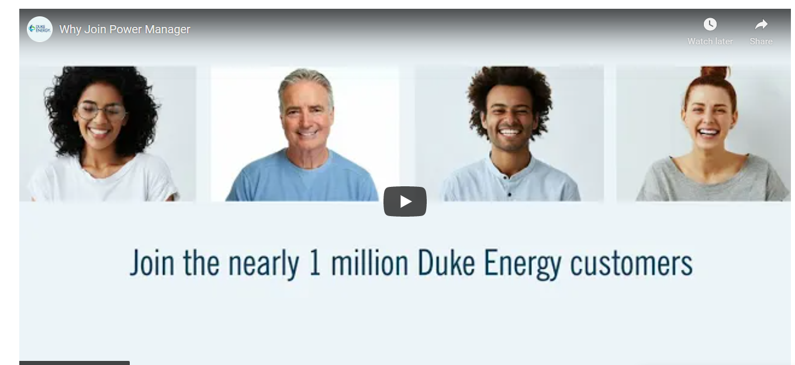
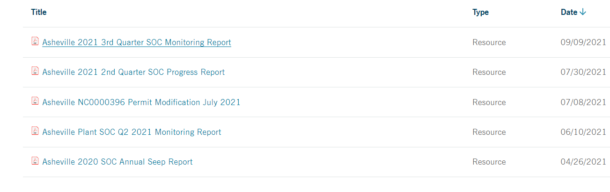
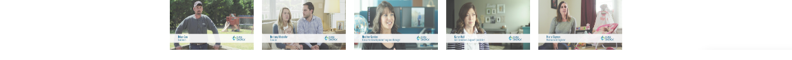
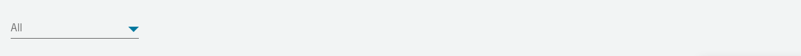
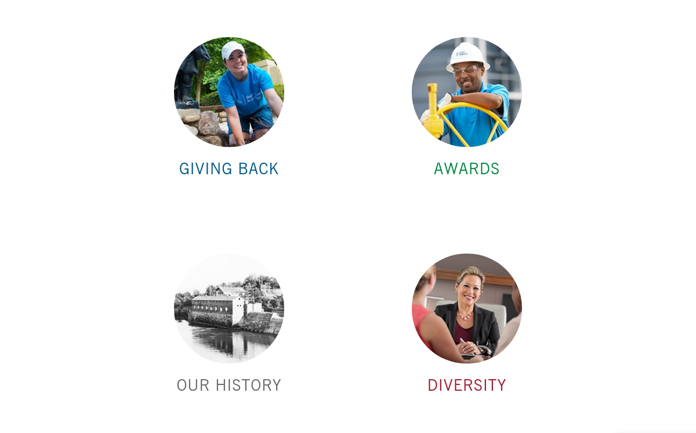
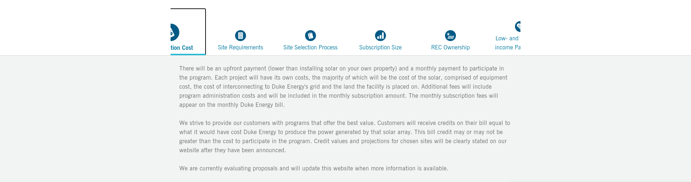
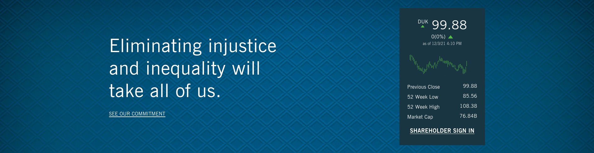
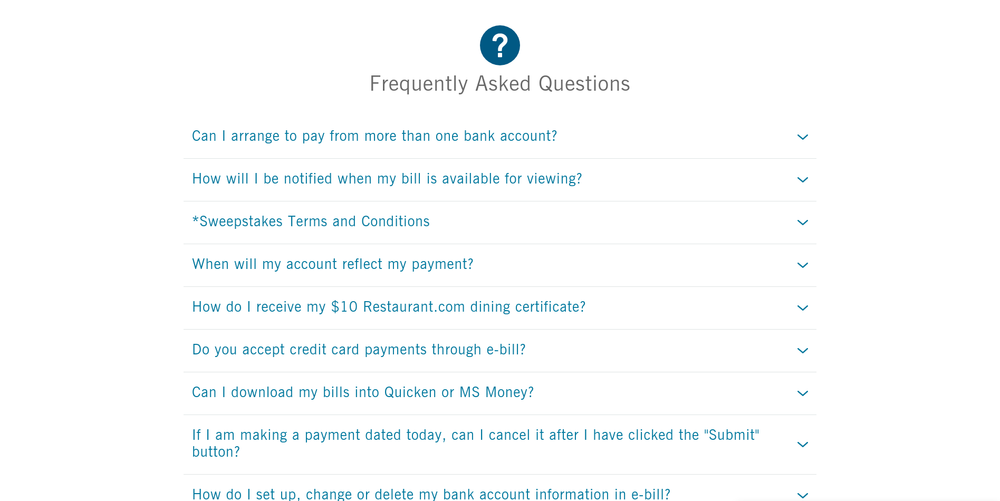
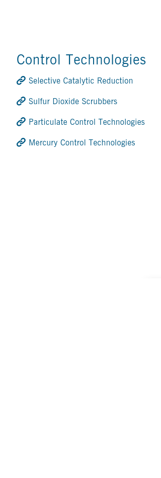
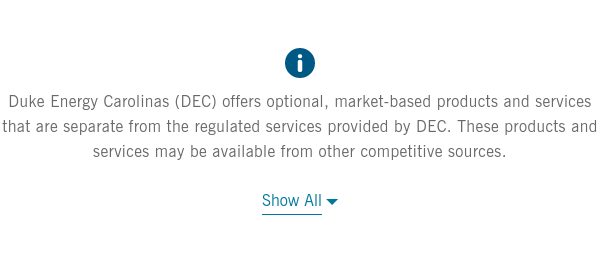

# Duke Energy Manual Audit_Report

 

Duke Energy Manual Audit

Web Accessibility Review

January 31, 2022

Duke Energy

Table of Contents

Engagement Overview 4

Engagement Details 4

User Journeys and Components Reviewed: 4

Findings 7

User Journey and Component Findings 8

Summary of Priority Findings by WCAG 2.1 Success Criteria 8

Explanation of Table Headers 9

User Journey: Common Components 10

1\. Secondary Nav 11

2\. Footer 15

3\. Footer 19

4\. Primary Nav 20

5\. Footer 31

6\. Common Issues 32

User Journey: Component Library 33

7\. Video Player 34

8\. News and Resources 41

9\. Table 45

10\. Multi Video 50

11\. News and Resources 52

12\. Push Down Panel 53

13\. Flipboard 55

14\. Tab 57

15\. Hero Stock Chart 60

16\. Accordion (FAQ) 61

17\. Related Links 64

18\. More Info 65

User Journey: Feedback 68

19\. Your Feedback Aside 69

20\. Feedback 78

User Journey: Form 87

21\. Form 88

22\. Form 91

23\. Multi Step Form 102

24\. Date Picker 109

User Journey: Global Alert 114

25\. Global Alert 115

User Journey: Home 121

26\. Product Cards 122

27\. Jurisdiction Selector 125

28\. Search 129

29\. Search 134

30\. SignIn 135

31\. Jurisdiction Selector 145

32\. Jurisdiction Selector 149

33\. Jurisdiction Selector 150

34\. Nav Cards 154

35\. News Banner 156

36\. Top tasks 158

User Journey: New Components 161

37\. Quick Links 162

38\. Modal 164

39\. Call to action 170

40\. Bulleted Overview 174

41\. Twitter 176

42\. Photo with Caption 185

43\. Email Signup 187

44\. Jurisdiction Intercept 201

User Journey: Pay My Bill 207

45\. Rectangular Card 208

46\. Centered Card 210

User Journey: Search 211

47\. Search Results Page 212

48\. Search Results Page 214

Appendix: Web Accessibility Testing Tools 217

### Engagement Overview 

TPGi conducted a Web Accessibility Review for Duke Energy Manual Audit on December 09, 2021 - January 31, 2022 at the request of Duke Energy to determine if it is possible for users who have visual disabilities and who use a screen reader to access the content and perform key functions on the website.

### Engagement Details 

| 
<em>Title</em>: Duke Energy Manual Audit

<em>Engagement Type:</em> Responsive Web Accessibility Review

<em>Standards:</em> WCAG 2.1­

<em>Environment:</em> Responsive Web
 | 
<em>Assistive Technologies:</em> Firefox and NVDA, Safari and VoiceOver, Chrome and JAWS

<em>Testing Tools:</em> ARC Toolkit, Colour Contrast Analyser, ARC Capture Extension

<em>Variant Schemas:</em> Chrome - Desktop

<em>Technologies:</em> HTML, CSS, ARIA, JavaScript
 |
| -------------------------------------------------------------------------------------------------------------------------------------------------------------------------------------------------------------- | ---------------------------------------------------------------------------------------------------------------------------------------------------------------------------------------------------------------------------------------------------------------------------------------------------------------- |

### User Journeys and Components Reviewed: 

1. **Common Components**
   1. Secondary Nav - \[https: //scjsstest.duke-energy.com/home]\(https: //scjsstest.duke-energy.com/home)
   2. Footer - \[https: //scjsstest.duke-energy.com/home]\(https: //scjsstest.duke-energy.com/home)
   3. Footer - \[https: //scjsstest.duke-energy.com/home]\(https: //scjsstest.duke-energy.com/home)
   4. Primary Nav - \[https: //scjsstest.duke-energy.com/home]\(https: //scjsstest.duke-energy.com/home)
   5. Common Issues - \[https: //scjsstest.duke-energy.com/home]\(https: //scjsstest.duke-energy.com/home)
2. **Component Library**
   1. Video Player - \[https: //scjsstest.duke-energy.com/home/products/power-manager]\(https: //scjsstest.duke-energy.com/home/products/power-manager)
   2. News and Resources - \[https: //scjsstest.duke-energy.com/Our-Company/About-Us/Power-Plants/Asheville-Plant]\(https: //scjsstest.duke-energy.com/Our-Company/About-Us/Power-Plants/Asheville-Plant)
   3. Table - \[https: //scjsstest.duke-energy.com/home/billing/billing-payment-options]\(https: //scjsstest.duke-energy.com/home/billing/billing-payment-options)
   4. Multi Video - \[https: //scjsstest.duke-energy.com/our-company/careers/benefits]\(https: //scjsstest.duke-energy.com/our-company/careers/benefits)
   5. Push Down Panel - \[https: //scjsstest.duke-energy.com/home/billing/paperless]\(https: //scjsstest.duke-energy.com/home/billing/paperless)
   6. Flipboard - \[https: //scjsstest.duke-energy.com/our-company/about-us]\(https: //scjsstest.duke-energy.com/our-company/about-us)
   7. Tab - \[https: //scjsstest.duke-energy.com/home/products/renewable-energy/nc-shared-solar]\(https: //scjsstest.duke-energy.com/home/products/renewable-energy/nc-shared-solar)
   8. Hero Stock Chart - \[https: //scjsstest.duke-energy.com/our-company]\(https: //scjsstest.duke-energy.com/our-company)
   9. Accordion (FAQ) - \[https: //scjsstest.duke-energy.com/home/billing/paperless]\(https: //scjsstest.duke-energy.com/home/billing/paperless)
   10. Related Links - \[https: //scjsstest.duke-energy.com/our-company/environment/air-quality]\(https: //scjsstest.duke-energy.com/our-company/environment/air-quality)
   11. More Info - \[https: //scjsstest.duke-energy.com/home-services]\(https: //scjsstest.duke-energy.com/home-services)
3. **Feedback**
   1. Your Feedback Aside - \[https: //scjsstest.duke-energy.com/home]\(https: //scjsstest.duke-energy.com/home)
   2. Feedback - \[https: //scjsstest.duke-energy.com/home]\(https: //scjsstest.duke-energy.com/home)
4. **Form**
   1. Form - \[https: //scjsstest.duke-energy.com/home-services/gas-line-repair/enroll]\(https: //scjsstest.duke-energy.com/home-services/gas-line-repair/enroll)
   2. Multi Step Form - \[https: //scjsstest.duke-energy.com/business/products/design-assistance/request]\(https: //scjsstest.duke-energy.com/business/products/design-assistance/request)
   3. Date Picker - \[https: //scjsstest.duke-energy.com/business/products/design-assistance/request?first_name=test\&last_name=test\&company=sdsd\&title=sds\&Company_Role\_\_c=Account+Executive\&street=test\&city=test\&zip=08844\&EDA_Project_Name\_\_c=sdd\&email=tes%40test.com\&emailconf_predef=tes%40test.com\&phone=9089639922\&EDA_Anticipated_Permit_Date\_\_c=\&EDA_Schematic_Design_Date\_\_c=\&EDA_Design_Development_Date\_\_c=\&EDA\_ construction_Documents_Date\_\_c=\&EDA\_ construction_Completion_Date\_\_c=\&Building_Square_Footage\_\_c=\&Parking_Garage_Sq_Ft\_\_c=\&Data_Center_Sq_Ft\_\_c=\&Above_Grade_Stories\_\_c=\&Below_Grade_Stories\_\_c=\&Percent_Cooled\_\_c=\&Other_energy_design_alternatives\_\_c=\&Special_considerations_and_other_comment\_\_c=]\(https: //scjsstest.duke-energy.com/business/products/design-assistance/request?first*name=test\&last_name=test\&company=sdsd\&title=sds\&Company_Role**c=Account+Executive\&street=test\&city=test\&zip=08844\&EDA_Project_Name**c=sdd\&email=tes%40test.com\&emailconf_predef=tes%40test.com\&phone=9089639922\&EDA_Anticipated_Permit_Date**c=\&EDA_Schematic_Design_Date**c=\&EDA_Design_Development_Date\_\_c=\&EDA* construction*Documents_Date\_\_c=\&EDA* construction_Completion_Date**c=\&Building_Square_Footage**c=\&Parking_Garage_Sq_Ft**c=\&Data_Center_Sq_Ft**c=\&Above_Grade_Stories**c=\&Below_Grade_Stories**c=\&Percent_Cooled**c=\&Other_energy_design_alternatives**c=\&Special_considerations_and_other_comment\_\_c=)
5. **Global Alert**
   1. Global Alert - \[https: //sctest.duke-energy.com/home/healthcheck]\(https: //sctest.duke-energy.com/home/healthcheck)
6. **Home**
   1. Product Cards - \[https: //scjsstest.duke-energy.com/home]\(https: //scjsstest.duke-energy.com/home)
   2. Jurisdiction Selector - \[https: //scjsstest.duke-energy.com/home]\(https: //scjsstest.duke-energy.com/home)
   3. Search - \[https: //scjsstest.duke-energy.com/home]\(https: //scjsstest.duke-energy.com/home)
   4. SignIn - \[https: //scjsstest.duke-energy.com/search-results?searchInput=undefined]\(https: //scjsstest.duke-energy.com/search-results?searchInput=undefined)
   5. Nav Cards - \[https: //scjsstest.duke-energy.com/home]\(https: //scjsstest.duke-energy.com/home)
   6. News Banner - \[https: //scjsstest.duke-energy.com/home]\(https: //scjsstest.duke-energy.com/home)
   7. Top tasks - \[https: //scjsstest.duke-energy.com/home]\(https: //scjsstest.duke-energy.com/home)
7. **New Components**
   1. Quick Links - \[https: //scjsstest.duke-energy.com/home/products/outdoor-lighting#?type=fixtures\&style=Sanibel%20LED]\(https: //scjsstest.duke-energy.com/home/products/outdoor-lighting#?type=fixtures\&style=Sanibel%20LED)
   2. Modal - \[https: //scjsstest.duke-energy.com/home/products/renewable-energy/nc-solar-rebates]\(https: //scjsstest.duke-energy.com/home/products/renewable-energy/nc-solar-rebates)
   3. Call to action - \[https: //scjsstest.duke-energy.com/home/products/renewable-energy/nc-solar-rebates]\(https: //scjsstest.duke-energy.com/home/products/renewable-energy/nc-solar-rebates)
   4. Bulleted Overview - \[https: //scjsstest.duke-energy.com/our-company/about-us]\(https: //scjsstest.duke-energy.com/our-company/about-us)
   5. Twitter - \[https: //scjsstest.duke-energy.com/our-company]\(https: //scjsstest.duke-energy.com/our-company)
   6. Photo with Caption - \[https: //scjsstest.duke-energy.com/our-company/about-us/leadership/lynn-j-good]\(https: //scjsstest.duke-energy.com/our-company/about-us/leadership/lynn-j-good)
   7. Email Signup - \[https: //scjsstest.duke-energy.com/home]\(https: //scjsstest.duke-energy.com/home)
   8. Jurisdiction Intercept - \[https: //scjsstest.duke-energy.com/home/billing]\(https: //scjsstest.duke-energy.com/home/billing)
8. **Pay My Bill**
   1. Rectangular Card - \[https: //scjsstest.duke-energy.com/home/billing]\(https: //scjsstest.duke-energy.com/home/billing)
   2. Centered Card - \[https: //scjsstest.duke-energy.com/home/billing]\(https: //scjsstest.duke-energy.com/home/billing)
9. **Search**
   1. Search Results Page - \[https: //scjsstest.duke-energy.com/search-results?searchInput=the]\(https: //scjsstest.duke-energy.com/search-results?searchInput=the)

### Findings 

Screen reader users will have a difficult time fully understanding the content and performing some functions.

The following top key issues specific to the Duke Energy Manual Audit will make it difficult for screen reader users:

Duke Energy's \[test site]\(https: //scjsstest.duke-energy.com/home) presents considerable challenges for people with visual and motor disabilities that use assistive technologies.

There are significant accessibility issues in the site's template components, which appear on almost every site page. The site makes wide use of side panels to sign into the site, search the site, register one's email, and provide feedback.

These side panels have the behavior of dialogs, but lack all required focus management techniques. When these panels appear, focus is not set to the panel's container or a focusable element within the panel. As a result, screen reader users are not aware that the panel has appeared. In most cases, the panel represents the last element in the page's markup. Assistive technology users must navigate through the entirety of page content to reach these panels.

When the panels are visually hidden, they are positioned offscreen but remain accessible to screen readers and to users that navigate the page using the TAB key. As a result, when a keyboard user tabs onto the elements within these panels, it is not possible to visually determine what element is currently focused.

The site makes wide use of decorative icons and images to augment the visible text. The visible text, by itself, is sufficient for screen reader users to understand the purpose and meaning of the content. These decorative elements do not convey meaningful information, yet they frequently have redundant, unnecessary text alternatives. These text alternatives increase the page noise, making site navigation more cumbersome for screen reader users.

Despite the barriers present in the site's template components, a number of accessibility features are well-implemented. The site has a skip link to bypass the navigation region and jump to the main content region. The site's videos have closed captioning, ensuring that people that are deaf or hard of hearing can have the same experience as those able to fully hear the videos. Most site controls are keyboard accessible; a sighted, keyboard user should be able to access most of the site's core functionality. The site consistently has a visual focus indicator; however, given that the site uses the browsers' default focus outline, the visual focus indicator may at times, be hard for low vision and color-blind people, to perceive.

### User Journey and Component Findings 

This section of the report documents the accessibility findings that impact screen reader users, as well as recommended changes. The Web Accessibility Review included 48 components across 9 user journeys to determine what the user experience would be for a screen reader user.\\

### Summary of Priority Findings by WCAG 2.1 Success Criteria 

| WCAG 2.1 Success Criteria             | 
Checkpoint

Level
 | Failure Count | P1  | P2  | P3  | P4  | P5  |
| ------------------------------------- | ----------------------------- | ------------- | --- | --- | --- | --- | --- |
| 1.1.1 Non-text Content                | A                             | 78            | 0   | 3   | 6   | 0   | 64  |
| 1.2.5 Audio Description (Prerecorded) | AA                            | 1             | 1   | 0   | 0   | 0   | 0   |
| 1.3.1 Info and Relationships          | A                             | 28            | 0   | 3   | 10  | 8   | 6   |
| 1.3.2 Meaningful Sequence             | A                             | 5             | 0   | 4   | 1   | 0   | 0   |
| 1.3.5 Identify Input Purpose          | AA                            | 17            | 0   | 5   | 12  | 0   | 0   |
| 1.4.10 Reflow                         | AA                            | 10            | 1   | 5   | 3   | 0   | 1   |
| 1.4.11 Non-text Contrast              | AA                            | 3             | 0   | 3   | 0   | 0   | 0   |
| 1.4.12 Text Spacing                   | AA                            | 2             | 0   | 0   | 2   | 0   | 0   |
| 1.4.3 Contrast (Minimum)              | AA                            | 1             | 0   | 0   | 0   | 0   | 1   |
| 1.4.4 Resize text                     | AA                            | 2             | 0   | 2   | 0   | 0   | 0   |
| 1.4.5 Images of Text                  | AA                            | 2             | 0   | 0   | 0   | 0   | 2   |
| 2.1.1 Keyboard                        | A                             | 4             | 0   | 0   | 4   | 0   | 0   |
| 2.4.3 Focus Order                     | A                             | 17            | 0   | 17  | 0   | 0   | 0   |
| 2.4.4 Link Purpose (In Context)       | A                             | 3             | 0   | 1   | 2   | 0   | 0   |
| 2.4.6 Headings and Labels             | AA                            | 10            | 1   | 0   | 7   | 0   | 2   |
| 2.4.7 Focus Visible                   | AA                            | 4             | 0   | 4   | 0   | 0   | 0   |
| 2.5.3 Label in Name                   | A                             | 1             | 0   | 1   | 0   | 0   | 0   |
| 3.1.2 Language of Parts               | AA                            | 2             | 0   | 0   | 0   | 0   | 2   |
| 3.3.1 Error Identification            | A                             | 2             | 0   | 2   | 0   | 0   | 0   |
| 3.3.2 Labels or Instructions          | A                             | 14            | 0   | 9   | 5   | 0   | 0   |
| 3.3.3 Error Suggestion                | AA                            | 1             | 0   | 1   | 0   | 0   | 0   |
| 4.1.1 Parsing                         | A                             | 2             | 0   | 0   | 0   | 2   | 0   |
| 4.1.2 Name, Role, Value               | A                             | 58            | 8   | 26  | 22  | 1   | 1   |
| 4.1.3 Status Messages                 | AA                            | 2             | 0   | 1   | 1   | 0   | 0   |
| Total Issues                          |                               | 269           | 11  | 87  | 75  | 11  | 79  |

**NOTE:** In addition, 13 Best Practice issues have been documented. While these are not failures of WCAG criteria, their implementation would improve the accessibility and usability of the user interface.

### Explanation of Table Headers 

1. **#** - A unique issue number for cross-referencing throughout the report.
2. **Issue Description** - Description of where the page is not consistent with the specified accessibility standards.
3. **Modification** - Suggestions for fixing the problem.
4. **STD (Standard)** - The three-part numbers (e.g. 1.1.1) refer to the WCAG 2.1 success criteria (\[http: //www.w3.org/TR/WCAG21/]\(http: //www.w3.org/TR/WCAG21/)).
5. **Count** - Number of issues found.
6. **PRIO (Priority)** - The priority column indicates the recommended order in which the issues are remediated.
   1. **1** are recommended to be remediated first. These issues will block access for a screen reader user or would make the content very difficult to understand.
   2. **2** is the next most important issue to be fixed. These issues are areas where a screen reader user will have a difficult time interacting with the site and understanding the content.
   3. **3** are a bit less 1 than the issues marked priority 1 and 2 and should be fixed after the issues identified as P1 and P2 are fixed.

**NOTE**: The priority of an issue provides a guide to remediation priority only and is not necessarily the same as the A, AA, and AAA conformance levels of the WCAG success criteria related to the issue. Unless indicated otherwise, all issues listed in the report require remediation to fix the critical and high priority WCAG 2.1 conformance issues on these key screens and other similar pages that we did not review.

### User Journey: Common Components 

Common Components\\

### 1. Secondary Nav 

\\

#### Secondary Nav Technical Details

| #   | Issue Description                       | Modification                                                                                                                                                                                                                                                                                                                                                                                                                                                                                                                                                                                                                                                                                                                                                                                                                                                                                                                                                                                                                                                                                                                                                                                                                                           | STD | Count | PRIO |
| --- | --------------------------------------- | ------------------------------------------------------------------------------------------------------------------------------------------------------------------------------------------------------------------------------------------------------------------------------------------------------------------------------------------------------------------------------------------------------------------------------------------------------------------------------------------------------------------------------------------------------------------------------------------------------------------------------------------------------------------------------------------------------------------------------------------------------------------------------------------------------------------------------------------------------------------------------------------------------------------------------------------------------------------------------------------------------------------------------------------------------------------------------------------------------------------------------------------------------------------------------------------------------------------------------------------------------ | --- | ----- | ---- |
| 1.1 | Landmark use is incomplete or incorrect | 
When a page has multiple &#x3C;nav> elements, each must be given a unique label. The &#x3C;nav> element for the site's secondary navigation lacks a label to identify its purpose.

The container for each expandable menu is marked up as a &#x3C;nav>. This results in a &#x3C;nav> containing a &#x3C;nav>.

<strong>Recommendation</strong>

When using landmarks on a web page, ensure they are used correctly:
<ul><li>Apply a unique label to the &#x3C;nav> containing the set of expandable menu widgets. Remove the aria-label="Site" attribute from the &#x3C;nav>'s parent &#x3C;div> and instead apply it to directly to the &#x3C;nav>.</li><li>Remove the &#x3C;nav> role from the container for each expandable menu.</li></ul>
Simplified, recommended markup for an expandable menu

&#x3C;div> &#x3C;nav aria-label="Secondary navigation"> &#x3C;ul> ...

&#x3C;/ul> &#x3C;/nav> &#x3C;/div>

Assistive technologies typically ignore the aria-label attribute when it is applied to generic elements such as a &#x3C;div> or a &#x3C;span>. This is noted in a separate best practices assertion.

<strong>Resources</strong>
<ul><li>&#x3C;a href="https:</li></ul> |     |       |      |

//w3c.github.io/aria-practices/#general-principles-of-landmark-design">General Principles of Landmark Design

- [Easy content organisation with HTML5](https://https/www.tpgi.com/easy-content-organisation-with-html5/)
- [Landmarks browser extension](https://https/matatk.agrip.org.uk/landmarks/)
- [Landmarks](https://http/matatk.agrip.org.uk/talks/2020/landmarks/#1)
- [Support for landmarks](https://https/github.com/matatk/page-structural-semantics-scanner-tests#support-for-landmarks)

\| 1.3.1 Info and Relationships A | 5 | 5 | | 1.2 | ARIA attribute applied to generic element |

Not all ARIA role combinations are valid. When ARIA attributes conflict with the underlying semantics of an element, it may cause at best, have no effect or at worst, cause unpredictable behavior for assistive technologies.

aria-label is primarily designed to provide an accessible name to an element. aria-label, aria-labelledby, aria-describedby are generally ignored by assistive technologies when they are applied to generic HTML elements that do not provide any meaningful semantic information i.e. \
, \.

- The \
 container for the set of expandable flyout menus (My Account, Billing & Payments, Products & Services, Start, Stop, & Move, Outages, Customer Service) has an aria-label="Site" attribute.
- The \
 container for each expandable menu has an aria-label="Submenu" attribute.

In both cases, the direct descendant of the \
 is a \<nav>.

**Recommendation**

Remove the aria-label attribute from each \
 container. Instead apply the aria-label attribute to its descendant \<nav>.

Simplified, recommended markup for expandable "flyout" menu

\

\<nav _aria-label="Submenu"_>\</nav>

\
\

**Note:**

To determine whether a role and aria-\* is invalid, consult the [W3C Document conformance requirements for use of ARIA attributes in HTML](https://https/www.w3.org/TR/html-aria/#docconformance).

**Resources**

- [W3C Document conformance requirements for use of ARIA attributes in HTML](https://https/www.w3.org/TR/html-aria/#docconformance)
- [A short note on the use of aria-label](https://https/html5accessibility.com/stuff/2020/11/07/not-so-short-note-on-aria-label-usage-big-table-edition/)

\| | 7 | 5 | | 1.3 | Consecutive links with the same destination |

When there are consecutive links with the same destination but have different link names, it is confusing for screen reader users and makes site navigation less efficient.

The logo-based "Duke Energy" link and the next element, the "For Your Home" link have the same destination.

**Recommendation**

The "For Your Home" link is repetitive and does not clearly visually indicate that it is a link. It is suggested to remove link markup from "For Your Home". This will make site navigation more efficient for assistive technology and keyboard-only users.

User testing and reviewing site analytics is recommended to determine the change is preferable to users.

\| | 2 | 4 |

### 2. Footer 

\\

#### Footer Technical Details

| #   | Issue Description       | Modification                                                                                                                                                                                                                                                                                                                                                                                                                                                                                                                                                                                                                                                                                                                                                                                                                                                                                                                                                                                                                                                                                                                                                                                                                                                                                                                                                                                                                               | STD                     | Count | PRIO |
| --- | ----------------------- | ------------------------------------------------------------------------------------------------------------------------------------------------------------------------------------------------------------------------------------------------------------------------------------------------------------------------------------------------------------------------------------------------------------------------------------------------------------------------------------------------------------------------------------------------------------------------------------------------------------------------------------------------------------------------------------------------------------------------------------------------------------------------------------------------------------------------------------------------------------------------------------------------------------------------------------------------------------------------------------------------------------------------------------------------------------------------------------------------------------------------------------------------------------------------------------------------------------------------------------------------------------------------------------------------------------------------------------------------------------------------------------------------------------------------------------------ | ----------------------- | ----- | ---- |
| 2.1 | Images of text are used | 
Images of text can be problematic for users with low vision, color blindness, and cognitive impairments. When text is presented as an image, it is not possible for users to change the presentation of the text to suit their particular needs and preferences (such as changing the font/typeface, changing the foreground/background color to increase contrast, increasing line height or spacing).

In addition, when text is presented using bitmap images (JPEG, PNG, GIF), it generally becomes blocky, blurry and harder to read for users that use browser zoom or magnification software.

The "Building a Smarter Energy Future" text is an image of text and not HTML text.

<strong>Recommendation</strong>

Authors are encouraged to use "real" text in their web pages rather than making images of text (&#x3C;img> elements, CSS background images, rendered dynamically on &#x3C;canvas> elements, SVG path data, etc.), unless the particular way in which text is visually presented is essential and/or cannot be achieved using regular technologies like HTML/SVG/CSS (including, but not limited to, the use of text-shadow, web fonts, gradient backgrounds, rounded corners).

For "Building a Smarter Energy Future", the styling is not tied to branding such as a logo. The text is feasible to recreate using HTML and CSS. Therefore, it is recommended to use real HTML.
 | 1.4.5 Images of Text AA | 1     | 4    |
| 2.2 | Nested footer landmarks | 
The &#x3C;footer> has a direct descendant &#x3C;footer> element. It is inappropriate to have a footer within a footer. This duplicative use of the footer landmark may cause confuse for screen reader users that make use of landmark navigation.

<strong>Recommendation</strong>

Do not nest &#x3C;footer> or elements with role="contentinfo" within &#x3C;footer>.

Remove either the parent or child element that is conveying footer landmark semantics.

Simplified recommended markup for footer landmark

&#x3C;footer> &#x3C;!-- remove the nested footer

&#x3C;footer role="contentinfo"> ... &#x3C;/footer> --> &#x3C;footer>

<strong>Resources</strong>
<ul><li>&#x3C;a href="https:</li></ul>                                                                                                                                                                                                                                                                                                                                                                                                                                                                                                                                                                                                                                                                       |                         |       |      |

//w3c.github.io/aria-practices/#general-principles-of-landmark-design">General Principles of Landmark Design

- [Easy content organisation with HTML5](https://https/www.tpgi.com/easy-content-organisation-with-html5/)
- [Landmarks browser extension](https://https/matatk.agrip.org.uk/landmarks/)
- [Landmarks](https://http/matatk.agrip.org.uk/talks/2020/landmarks/#1)
- [Support for landmarks](https://https/github.com/matatk/page-structural-semantics-scanner-tests#support-for-landmarks)

\| 1.3.1 Info and Relationships A | 1 | 5 | | 2.3 | A color contrast ratio of 3:1 is not provided for graphical objects used in controls |

In Firefox, The "@ Sign up for Email" button uses the browser's default focus indicator, which has insufficient color contrast with the footer background.

Focus indicator: #0060DF\
Background: #005984\
Contrast ratio: 1.4:1

**Recommendation**

Provide enough contrast between the foreground color and background color (or, more generally, "adjacent" colors that need to be distinguishable in order to correctly perceive/understand the graphical elements or their component parts) so that people who are color-blind or with moderately low vision can sufficiently distinguish important content. The contrast ratio must be at least 3:1.

The browser's default indicator is exempt from the WCAG Non-text Contrast (Level AA) Success Criterion 1.4.11 when the adjacent colors are also the browser's default styling. The footer background is not the browser's default styling. Therefore, the Success Criterion applies to the button.

\| 1.4.11 Non-text Contrast AA | 1 | 2 | | 2.4 | Decorative images are not hidden from screen reader users |

The iOS and Android badges are image-based links. For each link, the \<a href> container has an aria-label attribute which provides the control's accessible name. Each link's descendant image has an alt attribute to also provide a text presentation. Given the aria-label attribute, the descendant image can be considered decorative; its alt attribute is unnecessary.

**Recommendation**

Use an empty string as text alternative alt="" for each badge link. This will ensure that the image is not announced by assistive technologies. When an image is indicated as decorative through the alt="" attribute, there's no possible benefit to doubling-up with the aria-hidden attribute. Remove the unnecessary aria-hidden attribute from the \.

Recommended (simplified) markup for decorative image

\<a href="https: //itunes.apple.com/us/app/duke-energy/id1325217974?mt=8" target="\_blank" aria-label="Download on the App Store" >

\

\
\</a>

**Resources**

[Text alternatives for images](https://https/www.w3.org/WAI/tutorials/images/)

\| 1.1.1 Non-text Content A | 2 | 4 |

### 3. Footer 

\\

#### Footer Technical Details

| #                     | Issue Description | Modification | STD | Count | PRIO |
| --------------------- | ----------------- | ------------ | --- | ----- | ---- |
| No issues identified. |                   |              |     |       |      |

### 4. Primary Nav 

\\

#### Primary Nav Technical Details

| #   | Issue Description                                              | Modification                                                                                                                                                                                                                                                                                                                                                                                                                                                                                                                                                                                                                                                                                                                                                                                                                                                                                                                                                                                                                                                                                                                                                                                                                                                                                                                                                                                                                                                                                                                                                                                                                                                                                                                                                                                                                                                                                                                                             | STD                         | Count | PRIO |
| --- | -------------------------------------------------------------- | -------------------------------------------------------------------------------------------------------------------------------------------------------------------------------------------------------------------------------------------------------------------------------------------------------------------------------------------------------------------------------------------------------------------------------------------------------------------------------------------------------------------------------------------------------------------------------------------------------------------------------------------------------------------------------------------------------------------------------------------------------------------------------------------------------------------------------------------------------------------------------------------------------------------------------------------------------------------------------------------------------------------------------------------------------------------------------------------------------------------------------------------------------------------------------------------------------------------------------------------------------------------------------------------------------------------------------------------------------------------------------------------------------------------------------------------------------------------------------------------------------------------------------------------------------------------------------------------------------------------------------------------------------------------------------------------------------------------------------------------------------------------------------------------------------------------------------------------------------------------------------------------------------------------------------------------------------- | --------------------------- | ----- | ---- |
| 4.1 | Large scale text does not have a 3:1 color contrast ratio      | 
Large size text does not have sufficient contrast with its background. This means people with moderately low vision or color blindness will have problems reading the text.

In the expandable side navigation menu, the buttons, when in hover state, lack sufficient color contrast between the background and the button text.

Foreground: #E0F6FB Background: #00789E Contrast ratio: 1.3:1

<strong>Recommendation</strong>

Provide enough contrast between the foreground (text) color and background color so that people who are color-blind or with moderately low vision can read text and distinguish elements. For large text (at least 18pt / 24px, or bold and at least 14pt / 18.5px), the contrast ratio must be at least 3:1.
                                                                                                                                                                                                                                                                                                                                                                                                                                                                                                                                                                                                                                                                                                                                                                                                                                                                                                                                                                                                                                                                                                                                                                        | 1.4.3 Contrast (Minimum) AA | 1     | 4    |
| 4.2 | Changes in language are not explicitly marked up               | 
To identify any changes in language - when certain content is in a language that's different from the overall language defined for the page - include the lang attribute on the most appropriate container/element, and set it to the value of the appropriate language code.

When the site is set to English, the button to switch to Spanish reads "Español". The button lacks a lang attribute to specify that it is a different language than the page's primary language.

When the page is toggled to Spanish, the test environment remains in English. The select language button's text changing to "English". The test site does not have a Spanish version.

Note: In the production site, when the site is presented in Spanish, the &#x3C;html>'s lang attribute shifts to lang="es-US" to specify the page is in (US) Spanish. The "English" button (to shift back to English version) lacks a lang="en" attribute to specify that it is a different language than the page's primary language, Spanish. Production site is out of scope for this audit.

<strong>Recommendation</strong>

The lang attribute must also be used to identify chunks of text in a language that is different from the document's primary language.

When the page is in English, apply lang="es" to the button with name, "Español".

Adding lang="..." attribute with appropriate language code

&#x3C;html lang="en"> &#x3C;body> ... &#x3C;button lang="es">Español&#x3C;/button> &#x3C;button>Sign In&#x3C;/button> &#x3C;/body> &#x3C;/html>

When the page is in Spanish, apply lang="en" to the button with name, "English".

Adding lang="..." attribute with appropriate language code

&#x3C;html lang="es-US"> &#x3C;body> ... &#x3C;button lang="en">English&#x3C;/button> &#x3C;button>Iniciar sesión&#x3C;/button> &#x3C;/body> &#x3C;/html>
 | 3.1.2 Language of Parts AA  | 2     | 4    |
| 4.3 | The menu button does not follow the established design pattern | 
A menu button is a type of button which is used to trigger a pop-up menu, but must convey this functionality to assistive technology. The menu buttons found are missing the appropriate ARIA attributes and are not identified as menu buttons.

The "hamburger menu" button, which opens the side navigation panel, lacks the ARIA attributes to indicate that it opens a pop-up.

<strong>Note</strong>:

When the navigation menu button is activated, the side navigation panel opens in the behavior of a dialog. Focus remains on the button and does not move to the navigation menu. This lack of focus management is reported in a separate &#x3C;a href="https:
                                                                                                                                                                                                                                                                                                                                                                                                                                                                                                                                                                                                                                                                                                                                                                                                                                                                                                                                                                                                                                                                                                                                                                                                                                                         |                             |       |      |

//www.w3.org/TR/UNDERSTANDING-WCAG20/navigation-mechanisms-focus-order.html">2.4.3 assertion.

**Recommendation**

Ensure that the \<button> element that triggers a pop-up menu has an aria-haspopup="true" attribute to indicate to assistive technologies that the button has an associated menu.

Simplified, recommended markup for navigation menu button

\<button aria-label="Navigation menu"

aria-haspopup="true"\_

\
\</button>

**Resources**

[WAI-ARIA Authoring Practices - Menu Button](https://https/w3c.github.io/aria-practices/#menubutton)

\| 4.1.2 Name, Role, Value A | 1 | 3 | | 4.4 | Label is not sufficiently descriptive |

Labels which do not sufficiently describe the functionality of an interactive control, such as buttons and form controls, make it difficult for users to understand the purpose of the control.

The hamburger menu button, which opens the side navigation panel, derives its accessible name from its aria-label="menu" attribute. The name does not indicate the menu's primary purpose.

**Recommendation**

The visible text, or alternative text, used to label interactive elements must clearly and concisely describe the control's function or purpose.

Revise the aria-label attribute to be more descriptive of the button's purpose e.g. note which menu is being opened. "Open full site navigation" is suggested.

Simplified, recommended markup for the hamburger menu button

\<button aria-label="Open full site navigation"

aria-haspopup="true"\_>

\
\</button>

**Resources**

[WCAG Technique: Providing descriptive labels](https://https/www.w3.org/WAI/WCAG21/Techniques/general/G131)

\| 2.4.6 Headings and Labels AA | 1 | 3 | | 4.5 | Side navigation panel lacks the focus management required for a dialog |

The side navigation panel has the behavior of a dialog. The side navigation menu appears above a dimmed overlay covering the main page content. The interaction lacks the necessary focus management.

When the side navigation menu opens, focus remains on the hamburger menu button and does not move to the side navigation menu.

Focus is not constrained to the side navigation menu. A keyboard user is able to tab to focusable elements visually positioned under the dimmed overlay. As a result, it is not possible to determine what element is currently focused.

Inversely, when the side navigation menu is closed, focus does not return to the hamburger menu button, which triggered the menu to open.

Neither the dialog nor a descendant of the dialog programmatically receives focus when the dialog is invoked. This results in a screen reader user being unaware that the dialog has rendered on screen.

**Recommendation**

When the side navigation menu is launched, focus must be moved to the menu. The safest option for keyboard and assistive technology users is to treat the navigation menu like a dialog and use the focus management techniques required for dialogs.

**Set initial focus**

Apply role="dialog" to the \
 container for the navigation menu. Then set focus to this element with role="dialog". To achieve this, make sure that the \
 element with role="dialog" can be programmatically focused (with the JavaScript focus() method) by setting tabindex="-1" on the element.

When the dialog is closed, return focus to the hamburger menu button which triggered the navigation menu to open.

**Focus management within the menu**

The dialog containing the navigation menu should "contain" focus. Navigating via the TAB key should cycle through the focusable controls in the dialog until the user either closes the menu (by activating the "Close" button or pressing the ESC key.

\| 2.4.3 Focus Order A | 1 | 2 | | 4.6 | Side navigation does not follow established pattern for dialogs |

The side navigation panel has the behavior of a dialog, but lacks all of the necessary semantics.

- Container for side navigation lacks role="dialog" to indicate that it is a dialog.
- When the side navigation panel opens, focus remains on the hamburger menu button and does not move to the side navigation. As a result, screen reader users are unaware that the content has appeared.
- Content in the background is still announced by and reachable to assistive technology while the modal dialog is showing.

**Recommendation**

- Add the role dialog to the element containing the side navigation menu and the close button.
- For dialogs with a visible title, use an aria-labelledby reference to the element containing the title text (ideally an \<h2>) to provide an accessible name. For dialogs without a visible title, use aria-label to provide an accessible name. The side navigation does not currently have an element that functions as a title. Therefore, apply aria-label to the element with role="dialog".
- Set focus to the element with role="dialog" or to the \<nav> within the dialog. Apply tabindex="-1" to the element serving as the focus target. This is further discussed in a separate 2.4.3 assertion.
- Ensure that keyboard focus is constrained to the modal dialog until it is dismissed.
- Ensure that the content obscured by the modal dialog is properly hidden from assistive technologies. Apply aria-hidden="true" to the inactive page content behind the dialog. This hides it from the reading order as perceived by assistive technology, while allowing it to remain slightly visible behind the dialog. Be sure to remove the aria-hidden attribute from page content when the dialog is closed.
- The side navigation currently has a close button. It is suggest to add functionality where pressing ESC key dismisses the dialog and returns focus to the hamburger menu button.

Simplified, recommended markup for side navigation dialog

\<html>\
\<body>\
\
\
\<main>\
...\
\</main>\
\
\
\
\
\<nav aria-label="Main navigation" tabindex="-1">\
...\
\</nav>\
\
\
\</body>\
\</html>

**Resources**

- [ARIA Authoring Practices Modal Dialog Example](https://https/w3c.github.io/aria-practices/examples/dialog-modal/dialog.html)
- [Accessible Modal Dialog](https://https/github.com/scottaohara/accessible_modal_window)
- [a11y-dialog widget](https://https/github.com/KittyGiraudel/a11y-dialog)
- [The current state of modal dialog accessibility](https://https/www.tpgi.com/the-current-state-of-modal-dialog-accessibility/)

\| 4.1.2 Name, Role, Value A | 2 | 1 | | 4.7 | Side navigation panels lacks focus management between menu and submenu levels |

The side navigation is a horizontally sliding set of menu/submenus. There is a lack of focus management in navigation between the main menu and the submenus.

When an element containing a submenu, such as "My Account", is selected, the content within the side navigation panel horizontally slides offscreen to display that submenu. However, focus does not move to the start of the new content. Focus remains on the control which triggered the new content, but the control is removed from the page and there is a loss of keyboard focus. As a result, screen reader users are not aware that new content has appeared.

**Recommendation**

Ensure that when a submenu is selected, focus is set to a logical target within the new content and that it triggers a meaningful announcement to assistive technology.

From one level of navigation to the next level, there are multiple acceptable focus targets. Either set focus to the navigation link to move back up a level or to the first link within the submenu. For example, in the main navigation menu, when "My Account" is activated, set focus to either the "Main Menu" link or the "My Account" link. If the user selects to move back to the "Main Menu", set focus to the "For Your Home" heading.

**Note:**

The site's side navigation panel does not use the ARIA menu pattern. This assertion uses the terms "menu" and "submenu" for the sake of simplicity. It is a good decision to not use the ARIA menu pattern and the use of these terms should not be interpreted as encouraging use of the ARIA menu pattern in this context. The menu pattern is intended for desktop-like applications and is inappropriate for a site's navigation.

\| 2.4.3 Focus Order A | 1 | 2 | | 4.8 | ARIA attribute applied to generic element |

Not all ARIA-role combinations are valid. When ARIA attributes conflict with the underlying semantics of an element, it may cause at best, have no effect or at worst, cause unpredictable behavior for assistive technologies.

aria-label is primarily designed to provide an accessible name to an interactive element or elements that act as landmarks. aria-label, aria-labelledby, aria-describedby are generally ignored by assistive technologies when they are applied to generic HTML elements which do not have an interactive role e.g. button, link, input.

The \
 container for the side navigational panel has aria-label="Side panel" attribute

**Recommendation**

The side navigation panel lacks the dialog role attributes. Remove the aria-label="Side panel" attribute from the \
 within the \<nav>.

**Note:**

To determine whether a role and aria-\* is invalid, consult the [W3C Document conformance requirements for use of ARIA attributes in HTML](https://https/www.w3.org/TR/html-aria/#docconformance).

**Resources**

[W3C Document conformance requirements for use of ARIA attributes in HTML](https://https/www.w3.org/TR/html-aria/#docconformance)

\| | 1 | 5 |

### 5. Footer 

\\

#### Footer Technical Details

| #                     | Issue Description | Modification | STD | Count | PRIO |
| --------------------- | ----------------- | ------------ | --- | ----- | ---- |
| No issues identified. |                   |              |     |       |      |

### 6. Common Issues 

\\

#### Common Issues Technical Details

| #                     | Issue Description | Modification | STD | Count | PRIO |
| --------------------- | ----------------- | ------------ | --- | ----- | ---- |
| No issues identified. |                   |              |     |       |      |

### User Journey: Component Library 

Component Library\\

### 7. Video Player 

\\

#### Video Player Technical Details

| #   | Issue Description                    | Modification                                                                                                                                                                                                                                                                                                                                                                                                                                                                                                                                                                                                                                                                                                                                                                                                                                                                                                                                                                                                                                                                                                                                                                                                                                        | STD | Count | PRIO |
| --- | ------------------------------------ | --------------------------------------------------------------------------------------------------------------------------------------------------------------------------------------------------------------------------------------------------------------------------------------------------------------------------------------------------------------------------------------------------------------------------------------------------------------------------------------------------------------------------------------------------------------------------------------------------------------------------------------------------------------------------------------------------------------------------------------------------------------------------------------------------------------------------------------------------------------------------------------------------------------------------------------------------------------------------------------------------------------------------------------------------------------------------------------------------------------------------------------------------------------------------------------------------------------------------------------------------- | --- | ----- | ---- |
| 7.1 | An audio description is not provided | 
The video includes visual content that is important to the meaning and understanding of the video but it is not provided via audio description. Blind and low vision users will not be able to understand the content.

<strong>Recommendation</strong>

Provide an audio description of all meaningful visual aspects of the synchronized media presentation.

An audio description is a specifically made audio track which, in addition to the regular audio elements of the media presentation, describes any meaningful visual aspects of the synchronized media presentation - this includes visible text, key visual elements such as graphics superimposed over a video (e.g. an arrow pointing to a UI element or a box around a group of UI elements), actions taking place in a video, or animations in an animated SVG diagram. This can be provided in various forms, ranging from an alternative audio track that a user can enable, a separate video file (in the case of a self-contained audio/video presentation), or a completely separate page with the synchronized media presentation which incorporates the audio description.

For a good example of audio description, see &#x3C;a href="https:
 |     |       |      |

//www.youtube.com/watch?v=Kl4CT4DaypM">YouTube: MSFTEnable - Introduction to Disability and Accessibility (audio described version), which includes audio description in the natural pauses of the regular narration track in the segments between 3:26 and 11:10.

If the original presentation does not provide sufficient natural pauses, a possible approach is to provide extended audio descriptions. With this approach, playback is paused while the audio description plays, and resumes when the description has ended. An example of this approach can be found in the [CaptionSync Smart Player](https://https/www.automaticsync.com/captionsync/service-list/audio-description-example/).

You may also keep this video as it is and provide a link to the same video with audio description. The link to the audio-described video must be adjacent to the original video and must not be difficult to find.

Remediating this assertion will also resolve violations for the following success criterion: 1.2.3: Audio Description or Media Alternative (Prerecorded).

\| 1.2.5 Audio Description (Prerecorded) AA | 1 | 1 | | 7.2 | Video requires both horizontal and vertical scrolling when resized to a width of 320 CSS px / height of 256 CSS px |

In smaller viewports or when zoomed in, content requires scrolling in two dimensions. Users with low vision will find it difficult to read and understand content.

**Recommendation**

Ensure that all content adapts and reflows to a viewport width of 320 CSS pixels without loss of information or functionality, and without requiring both horizontal and vertical scrolling. An exception is content which requires two-dimensional layout for usage or meaning, such as data tables.

To ensure content does not cause horizontal scrollbars or end up clipped, do not use large fixed-width elements. Use CSS techniques such as relative units of measurement, flexbox layout, and/or media queries to display all content while achieving appropriate styling in small and large screens.

Example of using relative units of measurement for a primary content area

.content { width: 90%; }

Example of using [media queries](https://https/developer.mozilla.org/en-US/docs/Learn/CSS/CSS_layout/Responsive_Design#media_queries) for more specific styles

\<link rel="stylesheet" href="basic.css">\
\<link rel="stylesheet" media="(max-width:320px)" href="small.css">\
\<link rel="stylesheet" media="(max-width:600px)" href="medium.css"> \<link rel="stylesheet" media="(min-width:601px)" href="large.css">

**Note:** CSS techniques like these achieve responsive web design goals while allowing desktop browser users to zoom in to 400%.

**Resources**

- [Responsive design](https://https/developer.mozilla.org/en-US/docs/Learn/CSS/CSS_layout/Responsive_Design#responsive_design)
- [Understanding Success Criterion 1.4.10: Reflow](https://https/www.w3.org/WAI/WCAG21/Understanding/reflow.html)
- [Under-Engineered Responsive Tables](https://https/adrianroselli.com/2020/11/under-engineered-responsive-tables.html)

\| 1.4.10 Reflow AA | 1 | 1 | | 7.3 | Third party content is not accessible |

Web authors are responsible for ensuring that all third party content is accessible, including:

- content that is part of a service supplied by an external provider, such as ecommerce processes, online booking systems, product shipping tracking, and standalone user login systems.
- content in the form of media supplied by an external provider, such as embedded videos from providers like YouTube and Vimeo, commercial news feeds, social media feeds, online entertainment feeds, games, tickers, and advertisements.
- content supplied or generated by users, such as blog posts, comments, articles, images, and videos uploaded by users.

The video is an embedded YouTube video and has several accessibility issues, including the following:

- The Duke Energy logo is announced by screen readers as "photo image of Duke Energy".
- There is low text contrast for white text when the video is also white or a light color.
- The focus indicator is difficult to perceive.
- There is no announcement for screen reader users when the volume slider is adjusted.
- There are parsing errors, including but not limited to stray end tags and unclosed elements.
- When text spacing is increased, "Watch Later" becomes "Watch La," which is more difficult to understand.

**Recommendation**

- Remediate any issues you are able to address.
- Tell third party content providers that they must make their content accessible.
- Don't use providers of non-conformant third party content.
- Use third party embedding systems that provide control over accessibility.
- Manually or automatically check and block inaccessible third party content.
- Provide accessible alternative formats for content that can't be remediated.
- Tell users when third party content may not be accessible, and how they can access the content.

**Resources**

- [Understanding Conformance](https://https/www.w3.org/TR/UNDERSTANDING-WCAG/conformance.html#uc-partial-third-head)
- [Inaccessible Third-party Content and Code — Why it is Important, and How to Address it](https://https/sheribyrnehaber.medium.com/inaccessible-third-party-content-and-code-why-it-is-important-and-how-to-address-it-7446acdee53a)

\| | 1 | 5 | | 7.4 | The iframe title does not adequately describe its purpose |

The video is an \<iframe> with the label "YouTube video player". This title does not let users know which video is in the \<iframe>. Screen reader users do not have enough information to know whether or not they should enter the \<iframe> content.

**Recommendation**

Provide a descriptive title for \<iframe> elements when they contain content for a user.

Code example (simplified)

\<iframe title="Video: Why Join Power Manager">\</iframe>

For \<iframe> elements that do not display content to users (e.g. it is used for programmatic reasons), take the following steps: Use CSS display:none or the hidden attribute

Example code indicating an \<iframe> is not intended to be read.

\<iframe name="..." hidden src="..." title="No user content" ...>\</iframe>

Or

iframe.hidden {\
display:none;\
}

\<iframe name="..." class="hidden" src="..." title="No user content" ...>\</iframe>

**Resources**

[WCAG Technique: Providing descriptive labels](https://https/www.w3.org/WAI/WCAG21/Techniques/general/G131)

\| 2.4.6 Headings and Labels AA | 1 | 4 |

### 8. News and Resources 

\\

#### News and Resources Technical Details

| #                                                                                                                                                                                                                                                                                                                                                                                                                                                                                                                                                                          | Issue Description                                    | Modification                                                                                                                                                                                                                                                                                                                                                                                                                                                                                                                                                                                                                                                                                                                                                                                                                                                                                                                                                                                                                                                                                                                                                                                                                                                                                                                                                                                                                                                                                                                                                                                                                                                                                                                                                                                                                                                                                                                                                                                                                                                                                                                                                                                                  | STD | Count | PRIO |
| -------------------------------------------------------------------------------------------------------------------------------------------------------------------------------------------------------------------------------------------------------------------------------------------------------------------------------------------------------------------------------------------------------------------------------------------------------------------------------------------------------------------------------------------------------------------------- | ---------------------------------------------------- | ------------------------------------------------------------------------------------------------------------------------------------------------------------------------------------------------------------------------------------------------------------------------------------------------------------------------------------------------------------------------------------------------------------------------------------------------------------------------------------------------------------------------------------------------------------------------------------------------------------------------------------------------------------------------------------------------------------------------------------------------------------------------------------------------------------------------------------------------------------------------------------------------------------------------------------------------------------------------------------------------------------------------------------------------------------------------------------------------------------------------------------------------------------------------------------------------------------------------------------------------------------------------------------------------------------------------------------------------------------------------------------------------------------------------------------------------------------------------------------------------------------------------------------------------------------------------------------------------------------------------------------------------------------------------------------------------------------------------------------------------------------------------------------------------------------------------------------------------------------------------------------------------------------------------------------------------------------------------------------------------------------------------------------------------------------------------------------------------------------------------------------------------------------------------------------------------------------- | --- | ----- | ---- |
| 8.1                                                                                                                                                                                                                                                                                                                                                                                                                                                                                                                                                                        | Active SVG does not have a text alternative          | 
Links in the table open PDF documents. A PDF icon informs visual users that these links lead to PDFs. There is no text alternative for screen reader users. Additionally, the "PDF" text is very small and will be difficult to read for users with low vision.

<strong>Recommendation</strong>

Add "PDF" to the link text itself, and use aria-hidden="true' to hide the &#x3C;svg> from assistive technologies. Also add focusable="false" to the &#x3C;svg> element to prevent unnecessary tab stops.

Simplified code example

&#x3C;a href="https:
                                                                                                                                                                                                                                                                                                                                                                                                                                                                                                                                                                                                                                                                                                                                                                                                                                                                                                                                                                                                                                                                                                                                                                                                                                                                                                                                                                                                                                                                                                                                                                                                                          |     |       |      |
| 
//desitecoredev92-cd.azureedge.net/\_/media/pdfs/our-company/ash-management/212492-asheville-3q21-monitoring-results.pdf?la=en&#x26;rev=009ac748bbac49149c7676ac52d343f7"> 

&#x3C;svg aria-hidden="true" focusable="false">

 ... &#x3C;/svg> 

&#x3C;span class="flex-grow">Asheville 2021 3rd Quarter SOC Monitoring Report (PDF)&#x3C;/span>

 &#x3C;/a>

Remediating this assertion will also solve for violations of the following success criteria:
<ul><li>1.4.5 Images of Text</li><li>2.4.4 Link Purpose</li></ul> | 1.1.1 Non-text Content A                             | 5                                                                                                                                                                                                                                                                                                                                                                                                                                                                                                                                                                                                                                                                                                                                                                                                                                                                                                                                                                                                                                                                                                                                                                                                                                                                                                                                                                                                                                                                                                                                                                                                                                                                                                                                                                                                                                                                                                                                                                                                                                                                                                                                                                                                             | 3   |       |      |
| 8.2                                                                                                                                                                                                                                                                                                                                                                                                                                                                                                                                                                        | Sortable data tables are not defined and well formed | 
Data tables can be very useful components for conveying complicated information. These components can be difficult or impossible to navigate for keyboard only and screen reader users when not built using established design patterns.

The complex data table has the following issues:
<ul><li>No announcement when table is sorted.</li><li>No accessible name.</li><li>Contains parsing errors: the &#x3C;tbody> element is improperly nested within the &#x3C;table> element (after the &#x3C;tfoot> element).</li><li>Direction of sort appears when the button is hovered but not when it's focused with a keyboard.</li></ul>
<strong>Recommendation</strong>

Ensure that data tables are well-formed:
<ul><li>For the table itself, use the &#x3C;table> element (or an element with a table role for ARIA based tables). Note that the grid role is reserved for a widget that uses most of the same roles within it (identified below) but triggers a different interaction mode for screen reader users.</li><li>Ensure that the table does not have a presentation or none role.</li><li>Use a &#x3C;caption> element to label the table. For ARIA based tables, use an ARIA labeling method such as aria-labelledby.</li><li>Use a &#x3C;tr> element for each row, or the row role for rows in ARIA based tables.</li><li>Use the &#x3C;th> element for row and column headers. To indicate what dimension the header applies to, the scope=col and scope=row attributes for row headers are implied by user agents assistive technology so are generally not needed. For ARIA based tables, use the columnheader and rowheader roles.</li><li>Use the &#x3C;td> element for each cell (or an element with a cell role for ARIA based tables, gridcell if using the grid role).</li></ul>
For this &#x3C;table> element, also ensure:
<ul><li>Sorting changes are announced to users. Use role="status" on an element within the &#x3C;caption> element.</li><li>Sort direction is visually available at all times, or at least available when the button has keyboard focus.</li></ul>
To fix parsing issues:
<ol><li>Add the &#x3C;a href="https:</li></ol> |     |       |      |

//validator.w3.org/nu/about.html#extras">Check serialized DOM of current page (DOM Checking) and [Check for WCAG 2.1 parsing compliance](https://https/s.codepen.io/stevef/debug/VRZdGJ) bookmarklets to your browser of choice.

- Open the page you wish to check, then activate the DOM checking bookmarklet.
- The [W3C validator](https://https/validator.w3.org/nu/) results for the page will be displayed, filter results using the Check for WCAG 2.1 parsing bookmarklet

Example of \<caption> element with status update when table is sorted

\<table>\
\<caption>News and Resources \sorted by title ascending\\</caption>\
...\
\</table>

Remediation this assertion will also fix violations for the following WCAG success criteria:

- 4.1.3 Status Messages
- 2.1.1 Keyboard
- 4.1.1. Parsing

\| 1.3.1 Info and Relationships A | 1 | 2 | | 8.3 | Focus order for show more button is not logical |

When a user clicks the "Show More" button below the table, new table rows appear above the button, but keyboard focus remains on the button. Non-sighted screen reader users might not realize more information has populated above the button.

**Recommendation**

When a user presses the "Show More" button, programmatically shift focus to the first new link in the table. If a user presses the "Show Less" button, keep focus on the button itself.

**Resources**

[Understanding Success Criterion 2.4.3: Focus Order](https://https/www.w3.org/WAI/WCAG21/Understanding/focus-order.html)

\| 2.4.3 Focus Order A | 1 | 2 |

### 9. Table 

\\

#### Table Technical Details

| #                                                                | Issue Description                                                                     | Modification                                                                                                                                                                                                                                                                                                                                                                                                                                                                                                                                                                                                                                                                                                                                                                                                                                                                                                                                                                                                                                                                                                                                                                                                                                                                                                                                                                                                                                                                                                                                                                                                                                                                                                                                                                                                                                                                                                                                                                                                                                                                                                                                                                                                                                                                                                                                                                                                                                                                                                                                                                                                                                                                                                                                                                                                                                                                                                                                                                                                                                                                                                                                                                                                                                                                                                                                                                                                                                                                                                                                                                                                                                                                                                                                                                                                                                                                                                                                                                                                                                                  | STD                            | Count | PRIO |
| ---------------------------------------------------------------- | ------------------------------------------------------------------------------------- | ------------------------------------------------------------------------------------------------------------------------------------------------------------------------------------------------------------------------------------------------------------------------------------------------------------------------------------------------------------------------------------------------------------------------------------------------------------------------------------------------------------------------------------------------------------------------------------------------------------------------------------------------------------------------------------------------------------------------------------------------------------------------------------------------------------------------------------------------------------------------------------------------------------------------------------------------------------------------------------------------------------------------------------------------------------------------------------------------------------------------------------------------------------------------------------------------------------------------------------------------------------------------------------------------------------------------------------------------------------------------------------------------------------------------------------------------------------------------------------------------------------------------------------------------------------------------------------------------------------------------------------------------------------------------------------------------------------------------------------------------------------------------------------------------------------------------------------------------------------------------------------------------------------------------------------------------------------------------------------------------------------------------------------------------------------------------------------------------------------------------------------------------------------------------------------------------------------------------------------------------------------------------------------------------------------------------------------------------------------------------------------------------------------------------------------------------------------------------------------------------------------------------------------------------------------------------------------------------------------------------------------------------------------------------------------------------------------------------------------------------------------------------------------------------------------------------------------------------------------------------------------------------------------------------------------------------------------------------------------------------------------------------------------------------------------------------------------------------------------------------------------------------------------------------------------------------------------------------------------------------------------------------------------------------------------------------------------------------------------------------------------------------------------------------------------------------------------------------------------------------------------------------------------------------------------------------------------------------------------------------------------------------------------------------------------------------------------------------------------------------------------------------------------------------------------------------------------------------------------------------------------------------------------------------------------------------------------------------------------------------------------------------------------------------------------- | ------------------------------ | ----- | ---- |
| 9.1                                                              | Decorative images are not hidden from screen reader users                             | 
Icons in the first column of the table are decorative image elements that are not hidden from screen reader users.. This can cause confusion for screen reader users.

<strong>Recommendation</strong>

Use an empty string as text alternative alt="". This will ensure that the image is not announced by assistive technologies.

Recommended (simplified) markup

&#x3C;img src="stock1.jpg" alt="">

<strong>Resources</strong>

&#x3C;a href="https:
                                                                                                                                                                                                                                                                                                                                                                                                                                                                                                                                                                                                                                                                                                                                                                                                                                                                                                                                                                                                                                                                                                                                                                                                                                                                                                                                                                                                                                                                                                                                                                                                                                                                                                                                                                                                                                                                                                                                                                                                                                                                                                                                                                                                                                                                                                                                                                                                                                                                                                                                                                                                                                                                                                                                                                                                                                                                                                                                                                                                                                                                                                                                                                                                                                                                                                                                                                                                                                                                                                                                                               |                                |       |      |
| //www.w3.org/WAI/tutorials/images/">Text alternatives for images | 1.1.1 Non-text Content A                                                              | 6                                                                                                                                                                                                                                                                                                                                                                                                                                                                                                                                                                                                                                                                                                                                                                                                                                                                                                                                                                                                                                                                                                                                                                                                                                                                                                                                                                                                                                                                                                                                                                                                                                                                                                                                                                                                                                                                                                                                                                                                                                                                                                                                                                                                                                                                                                                                                                                                                                                                                                                                                                                                                                                                                                                                                                                                                                                                                                                                                                                                                                                                                                                                                                                                                                                                                                                                                                                                                                                                                                                                                                                                                                                                                                                                                                                                                                                                                                                                                                                                                                                             | 4                              |       |      |
| 9.2                                                              | Data tables are not defined as well-formed tables with correct row and column headers | 
Data tables can be very useful components for conveying complicated information. These components can be difficult or impossible to navigate for keyboard only and screen reader users when not built using established design patterns.

The data table has the following issues:
<ul><li>Does not use &#x3C;th> elements. Uses headings instead.</li><li>No accessible name</li><li>Missing attributes: role(s), colspan, rowspan</li><li>Rows not correctly associated to headers</li><li>Some text is hard-coded as all caps in the HTML. This can lead screen readers to announce the words in acronyms and is more difficult to read for people with dyslexia.</li></ul>
<strong>Recommendation</strong>

Ensure that data tables are well-formed:
<ul><li>Use a &#x3C;caption> element to label the table. For ARIA based tables, use an ARIA labeling method such as aria-labelledby.</li><li>Use a &#x3C;tr> element for each row, or the row role for rows in ARIA based tables.</li><li>Use the &#x3C;th> element for row and column headers. To indicate what dimension the header applies to, the scope=col and scope=row attributes for row headers are implied by user agents assistive technology so are generally not needed. For ARIA based tables, use the columnheader and rowheader roles.</li><li>Use the &#x3C;td> element for each cell (or an element with a cell role for ARIA based tables, gridcell if using the grid role).</li></ul>
Additionally, remove headings. We recommend using sentence case. If this is unachievable, then use sentence case in the HTML and use CSS text-transform to transform the text to uppercase.

The following shows a simple HTML table:

&#x3C;table> &#x3C;caption>Contact Information&#x3C;/caption> &#x3C;tr> &#x3C;td>&#x3C;/td> &#x3C;th>Name&#x3C;/th> &#x3C;th>Phone#&#x3C;/th> &#x3C;th>Fax#&#x3C;/th> &#x3C;th>City&#x3C;/th> &#x3C;/tr> &#x3C;tr> &#x3C;td>1.&#x3C;/td> &#x3C;th>Joel Garner&#x3C;/th> &#x3C;td>412-212-5421&#x3C;/td> &#x3C;td>412-212-5400&#x3C;/td> &#x3C;td>Pittsburgh&#x3C;/td> &#x3C;/tr> &#x3C;tr> &#x3C;td>2.&#x3C;/td> &#x3C;th>Clive Lloyd&#x3C;/th> &#x3C;td>410-306-1420&#x3C;/td> &#x3C;td>410-306-5400&#x3C;/td> &#x3C;td>Baltimore&#x3C;/td> &#x3C;/tr> &#x3C;tr> &#x3C;td>3.&#x3C;/td> &#x3C;th>Gordon Greenidge&#x3C;/th> &#x3C;td>281-564-6720&#x3C;/td> &#x3C;td>281-511-6600&#x3C;/td> &#x3C;td>Houston&#x3C;/td> &#x3C;/tr> &#x3C;/table>

The following shows the same structure but achieved through ARIA table roles:

&#x3C;div role="table" aria-labelledby="Caption">

&#x3C;div id="Caption">Contact Information&#x3C;/div>

&#x3C;div role="row">

&#x3C;div role="cell">

 &#x3C;/div>

&#x3C;div role="columnheader">Name&#x3C;/div>

&#x3C;div role="columnheader">Phone#&#x3C;/div>

&#x3C;div role="columnheader">Fax#&#x3C;/div>

&#x3C;div role="columnheader">City&#x3C;/div>

&#x3C;/div> &#x3C;div role="row">

&#x3C;div role="cell">1.&#x3C;/div>

&#x3C;div role="rowheader">Joel Garner&#x3C;/div>

&#x3C;div role="cell">412-212-5421&#x3C;/div>

&#x3C;div role="cell">412-212-5400&#x3C;/div>

&#x3C;div role="cell">Pittsburgh&#x3C;/div>

&#x3C;/div> &#x3C;div role="row">

&#x3C;div role="cell">2.&#x3C;/div>

&#x3C;div role="rowheader">Clive Lloyd&#x3C;/div>

&#x3C;div role="cell">410-306-1420&#x3C;/div>

&#x3C;div role="cell">410-306-5400&#x3C;/div>

&#x3C;div role="cell">Baltimore&#x3C;/div>

 &#x3C;/div>

&#x3C;div role="row">

&#x3C;div role="cell">3.&#x3C;/div>

&#x3C;div role="rowheader">Gordon Greenidge&#x3C;/div>

&#x3C;div role="cell">281-564-6720&#x3C;/div>

&#x3C;div role="cell">281-511-6600&#x3C;/div>

&#x3C;div role="cell">Houston&#x3C;/div>

 &#x3C;/div> &#x3C;/div>
 | 1.3.1 Info and Relationships A | 1     | 2    |

### 10. Multi Video 

\\

#### Multi Video Technical Details

| #    | Issue Description                                 | Modification                                                                                                                                                                                                                                                                                                                                                                                                                                                                                                                                                                                                                                                                                                                                                                                                                                                                                                                                                                                                                                                                                                                                                                                                                                                                               | STD                       | Count | PRIO |
| ---- | ------------------------------------------------- | ------------------------------------------------------------------------------------------------------------------------------------------------------------------------------------------------------------------------------------------------------------------------------------------------------------------------------------------------------------------------------------------------------------------------------------------------------------------------------------------------------------------------------------------------------------------------------------------------------------------------------------------------------------------------------------------------------------------------------------------------------------------------------------------------------------------------------------------------------------------------------------------------------------------------------------------------------------------------------------------------------------------------------------------------------------------------------------------------------------------------------------------------------------------------------------------------------------------------------------------------------------------------------------------ | ------------------------- | ----- | ---- |
| 10.1 | Button does not indicate whether it is pressed    | 
The video tile buttons do not indicate when they are selected. When a video tile button is selected, the video opens in the adjacent video player, but it does not trigger an announcement to assistive technology.

<strong>Recommendation</strong>

Ensure that when a video is selected, it triggers an announcement to assistive technology which conveys that the page content has updated.

<strong>Option 1</strong>

The best and most appropriate solution is to apply an aria-pressed attribute to each video tile button. Toggle the button to reflect whether that video is selected.

Simplified, recommended markup using aria-pressed attribute.

&#x3C;button aria-pressed="true" aria label="Parental leave - Maria"> &#x3C;img src="..." alt=""> &#x3C;/button>

<strong>Option 2</strong>

Create a live region. Apply aria-live="polite", role="status", aria-atomic="true" to a visually hidden &#x3C;span>. When a video is selected, update this live region to describe/summarize the change in page i.e. "Parental leave - Maria video selected".

Simplified, recommended markup for a live region

&#x3C;span aria-live="polite" role="status">Parental leave - Maria video selected&#x3C;/span>
 | 4.1.2 Name, Role, Value A | 5     | 3    |
| 10.2 | Text alternative includes superfluous information | 
Each video tile button derives its accessible name from its descendant image's alt attribute. The alt attribute indicates that the text describing its image i.g. "Parental Leave - Chris Bethany Mosteller image". This information is unnecessary; the text alternative is meant to describe the control's purpose. Superfluous information in the text alternative increase the page noise and make it harder to understand a control's purpose.

<strong>Recommendation</strong>

Good alternative text should describe an image's purpose more than its contents. Remove "image" from the alt attribute. The text alternative could be further improved by noting that it is a video.

Simplified, recommended markup for a video tile button

&#x3C;button>

&#x3C;img alt="Parental Leave - Chris Bethany Mosteller video">

 &#x3C;/button>
                                                                                                                                                                                                                                                                                                                                                                                                |                           | 5     | 4    |

### 11. News and Resources 

\\

#### News and Resources Technical Details

| #    | Issue Description                                       | Modification                                                                                                                                                                                                                                                                                                                                                                                                                                                                                                                                                                                                                                                                                                                                                                                                                                                                    | STD | Count | PRIO |
| ---- | ------------------------------------------------------- | ------------------------------------------------------------------------------------------------------------------------------------------------------------------------------------------------------------------------------------------------------------------------------------------------------------------------------------------------------------------------------------------------------------------------------------------------------------------------------------------------------------------------------------------------------------------------------------------------------------------------------------------------------------------------------------------------------------------------------------------------------------------------------------------------------------------------------------------------------------------------------- | --- | ----- | ---- |
| 11.1 | Filter control does not have a persistent visible label | 
The "show" &#x3C;select> element has a label that is visually hidden until the user selects a value. The purpose of the control may not be clear to users.

<strong>Recommendation</strong>

Ensure that the "Show" label is always visible. Form controls that require user input must have an appropriate label that describes the expected input to all users. For form controls that have additional restrictions or input requirements (such as requiring a specific format or a specific piece of information that is not obvious from the label alone), some form of instruction must be present to inform the user of these specific restrictions or requirements. This information must be permanently available and cannot be removed once a value is entered in the control.

<strong>Resources</strong>
<ul><li>&#x3C;a href="https:</li></ul> |     |       |      |

//w3c.github.io/aria-practices/#describing_techniques">Describing Techniques

- [Labeling Controls](https://https/www.w3.org/WAI/tutorials/forms/labels/)

\| 3.3.2 Labels or Instructions A | 1 | 3 |

### 12. Push Down Panel 

\\

#### Push Down Panel Technical Details

| #    | Issue Description                                                  | Modification                                                                                                                                                                                                                                                                                                                                                                                                                                                                                                                                                                                                                                    | STD                            | Count | PRIO |
| ---- | ------------------------------------------------------------------ | ----------------------------------------------------------------------------------------------------------------------------------------------------------------------------------------------------------------------------------------------------------------------------------------------------------------------------------------------------------------------------------------------------------------------------------------------------------------------------------------------------------------------------------------------------------------------------------------------------------------------------------------------- | ------------------------------ | ----- | ---- |
| 12.1 | Elements that are not conveying headings are marked up as headings | 
When the content is expanded, the first text for each expanded section is marked up as a heading. This content is a repeat of the heading above it and is marked up as the same heading level (&#x3C;h3>). This can be confusing for users, especially assistive technology users who navigate the page by heading.

<strong>Recommendation</strong>

Do not use heading markup for text that does not serve as a descriptive label for the section of content that follows it.
                                                                                                                                                | 1.3.1 Info and Relationships A | 3     | 4    |
| 12.2 | Underlined buttons appear visually as links                        | 
Button text, such as "get your bill online" and the "Close" button for expanded content is underlined when hovered by a mouse user. This visually signifies a link. Links navigate to a new location while buttons produce actions. If users click a link, they expect to navigate to another page or another part of the page. Clicking these controls expands and collapses content. This can create a confusing experience.

<strong>Recommendation</strong>

Remove the underline when the buttons are hovered. Use a different way of expressing hover state. For example, add a box around the button text when hovered.
 |                                | 6     | 0    |

### 13. Flipboard 

\\

#### Flipboard Technical Details

| #                                                                              | Issue Description                                         | Modification                                                                                                                                                                                                                                                                                                                                                                                                                                                                                                                                                                                                                     | STD              | Count | PRIO |
| ------------------------------------------------------------------------------ | --------------------------------------------------------- | -------------------------------------------------------------------------------------------------------------------------------------------------------------------------------------------------------------------------------------------------------------------------------------------------------------------------------------------------------------------------------------------------------------------------------------------------------------------------------------------------------------------------------------------------------------------------------------------------------------------------------- | ---------------- | ----- | ---- |
| 13.1                                                                           | Decorative images are not hidden from screen reader users | 
The image within each link is decorative. Each image has inappropriate alt="image" attribute. This extra "page noise" can cause confusion for screen reader users. Screen reader users will wonder whether the image is actually informative and its information is not adequately announced to them.

<strong>Recommendation</strong>

Use an empty string as text alternative alt="". This will ensure that the image is not announced by assistive technologies.

Recommended (simplified) markup

&#x3C;img alt="" src="...">

<strong>Resources</strong>

&#x3C;a href="https:
         |                  |       |      |
| //www.w3.org/WAI/tutorials/images/">Text alternatives for images               | 1.1.1 Non-text Content A                                  | 4                                                                                                                                                                                                                                                                                                                                                                                                                                                                                                                                                                                                                                | 4                |       |      |
| 13.2                                                                           | Inappropriate title attribute                             | 
The "Awards" link has a title attribute with a long, incomprehensible string sitecore:item:InternalLinkTreeview_AC99B8D34494492B9AFA2BD36DF3DDC6, that resembles a file name, as its value. When focus is set to the link, screen readers announce this title attribute as part of the link's accessible name/description.

<strong>Recommendation</strong>

Remove the title attribute.

Recommended (simplified) markup for the link with the title attribute removed

&#x3C;a href="/our-company/about-us/awards"> ... &#x3C;/a>

<strong>Resources</strong>

&#x3C;a href="https:
 |                  |       |      |
| //www.tpgi.com/using-the-html-title-attribute/">Using the HTML title attribute | 2.4.6 Headings and Labels AA                              | 1                                                                                                                                                                                                                                                                                                                                                                                                                                                                                                                                                                                                                                | 3                |       |      |
| 13.3                                                                           | Flashcard is not keyboard accessible                      | 
The links, "Giving Back", "Awards", "Our History", and "Diversity", have behavior that could be described as flashcards or flipboards. When the mouse moves over a card, it displays a description of the link. However, this interaction cannot be triggered via keyboard.

It's important to note that the link description can be accessed by screen reader users, even when it is visually hidden. This is good behavior.

<strong>Recommendation</strong>

When focus is set to the link, display the description; extend the behavior for hover state to focus state.
                                | 2.1.1 Keyboard A | 4     | 3    |

### 14. Tab 

\\

#### Tab Technical Details

| #                                                                | Issue Description                                                                                                    | Modification                                                                                                                                                                                                                                                                                                                                                                                                                                                                                                                                                                                                                                                                                                                                                                                                                                                                                                                                                                                                                                                                                                                                                                                                                                                         | STD | Count | PRIO |
| ---------------------------------------------------------------- | -------------------------------------------------------------------------------------------------------------------- | -------------------------------------------------------------------------------------------------------------------------------------------------------------------------------------------------------------------------------------------------------------------------------------------------------------------------------------------------------------------------------------------------------------------------------------------------------------------------------------------------------------------------------------------------------------------------------------------------------------------------------------------------------------------------------------------------------------------------------------------------------------------------------------------------------------------------------------------------------------------------------------------------------------------------------------------------------------------------------------------------------------------------------------------------------------------------------------------------------------------------------------------------------------------------------------------------------------------------------------------------------------------- | --- | ----- | ---- |
| 14.1                                                             | Decorative images are not hidden from screen reader users                                                            | 
Each element with role="tab" has has an aria-label attribute which provides the control's accessible name. Each tab's descendant image has an alt attribute which has a redundant text alternative e.g. alt="icon". Given the aria-label attribute on the image's functional container, the element with role="tab", the descendant image can be considered decorative; its alt attribute is unnecessary.

<strong>Recommendation</strong>

Use an empty string as text alternative alt="" for the image within each tab. This will ensure that the image is not announced by assistive technologies. When an image is indicated as decorative through the alt="" attribute, there's no possible benefit to doubling-up with the aria-hidden attribute. Remove the unnecessary aria-hidden attribute from the &#x3C;img>.

Recommended (simplified) markup for decorative image within a tab

&#x3C;button aria-controls="panel-site-requirements" aria-selected="false" role="tab" tabindex="-1" type="button"> &#x3C;img <em><strong>alt=""</strong></em>> &#x3C;span>Site Requirements&#x3C;/span> &#x3C;/button>

<strong>Resources</strong>

&#x3C;a href="https:
                                                 |     |       |      |
| //www.w3.org/WAI/tutorials/images/">Text alternatives for images | 1.1.1 Non-text Content A                                                                                             | 6                                                                                                                                                                                                                                                                                                                                                                                                                                                                                                                                                                                                                                                                                                                                                                                                                                                                                                                                                                                                                                                                                                                                                                                                                                                                    | 4   |       |      |
| 14.2                                                             | Tab panel is difficult to operate using a mouse                                                                      | 
When the browser width is less than 750 CSS pixels, two of the tabs are offscreen. A mouse user cannot scroll through the list of tabs to view these two offscreen tabs, "REC Ownership" and "Low-Moderate Participation".

This assertion is a best practice because issues with using a site via the mouse are primarily not covered under WCAG. However, regardless of whether the assertion is a WCAG error, the issue has a legitimate impact on the site's overall user experience.

<strong>Recommendation</strong>

There are multiple approaches which could be used.

<strong>Option 1</strong>

At smaller viewports, add a scrollbar to the tab panel. Mouse users can then select the scroll bar and move through the tab list.

<strong>Option 2</strong>

At smaller viewports, use an accordion tab rather than a tab panel.
                                                                                                                                                                                                                                                                                                                                                                               |     | 1     | 3    |
| 14.3                                                             | Content requires both horizontal and vertical scrolling when resized to a width of 320 CSS px / height of 256 CSS px | 
In smaller viewports or when zoomed in, content requires scrolling in two dimensions. Users with low vision will find it difficult to read and understand content.

At smaller viewports, two of the six tab controls are offscreen, which requires horizontal scrolling within the tab list.

Beyond the challenge for low-vision users, mouse users will face difficulty scrolling the tab list. It is not possible, using a mouse sans scroll wheel, to view the other tabs in the list. This aspect of the tab panel is discussed in a separate best practice assertion.

<strong>Recommendation</strong>

Ensure that all content adapts and reflows to a viewport width of 320 CSS pixels without loss of information or functionality, and without requiring both horizontal and vertical scrolling. An exception is content which requires two-dimensional layout for usage or meaning, such as data tables.

There are multiple approaches which could be used to make the tab panel reflow for smaller viewports. A scrollbar could be added to the tab list or the tab panel could have a responsive adaptation where it becomes an accordion tab.

<strong>Resources</strong>
<ul><li>&#x3C;a href="https:</li></ul> |     |       |      |

//developer.mozilla.org/en-US/docs/Learn/CSS/CSS_layout/Responsive_Design#responsive_design">Responsive design

- [Understanding Success Criterion 1.4.10: Reflow](https://https/www.w3.org/WAI/WCAG21/Understanding/reflow.html)

\| 1.4.10 Reflow AA | 1 | 2 |

### 15. Hero Stock Chart 

\\

#### Hero Stock Chart Technical Details

| #                                                                | Issue Description                                         | Modification                                                                                                                                                                                                                                                                                                                                                                                                                                                                                                                                                                                                                                                                               | STD | Count | PRIO |
| ---------------------------------------------------------------- | --------------------------------------------------------- | ------------------------------------------------------------------------------------------------------------------------------------------------------------------------------------------------------------------------------------------------------------------------------------------------------------------------------------------------------------------------------------------------------------------------------------------------------------------------------------------------------------------------------------------------------------------------------------------------------------------------------------------------------------------------------------------ | --- | ----- | ---- |
| 15.1                                                             | Decorative images are not hidden from screen reader users | 
The image of a stock chart is a decorative image. It has redundant alt="chart" attribute.

The image, representing the background for the section has inappropriate alt="patterned background for duke Energy grant notification copy" attribute.

These unnecessary text alternatives extra "page noise" can cause confusion for screen reader users.

<strong>Recommendation</strong>

Use an empty string as text alternative alt="". This will ensure that the image is not announced by assistive technologies.

Recommended (simplified) markup

&#x3C;img src="stock1.jpg" alt="">

<strong>Resources</strong>

&#x3C;a href="https:
 |     |       |      |
| //www.w3.org/WAI/tutorials/images/">Text alternatives for images | 1.1.1 Non-text Content A                                  | 2                                                                                                                                                                                                                                                                                                                                                                                                                                                                                                                                                                                                                                                                                          | 4   |       |      |

### 16. Accordion (FAQ) 

\\

#### Accordion (FAQ) Technical Details

| #    | Issue Description                                         | Modification                                                                                                                                                                                                                                                                                                                                                                                                                                                                                                                                           | STD | Count | PRIO |
| ---- | --------------------------------------------------------- | ------------------------------------------------------------------------------------------------------------------------------------------------------------------------------------------------------------------------------------------------------------------------------------------------------------------------------------------------------------------------------------------------------------------------------------------------------------------------------------------------------------------------------------------------------ | --- | ----- | ---- |
| 16.1 | Decorative images are not hidden from screen reader users | 
There is an image of a question mark above the "Frequently Asked Questions" heading. This image is announced to screen reader users as "Image". This can cause confusion for screen reader users. Users will wonder if there is an informative image that is not adequately announced to them.

<strong>Recommendation</strong>

Use an empty string as text alternative alt="". This will ensure that the image is not announced by assistive technologies.

Recommended (simplified) markup

&#x3C;img alt="" src="https:
 |     |       |      |

//desitecoredev92-cd.azureedge.net/\_/media/images/svg/account/iconquestion.svg?h=100\&la=en\&w=100\&rev=cff914c360f8411c80ba3ccfad6880f5">

**Resources**

[Text alternatives for images](https://https/www.w3.org/WAI/tutorials/images/)

\| 1.1.1 Non-text Content A | 1 | 4 | | 16.2 | Link does not have any text |

Within the section with the heading "If I am making a payment dated today, can I cancel it after I have clicked the 'Submit' button?" there is a link without any text. This link is invisible on the page, but it is still announced to screen reader users. Because there is no associated text, the full URL is announced instead. This can be confusing and difficult to parse for screen reader users.

**Recommendation**

Remove the link, hide it from all users via the hidden attribute or CSS display:none, or add text and ensure it is available to all users.

Recommended markup (if not removed)

\<a href="/home/billing/credit-card-debit-card-or-electronic-check-payments">Card or eCheck Payments\</a>

This also fails the following WCAG success criteria, which will also be resolved by remediation of this assertion: 4.1.2 Name, Role, Value

**Resources**

- [Understanding Success Criterion 2.4.4: Link Purpose (In Context)](https://https/www.w3.org/WAI/WCAG21/Understanding/link-purpose-in-context.html)
- [Link Text and Appearance](https://https/webaim.org/techniques/hypertext/link_text)

\| 2.4.4 Link Purpose (In Context) A | 1 | 3 | | 16.3 | Link name is ambiguous in isolation |

In the section with the heading, "How do I receive my $10 Restaurant.com dining certificate?" there is a link that is simply labelled "this page". Within the context of this paragraph, it's clear that this is a link to the terms and conditions page. Some screen reader users navigate using TAB or encounter all links within one list. Without the context of the surrounding text, these users will not know where the link "this page" leads.

**Recommendation**

Include the destination of the link within the link text itself.

Recommended Markup (simplified)

\
... Please view our \<a href="http: //www.prizelabs.com/termsandconditions/" target="\_blank">complete terms and conditions\</a>. ....\

\| | 1 | 4 |

### 17. Related Links 

\\

#### Related Links Technical Details

| #                     | Issue Description | Modification | STD | Count | PRIO |
| --------------------- | ----------------- | ------------ | --- | ----- | ---- |
| No issues identified. |                   |              |     |       |      |

### 18. More Info 

\\

#### More Info Technical Details

| #                                                                                 | Issue Description                                                                                             | Modification                                                                                                                                                                                                                                                                                                                                                                                                                                                                                                                                                                                                                                                                                                                                                                                                                                                                                                                                                                                                                                                                                                                                                                                                                                                                                                                                                                                                                                                                                                                                                                                                                                                                                                                                                                                                                                                                                                                                                                                                                                                                                                                                                | STD | Count | PRIO |
| --------------------------------------------------------------------------------- | ------------------------------------------------------------------------------------------------------------- | ----------------------------------------------------------------------------------------------------------------------------------------------------------------------------------------------------------------------------------------------------------------------------------------------------------------------------------------------------------------------------------------------------------------------------------------------------------------------------------------------------------------------------------------------------------------------------------------------------------------------------------------------------------------------------------------------------------------------------------------------------------------------------------------------------------------------------------------------------------------------------------------------------------------------------------------------------------------------------------------------------------------------------------------------------------------------------------------------------------------------------------------------------------------------------------------------------------------------------------------------------------------------------------------------------------------------------------------------------------------------------------------------------------------------------------------------------------------------------------------------------------------------------------------------------------------------------------------------------------------------------------------------------------------------------------------------------------------------------------------------------------------------------------------------------------------------------------------------------------------------------------------------------------------------------------------------------------------------------------------------------------------------------------------------------------------------------------------------------------------------------------------------------------- | --- | ----- | ---- |
| 18.1                                                                              | A decorative image is not hidden from screen reader users                                                     | 
The decorative image, of an info "i" icon, is not hidden from assistive technologies. It has a redundant alt="image" attribute. This can cause confusion for screen reader users.

<strong>Recommendation</strong>

Use an empty string as text alternative alt="". This will ensure that the image is not announced by assistive technologies.

Recommended (simplified) markup

&#x3C;img alt="" src=...">

<strong>Resources</strong>

&#x3C;a href="https:
                                                                                                                                                                                                                                                                                                                                                                                                                                                                                                                                                                                                                                                                                                                                                                                                                                                                                                                                                                                                                                                                                                                                                                                                                                                                                                                                                                                                                                                                                                                                                                                                                                                         |     |       |      |
| //www.w3.org/WAI/tutorials/images/">Text alternatives for images                  | 1.1.1 Non-text Content A                                                                                      | 1                                                                                                                                                                                                                                                                                                                                                                                                                                                                                                                                                                                                                                                                                                                                                                                                                                                                                                                                                                                                                                                                                                                                                                                                                                                                                                                                                                                                                                                                                                                                                                                                                                                                                                                                                                                                                                                                                                                                                                                                                                                                                                                                                           | 4   |       |      |
| 18.2                                                                              | Dynamically-added content is not added to the focus order directly after the element that exposed the content | 
Content that is revealed when a user interacts with a control does not follow immediately after the control that triggers its appearance, either in reading or tab order.

When the "Show All" disclosure button is activated, the new content loads above the button. This is confusing for assistive technology users. When assistive technology users expand a widget, they expect the new content to be the next element on the page.

<strong>Recommendation</strong>

When a keyboard user activates a control (such as a button) that triggers the reveal or injection of previously hidden content (such as a new section in a form), they must be able to navigate quickly and easily to this added content. The new content must follow the trigger element in both the reading and tab order.

The most straightforward solution here is to add the new content after the "Show All" button and not before the button.

The button has an aria-expanded attribute to indicate whether the content it controls is expanded or collapsed. When the aria-expanded attribute is toggled, it triggers an announcement to assistive technology. This is positive behavior. The label also switches between "Show More" and "Show less". As a rule of thumb, one should not change an ARIA property and the label together. If the label changes, the button has already changed state in a sense. However, a change in label alone does not trigger an announcement to assistive technology.

While it is not required, it is suggested to provide a name for the button which does not switch between "Show more" and "Show less". A suitable name could be "Plan disclaimer" or "Plan details".

Simplified, recommended markup for expandable/collapsible widget with content following the disclosure button

&#x3C;button aria-expanded="true">Plan Disclaimer&#x3C;/button>

 &#x3C;p>These products or services are not part of the regulated utility services offered by Duke Energy Carolinas ("DEC") and ... &#x3C;/p>

<strong>Resources</strong>

&#x3C;a href="https:
 |     |       |      |
| //www.w3.org/WAI/WCAG21/Understanding/focus-order.html">Understanding Focus Order | 2.4.3 Focus Order A                                                                                           | 1                                                                                                                                                                                                                                                                                                                                                                                                                                                                                                                                                                                                                                                                                                                                                                                                                                                                                                                                                                                                                                                                                                                                                                                                                                                                                                                                                                                                                                                                                                                                                                                                                                                                                                                                                                                                                                                                                                                                                                                                                                                                                                                                                           | 2   |       |      |

### User Journey: Feedback 

Feedback\\

### 19. Your Feedback Aside 

\\

#### Your Feedback Aside Technical Details

| #    | Issue Description                                  | Modification                                                                                                                                                                                                                                                                                                                                                                                                                                                                                                                                                                                                                                                                                                                                                                                                                                                                                                                                                                                                                                                                                                                                                                                                                                                                                                                                                                             | STD | Count | PRIO |
| ---- | -------------------------------------------------- | ---------------------------------------------------------------------------------------------------------------------------------------------------------------------------------------------------------------------------------------------------------------------------------------------------------------------------------------------------------------------------------------------------------------------------------------------------------------------------------------------------------------------------------------------------------------------------------------------------------------------------------------------------------------------------------------------------------------------------------------------------------------------------------------------------------------------------------------------------------------------------------------------------------------------------------------------------------------------------------------------------------------------------------------------------------------------------------------------------------------------------------------------------------------------------------------------------------------------------------------------------------------------------------------------------------------------------------------------------------------------------------------- | --- | ----- | ---- |
| 19.1 | Active \`\\` does not have a text alternative | 
An &#x3C;img> is the sole element within the button to close the feedback aside. The image is missing a text alternative. As a result, the control, has no text representation that could provide an accessible name.

Screen reader users are not able to understand the control's purpose; screen readers mostly ignore the button to close the feedback aside because it is a generic &#x3C;div> but has no text.

<strong>Recommendation</strong>

For &#x3C;img> elements that need to contribute content to the accessible name of a link or button, apply an alt attribute with a value briefly describing the link target/button action and including any text displayed in the image.

Code example using the alt attribute:

&#x3C;button>

&#x3C;img src="..." alt="Close feedback form">

 &#x3C;/button>

Alternatively, when an image is the sole element within a functional container, an aria-label attribute can be applied to the functional container. Given the aria-label attribute provides an accessible name, the descendant image must be indicated as decorative.

Code example using the aria-label attribute:

&#x3C;button aria-label="Close feedback form">

&#x3C;img src="..." alt="">

 &#x3C;/button>

<strong>Resources</strong>
<ul><li>&#x3C;a href="https:</li></ul> |     |       |      |

//www.w3.org/TR/2014/REC-html5-20141028/embedded-content-0.html#a-link-or-button-containing-nothing-but-an-image">A link or button containing nothing but an image

- [img element with alt attribute](https://https/thepaciellogroup.github.io/AT-browser-tests/test-files/img-alt.html)

\| 1.1.1 Non-text Content A | 1 | 2 | | 19.2 | There is a loss of content or functionality when text is resized up to 200% |

When the browser is set to 1024 x 768 pixels, and zoomed to 200%, the content in the feedback widget becomes clipped off screen or overlaps other content. The effect is most notable when one scrolls down in the feedback widget and then attempts to scroll back to the top. The top of the feedback, including the button to collapse the widget becomes cut offscreen.

**Recommendation**

Make sure that all text responds to changes in text size settings, and that elements do not overlap or get clipped when resized. Ensure there is no loss of content or functionality when the site is zoomed to 200% and a mid-range screen size i.e. 1024 x 768 pixels.

General recommendations on building responsive web applications:

- Use em-based container and font sizes. Setting the size of containers using em units means that the container will adapt in size to reflect any changes in text size within those containers. In terms of text resizing, em units are more robust than px units, particularly when using Internet Explorer, which won't resize text that has been set using absolute measurements.
- Use fluid widths for layouts. For example, if you set the width of the main container for your site to 100% (rather than, say, 960px), this will mean that the container will always span the length of the browser window, regardless of the size of this window. In other words, you limit horizontal scrolling.
- Use responsive layouts. Using media queries, you can re-order the layout of content based on the size of the viewport. Consequently, if a user zooms into the page, or uses text resizing, the page will automatically adapt to the new viewport size.

**Resources**

- [Responsive web design basics](https://https/web.dev/responsive-web-design-basics/)
- [Understanding Resize text](https://https/www.w3.org/WAI/WCAG21/Understanding/resize-text.html)

\| 1.4.4 Resize text AA | 1 | 2 | | 19.3 | Landmark use is incomplete or incorrect |

The feedback widget has a generic \
 which has an inappropriate role="main" attribute. This element with role="main" which contains most of the widget's content. A page can only have one \<main> landmark.

**Recommendation**

When using landmarks on a web page, ensure they are used correctly:

- A page may only have one \<main>

In the case of the feedback widget, simply remove the \<main> landmark and instead use a generic \
 as a container.

\| 1.3.1 Info and Relationships A | 1 | 5 | | 19.4 | The iframe does not have a title that describes its purpose |

The feedback panel or aside is within an \<iframe> lacking a label.

**Recommendation**

Provide a descriptive title for \<iframe> elements when they contain content for a user such as the feedback panel.

Code example (simplified)

\<iframe title="Website Feedback panel">\</iframe>

When an \<iframe> elementdoes not display content to users (e.g. it is used for programmatic reasons), take the following steps: Use CSS display:none or the hidden attribute

Example code indicating an \<iframe> is not intended to be read.

\<iframe name="..." hidden src="..." title="No user content" ...>\</iframe>

Or

iframe.hidden { display:none; }

\<iframe name="..." class="hidden" src="..." title="No user content" ...>\</iframe>

\| 4.1.2 Name, Role, Value A | 1 | 4 | | 19.5 | Hidden content that affects understanding is announced by screen readers |

When the feedback widget is collapsed, its content is positioned offscreen but the content remains accessible to assistive technologies. Screen reader and keyboard-only users are able to interact with its content. That keyboard users are able to tab onto the content within the feedback widget is discussed in a separate 2.4.3 assertion.

**Recommendation**

When the widget is collapsed, ensure its content is not reachable via keyboard or assistive technologies. Apply display: none or visibility: hidden to the widget's container.

\| 1.3.2 Meaningful Sequence A | 1 | 2 | | 19.6 | Control does not have an accessible name |

The image-based control to close the feedback aside lacks an accessible. The descendant image does not have a text alternative and there is no other method present to provide an accessible name.

The control is a generic \
 element. Besides lacking an accessible name, the control also lacks the appropriate button role. This is discussed in a separate 4.1.2 assertion.

**Recommendation**

The accessible name is the text that identifies and describes the control to assistive technology users. It is programmatically exposed by the browser to assistive technology products (such as screen readers or speech recognition tools).

There are many methods to provide an [accessible name](https://https/w3c.github.io/html-aam/#accessible-name-and-description-computation) for the form controls using native HTML elements/attributes or ARIA attributes.

The control to open the feedback aside is a generic \
. It lacks accessible name, role, and state information. There are numerous steps which must be undertaken besides providing an accessible name.

- Mark up the control as a \<button> or apply role="button"

To provide an accessible name, either apply an appropriate alt attribute to the descendant \. Alternatively, when an image is the sole element within an interactive element, i.e. a button or a link, apply aria-label attribute to the functional container.

Simplified, recommended markup for control to expand the feedback aside using plain HTML text

\<button

aria-label="Close website feedback form">

\

\</button>

**Resources**

[What is an accessible name?](https://https/www.tpgi.com/what-is-an-accessible-name/)

\| 4.1.2 Name, Role, Value A | 1 | 1 | | 19.7 | Buttons do not follow the established design pattern |

The feedback aside contains numerous controls which lack appropriate programmatic button roles.

- The control to close the feedback aside acts like a button but the control is a generic \
 and does not convey the appropriate semantic information.
- The control to capture the screen is marked up as a generic \.

The control to close the feedback aside also lacks an accessible name; this issue is covered in a separate 4.1.2 assertion.

**Recommendation**

It is strongly preferred to use a \<button> instead of coercing a generic \
 or \ into a custom button. Native HTML comes with accessibility built into the element and does not require functionality to be rebuilt.

If it is not possible to use native HTML, ARIA may be used to explicitly assign a role to a generic element.

- Set role="button" on the generic \
 or \.
- Include it in the focus order with tabindex="0".
- Add JavaScript event handlers to accept SPACE (in addition to ENTER) to activate the button.

**Resources**

- [button element](https://https/html.spec.whatwg.org/multipage/form-elements.html#the-button-element)
- [button design pattern](https://https/www.w3.org/TR/wai-aria-practices/#button)

\| 4.1.2 Name, Role, Value A | 2 | 3 |

### 20. Feedback 

\\

#### Feedback Technical Details

| #                                                                                                                                                                                                                                                                                                                                                                                                                                                                                                                                                                                                                                                                                                                                                                                                                                                                                                                                                                                                        | Issue Description                                       | Modification                                                                                                                                                                                                                                                                                                                                                                                                                                                                                                                                                                                                                                                                                                                                                                                                                                                                                                                                                                                                                                                                                                                                                                                                                                                                                                                                                                                                                      | STD                     | Count | PRIO |
| -------------------------------------------------------------------------------------------------------------------------------------------------------------------------------------------------------------------------------------------------------------------------------------------------------------------------------------------------------------------------------------------------------------------------------------------------------------------------------------------------------------------------------------------------------------------------------------------------------------------------------------------------------------------------------------------------------------------------------------------------------------------------------------------------------------------------------------------------------------------------------------------------------------------------------------------------------------------------------------------------------- | ------------------------------------------------------- | --------------------------------------------------------------------------------------------------------------------------------------------------------------------------------------------------------------------------------------------------------------------------------------------------------------------------------------------------------------------------------------------------------------------------------------------------------------------------------------------------------------------------------------------------------------------------------------------------------------------------------------------------------------------------------------------------------------------------------------------------------------------------------------------------------------------------------------------------------------------------------------------------------------------------------------------------------------------------------------------------------------------------------------------------------------------------------------------------------------------------------------------------------------------------------------------------------------------------------------------------------------------------------------------------------------------------------------------------------------------------------------------------------------------------------- | ----------------------- | ----- | ---- |
| 20.1                                                                                                                                                                                                                                                                                                                                                                                                                                                                                                                                                                                                                                                                                                                                                                                                                                                                                                                                                                                                     | CSS-generated background image lacks a text alternative | 
The control to open the Feedback widget is a &#x3C;div> with a CSS-generated background image. The image does not have a text alternative. The control is a generic &#x3C;div> element and does not expose a button role. Screen readers mostly ignore the control. The control has a tabindex="0" attribute. When the control receives focus, screen readers either announce "clickable" or make no announcement at all.

The lack of accessible role and state information is discussed in a separate &#x3C;a href="https:
                                                                                                                                                                                                                                                                                                                                                                                                                                                                                                                                                                                                                                                                                                                                                                                                                                                                                          |                         |       |      |
| 
//www.w3.org/WAI/WCAG21/Understanding/name-role-value.html">4.1.2 assertion.

<strong>Recommendation</strong>

Ensure the control has an accessible name. The most straightforward fix is to:
<ul><li>Preferably, make the control into a &#x3C;button>. If this is not possible, apply role="button" to the control. ARIA role attributes can be used to provide semantics to generic elements.</li><li>Apply aria-label="Feedback form" to the control. Visually hidden text within the button could also be used.</li><li>Apply aria-expanded attribute to the control to reflect whether the content it controls is expanded or collapsed.</li></ul>
Simplified code example

&#x3C;button class="slider-control-SI_dgOopUlfa9iTuAZ" aria-label="Feedback form"

aria-expanded="false" class=">

 &#x3C;/button>

Remediating this assertion will also solve for violations of the following success criteria:
<ul><li>4.1.2 Name, Role, Value</li></ul> | 1.1.1 Non-text Content A                                | 1                                                                                                                                                                                                                                                                                                                                                                                                                                                                                                                                                                                                                                                                                                                                                                                                                                                                                                                                                                                                                                                                                                                                                                                                                                                                                                                                                                                                                                 | 2                       |       |      |
| 20.2                                                                                                                                                                                                                                                                                                                                                                                                                                                                                                                                                                                                                                                                                                                                                                                                                                                                                                                                                                                                     | Images of text are used                                 | 
Images of text can be problematic for users with low vision, color blindness, and cognitive impairments. When text is presented as an image, it is not possible for users to change the presentation of the text to suit their particular needs and preferences (such as changing the font/typeface, changing the foreground/background color to increase contrast, increasing line height or spacing).

In addition, when text is presented using bitmap images (JPEG, PNG, GIF), it generally becomes blocky, blurry and harder to read for users that use browser zoom or magnification software.

The control to expand the feedback aside is a CSS-generated background image of text, "Feedback".

<strong>Recommendation</strong>

Authors are encouraged to use "real" text in their web pages rather than making images of text (&#x3C;img> elements, CSS background images, rendered dynamically on &#x3C;canvas> elements, SVG path data, etc.), unless the particular way in which text is visually presented is essential and/or cannot be achieved using regular technologies like HTML/SVG/CSS (including, but not limited to, the use of text-shadow, web fonts, gradient backgrounds, rounded corners).

For "Feedback", the styling is not tied to branding such as a logo. The text is feasible to recreate using HTML and CSS. Therefore, it is recommended to use real HTML.
 | 1.4.5 Images of Text AA | 1     | 4    |
| 20.3                                                                                                                                                                                                                                                                                                                                                                                                                                                                                                                                                                                                                                                                                                                                                                                                                                                                                                                                                                                                     | Control does not have an accessible name                | 
The CSS-generated background image-based disclosure control to expand the feedback aside lacks an accessible name. The image does not have a text alternative.

The control is a generic &#x3C;div> element. Besides lacking an accessible name, the control also lacks the appropriate button role and state information to indicate whether the content it controls is expanded or collapsed. This is discussed in a separate 4.1.2 assertion.

<strong>Recommendation</strong>

The accessible name is the text that identifies and describes the control to assistive technology users. It is programmatically exposed by the browser to assistive technology products (such as screen readers or speech recognition tools).

There are many methods to provide an &#x3C;a href="https:
                                                                                                                                                                                                                                                                                                                                                                                                                                                                                                                                                                                                            |                         |       |      |

//w3c.github.io/html-aam/#accessible-name-and-description-computation">accessible name for the form controls using native HTML elements/attributes or ARIA attributes.

The control to open the feedback aside is a generic \
. It lacks accessible name, role, and state information. There are numerous steps which must be undertaken besides providing an accessible name.

- Mark up the control as a \<button> or apply role="button"
- Apply aria-expanded attribute to the control and toggle its value to reflect whether the content it controls is expanded or collapsed.

To provide an accessible name, the most straightforward best approach is to place real HTML text within the control rather than use an image of text. This solves the 1.1.1 Non-text Content, 1.4.5 Image of Text, and part of the 4.1.2 Name, Role, Value assertions.

If it is not possible to use HTML text, alternatively, when an image is the sole element within an interactive element, i.e. a button or a link, apply aria-label attribute to the functional container.

Simplified, recommended markup for control to expand the feedback aside using plain HTML text

\<button

aria-expanded="false">

\
\Feedback\

\</button>

Simplified, recommended markup for control to expand the feedback aside using aria-label attribute

\<button aria-label="Feedback" aria-expanded="false">

\</button>

**Resources**

[What is an accessible name?](https://https/www.tpgi.com/what-is-an-accessible-name/)

\| 4.1.2 Name, Role, Value A | 1 | 1 | | 20.4 | For elements with visible text/label, the accessible name does not contain the visible text |

Controls have an accessible name that does not match or contain the visible text label for the control. This will make it more difficult for speech interface users to identify and operate the controls.

The control to expand the feedback aside has a CSS-generated background image of text "Feedback" but no text alternative that could provide an accessible name. Given the lack of an accessible name, it is not possible for the control's accessible name to match the visible text.

**Recommendation**

Ensure that all interface components that present the user with visible label text have an accessible name which matches, or at least contains, this visible text.

**Note:** The visible label text needs to be part of the accessible name as visually displayed. It cannot be reordered, nor be modified to contain additional words in between the visible label. A control with the visible label "FOO BAR" can have an accessible name of:

- "FOO BAR other words"
- "other words FOO BAR other words"
- "other words FOO BAR"

But it cannot be:

- "FOO other words BAR"
- "BAR FOO"

**Resources**

- [Understanding 2.5.3 Label in Name](https://https/www.w3.org/WAI/WCAG21/Understanding/label-in-name.html)
- [How to Meet 2.5.3 Label in Name](https://https/www.w3.org/WAI/WCAG21/quickref/#label-in-name)

\| 2.5.3 Label in Name A | 1 | 2 | | 20.5 | The disclosure control does not follow the established design pattern |

The control to expand the feedback aside has the following issues:

- The disclosure control is a generic \
. The control to reveal the disclosure content is not exposed as a button.
- The disclosure control is a CSS-generated background image of text but lacks a text alternative. Partly as a result, the control lacks an accessible name
- Does not have the correct states and properties, e.g. aria-expanded

**Recommendation**

- Use real HTML text within the control to provide an accessible name. Alternatively, apply aria-label to the functional container.
- Preferably, mark up the control as a native HTML \<button> or at least apply role="button" to the control
- Add aria-expanded attribute to the control and toggle its value to reflect whether the content it controls is collapsed or expanded.

Simplified, recommended markup for disclosure control

\<button aria-expanded="false">\
\Feedback\\
\</button>

**Resources**

- [ARIA Authoring Practices Disclosure (Show/Hide) Design Pattern](https://https/w3c.github.io/aria-practices/#disclosure)
- [Disclosure Widgets](https://https/adrianroselli.com/2020/05/disclosure-widgets.html)

\| 4.1.2 Name, Role, Value A | 1 | 2 | | 20.6 | Visually hidden elements receive keyboard focus |

When the feedback aside is collapsed, its content remains accessible to keyboard users. Keyboard users are able to tab onto the feedback aside and interact with its focusable elements when they are offscreen.

aria-hidden="true" is applied to the feedback aside's container. However, ARIA only changes the announcement to screen readers and does not affect the functionality for any other user group. ARIA does not prevent an element from receiving keyboard focus.

**Recommendation**

When the feedback aside is collapsed, ensure that its content is hidden from assistive technologies and that focus cannot be set to its content. The most straightforward and best solution is to hide its content using display: none or visibility: hidden.

If this is not possible, keep aria-hidden="true" attribute on the feedback aside container, when it is collapsed and apply tabindex="-1" to each focusable element within the container.

\| 2.4.3 Focus Order A | 6 | 2 | | 20.7 | Hidden content that affects understanding is announced by screen readers |

When the feedback widget is collapsed, its content is positioned offscreen but the content remains accessible to assistive technologies. Screen reader and keyboard-only users are able to interact with its content. That keyboard users are able to tab onto the content within the feedback widget is discussed in a separate 2.4.3 assertion.

**Recommendation**

When the widget is collapsed, ensure its content is not reachable via keyboard or assistive technologies. Apply display: none or visibility: hidden to the widget's container.

While a less favorable solution, apply aria-hidden="true" to the widget's container and tabindex="-1" attribute to all focusable elements within the widget, when it is visually hidden.

\| 1.3.2 Meaningful Sequence A | 1 | 2 |

### User Journey: Form 

Form\\

### 21. Form 

\\

#### Form Technical Details

| #                                                                                                                            | Issue Description                                           | Modification                                                                                                                                                                                                                                                                                                                                                                                                                                                                                                                                                                                                                                                                                                                                                                                                                                                                                                                                                                                                                                                                                                                                                                                                                                                                                                                                                                                                                                                                                                                                                                                                                                                         | STD | Count | PRIO |
| ---------------------------------------------------------------------------------------------------------------------------- | ----------------------------------------------------------- | -------------------------------------------------------------------------------------------------------------------------------------------------------------------------------------------------------------------------------------------------------------------------------------------------------------------------------------------------------------------------------------------------------------------------------------------------------------------------------------------------------------------------------------------------------------------------------------------------------------------------------------------------------------------------------------------------------------------------------------------------------------------------------------------------------------------------------------------------------------------------------------------------------------------------------------------------------------------------------------------------------------------------------------------------------------------------------------------------------------------------------------------------------------------------------------------------------------------------------------------------------------------------------------------------------------------------------------------------------------------------------------------------------------------------------------------------------------------------------------------------------------------------------------------------------------------------------------------------------------------------------------------------------------------- | --- | ----- | ---- |
| 21.1                                                                                                                         | Informative SVG does not have text alternative              | 
The check mark that indicates that the form has been successfully submitted is an &#x3C;svg> image without a text alternative. Blind and low vision users will not have the same immediate understanding that the form has submitted successfully.

<strong>Recommendation</strong>

Use the SVG &#x3C;title> element to provide a text alternative that's appropriate for the context. To ensure support in assistive technologies, provide role="img" and aria-labelledby attributes in the &#x3C;svg> element. To ensure that &#x3C;svg> elements do not receive keyboard focus, add focusable="false".

SVG simplified code

&#x3C;svg role="img" aria-labelledby="checkmark" focusable="false">

&#x3C;title id="checkmark">Your information has been received.&#x3C;/title>

 ... &#x3C;/svg>

<strong>Resources</strong>

&#x3C;a href="https:
                                                                                                                                                                                                                                                                                                                                                                                                                                                                                                                                                                                                                                                                                                                                                           |     |       |      |
| //www.scottohara.me/blog/2019/05/22/contextual-images-svgs-and-a11y.html">Contextually Marking up accessible images and SVGs | 1.1.1 Non-text Content A                                    | 1                                                                                                                                                                                                                                                                                                                                                                                                                                                                                                                                                                                                                                                                                                                                                                                                                                                                                                                                                                                                                                                                                                                                                                                                                                                                                                                                                                                                                                                                                                                                                                                                                                                                    | 4   |       |      |
| 21.2                                                                                                                         | Content is presented as list visually but not coded as list | 
The information about call-time preference is visually displayed as a description list. In this case, it's a question and then an answer. This content is not marked up as a list.

When content is presented as a list, or a clearly related collection of items, marking it up using semantic list HTML elements helps assistive technology users to navigate and orient themselves within a page of content. Screen reader users can navigate to (or over) lists when they are correctly marked up. Also, when reading content in a list, assistive technology provides rich information about how long the list is and where the user is in the list. For example: "List, 9 items, Home, 1 of 9, About, 2 of 9".

This particular list is confusing because it is displayed even when there is no time indicated, like when a user chooses email as the preferred method of communication.

<strong>Recommendation</strong>

Remove the list entirely and write this information as a sentence. "We will reach out to you by phone during business hours," for example. If the user indicates that they prefer email, either write a new sentence indicating that preference, "One of our representatives will email you shortly," or remove the sentence altogether.

If you choose to keep the question and answer structure, use a description list (&#x3C;dl>)for this data.

Code example (simplified)

&#x3C;dl> &#x3C;dt>If contact by phone is your preference, what time of day is best?&#x3C;/dt> &#x3C;dd>Daytime&#x3C;/dd> &#x3C;/dl>

<strong>Resources</strong>

&#x3C;a href="https:
 |     |       |      |
| //www.w3.org/WAI/WCAG21/Techniques/html/H40">Using description lists                                                         | 1.3.1 Info and Relationships A                              | 1                                                                                                                                                                                                                                                                                                                                                                                                                                                                                                                                                                                                                                                                                                                                                                                                                                                                                                                                                                                                                                                                                                                                                                                                                                                                                                                                                                                                                                                                                                                                                                                                                                                                    | 5   |       |      |

### 22. Form 

\\

#### Form Technical Details

| #    | Issue Description                                  | Modification                                                                                                                                                                                                                                                                                                                                                                                                                                                                                                                                                                                                                                                                                                                                                                                                                                                                                                     | STD | Count | PRIO |
| ---- | -------------------------------------------------- | ---------------------------------------------------------------------------------------------------------------------------------------------------------------------------------------------------------------------------------------------------------------------------------------------------------------------------------------------------------------------------------------------------------------------------------------------------------------------------------------------------------------------------------------------------------------------------------------------------------------------------------------------------------------------------------------------------------------------------------------------------------------------------------------------------------------------------------------------------------------------------------------------------------------- | --- | ----- | ---- |
| 22.1 | Changing text spacing results in a loss of content | 
When text spacing styles are changed, the label for "If contact by phone is your preference, what time of day is best" is obscured and no longer intelligible. Users with low vision or cognitive disabilities, may need to restyle text to make it easier to read (by increasing style properties such as line height, letter spacing and word spacing)

<strong>Recommendation</strong>

No loss of content or functionality must occur when setting the following text style properties and by changing no other property:
<ul><li>line height (line spacing) to at least 1.5 times the font size;</li><li>spacing following paragraphs to at least 2 times the font size;</li><li>letter spacing (tracking) to at least 0.12 times the font size;</li><li>word spacing to at least 0.16 times the font size</li></ul>
<strong>Resources</strong>
<ul><li>&#x3C;a href="https:</li></ul> |     |       |      |

//www.w3.org/WAI/WCAG21/Understanding/text-spacing.html">WCAG 2.1: Understanding Success Criterion 1.4.12: Text Spacing

- [TPGi blog: Short note on getting spaced out with SC 1.4.12 Text Spacing](https://https/www.tpgi.com/short-note-on-getting-spaced-out-with-sc-1-4-12-text-spacing/)

\| 1.4.12 Text Spacing AA | 1 | 3 | | 22.2 | List markup is missing |

The checkbox is marked up as a list with one item in it and does not make sense as a list. The three terms and conditions below the checkbox visually appear as a list but are not marked up as a list.

When content is presented as a list, or a clearly related collection of items, marking it up using semantic list HTML elements helps assistive technology users to navigate and orient themselves within a page of content. Screen reader users can navigate to (or over) lists when they are correctly marked up. Also, when reading content in a list, assistive technology provides rich information about how long the list is and where the user is in the list. For example: "List, 9 items, Home, 1 of 9, About, 2 of 9".

**Recommendation**

Remove the list semantics from the checkbox. Add unordered list semantics to the terms and conditions.

Recommended Markup for terms and conditions

\<ul>\
\<li>Duke Energy \<b>Carolinas\</b> - \<a href="..." target="\_blank">Gas Line Repair Program\</a> (\<a href="..." target="\_blank">En Español\</a>)\</li>\
\<li>Duke Energy \<b>Indiana\</b> - \<a href="..." title="DE Indiana Gas Line Repair Program" target="\_blank">Gas Line Repair Program\</a> (\<a href="..." target="\_blank">En Español\</a>)\</li>\
\<li>Duke Energy \<b>Progress\</b> - \<a href="..." title="DE Progress Gas Line Repair Program" target="\_blank">Gas Line Repair Program\</a> (\<a href="..." target="\_blank">En Español\</a>\</li>\
\</ul>

Additionally, this checkbox is within a \<fieldset> element with an empty \<legend> element. This is unnecessary and could cause confusion. Remove these elements.

Remediating this assertion will also fix the following success criteria: 2.4.4 Link Purpose (In Context).

**Resources**

- [Using ol, ul and dl for lists or groups of links](https://https/www.w3.org/WAI/WCAG21/Techniques/html/H48)
- [Using description lists](https://https/www.w3.org/WAI/WCAG21/Techniques/html/H40)

\| 1.3.1 Info and Relationships A | 2 | 4 | | 22.3 | Textbox relies on placeholder text for instructions |

Instructions for the "Comments" field are only available within the placeholder attribute.

Text marked up using the placeholder attribute will generally be exposed to assistive technologies, so is announced by screen readers. But for other user groups, relying on placeholder text on its own for instructions is a problematic approach. Issues include:

- Placeholder text disappears when a user starts typing. This means that there is no visible label when users are entering text into the input, which could affect users with short-term memory issues.
- Placeholder text generally has poor contrast, and when its contrast is increased (and sometimes not even when it is increased) users may skip a field with placeholder text thinking the field has already been filled out. In this case, the placeholder text is gray (#a1a1aa) on a white (#fff) background. This only provides a contrast of 2.6:1, which does not pass the minimum 4.5:1 contrast ratio between foreground and background colors.

**Recommendation**

Include the character limit information outside of the \<textarea> element. Associate this instruction text to the \<textarea> by using the aria-describedby attribute.

- Give the element that contains the instructions a unique id value.
- Give the \<textarea> element an aria-describedby attribute with a value that matches the value of the id in the previous step.
- Remove the placeholder text.

Simplified Markup

\<label ... for="Comments">Comments\</label>

\<textarea id="Comments" aria-describedby="char-limit">\</textarea>

\
Please note: Comments cannot exceed 250 characters\

Remediating this assertion also addresses violations of the following WCAG success criterion: 1.4.3 Contrast (Minimum).

**Resources**

- [HTML5 Accessibility Chops: the placeholder attribute](https://https/www.tpgi.com/html5-accessibility-chops-the-placeholder-attribute/)
- [Describing aria-describedby](https://https/www.tpgi.com/describing-aria-describedby/)

\| 3.3.2 Labels or Instructions A | 1 | 3 | | 22.4 | Required form controls do not visually convey the fact that they are required |

Users are required to input data before a form can be completed, but not all required fields are visually indicated.

**Recommendation**

Ensure required fields indicate their required state to users. This involves taking the following steps:

- Indicate a field is required by including the text (required) or an asterisk \_ in the label of the field
- If an asterisk is used:
  - Include a message at the start of the form to explain the meaning of the asterisk, or
  - Hide it with an aria-hidden="true" attribute to ensure that screen readers do not announce the ambiguous "star" text when the associated field receives focus.
- For screen reader users (if not complete already):
  - Apply the aria-required attribute to the \<input> and set its value to true. This will ensure that the \<input> is exposed to assistive technologies as a required field, and thus screen readers will announce this fact to their users (e.g. by announcing "required" after announcing the label and any contents within the field).

Example markup for a required field

\<label for="employeeName">Employee \(required)\\</label>

\<input type="text" id="employeeName" aria-required="true">

Another possible example markup for a required field

\<form> \
Fields with an asterisk \_ are required\
\
...\
\<label for="employeeName">Employee \*\</label>

\<input type="text" id="employeeName" aria-required="true">

\
...\
\</form>

In this example, it is not necessary to hide the asterisk as users have been advised what it means. ^^^

\| 3.3.2 Labels or Instructions A | 4 | 2 | | 22.5 | Invalid form controls must convey/expose the fact that they are invalid |

Invalid form controls are visually indicated as invalid, but this state is not communicated programmatically. Assistive technology users may have difficulty determining which controls are invalid.

**Recommendation**

Set aria-invalid="true" on form fields that contain invalid data. This will ensure that the field is exposed to assistive technologies as an invalid field, and screen readers will announce this, for example, by announcing "invalid entry" as part of the field description. Once the field is valid, remove the aria-invalid attribute or set it to false.

Setting aria-invalid

\<label for="address">Address\</label>

\<input id="address" type="text" aria-invalid="true">

When an inline error message communicates specific information (e.g., beyond the fact that the field was left blank), use aria-describedby to associate the error message with the form field. Once the field is valid, remove the error message.

Setting aria-describedby to point to an error message

\<label for="email">Email\</label>

\<input id="email" type="email" aria-invalid="true" aria-describedby="email_error">

\
Please enter a valid email address in the format name@example.com\

**Resources**

- [aria-invalid (state)](https://https/www.w3.org/TR/wai-aria/#aria-invalid)
- [Using aria-invalid to indicate an error field](https://https/w3c.github.io/wcag/techniques/aria/ARIA21)
- [Required attribute requirements](https://https/www.tpgi.com/required-attribute-requirements/)

\| 4.1.2 Name, Role, Value A | 12 | 3 | | 22.6 | Input fields collecting information about the user do not programmatically expose their purpose |

There are input fields asking for personal data which are not enabled to provide autocomplete information. This will make it more difficult for some users to enter their information.

**Recommendation**

Input fields collecting information about the user must programmatically expose their purpose. For web content, ensure that known/common inputs (such as name, home/business address, email, phone number, and any other common [Input Purposes for User Interface Components](https://https/www.w3.org/TR/WCAG21/#input-purposes) relating to personal user information) are identified explicitly in markup using relevant [autocomplete values from HTML Living Standard](https://https/html.spec.whatwg.org/multipage/form-control-infrastructure.html#autofilling-form-controls:-the-autocomplete-attribute). Doing so enables user agents and tools (such as browsers, password managers, and assistive technologies) to provide useful functionality such as auto-filling fields with stored personal information (meaning users don't have to remember / enter this information manually).

Specifying purpose using the autocomplete attribute

\<label for="usernameId">User Name\</label> \<input type="text" id="usernameId" autocomplete="username">

...\
\<label for="passwordId">Password\</label>

\<input type="password" id="passwordId" autocomplete="current-password">

\| 1.3.5 Identify Input Purpose AA | 12 | 3 | | 22.7 | Form instructions are in an illogical location and not announced by screen readers |

There are instructions within the form that are not associated with any form field. The instructions state that "South Carolina customers on Duke Energy Prepaid Advantage are not eligible for this service at this time." Users are not given this information until the middle of the form. Users who do not meet the requirements may have already filled in information. This can be a great burden to users with various types of disability.

Additionally, many screen readers will enter "forms mode" when they enter this form. Any instructions not associated with a form field will not be announced by a screen reader at all.

**Recommendation**

Move this information to above the form. This will ensure it is announced by screen readers and that South Carolina customers on Duke Energy Prepaid Advantage do not unnecessarily fill out the form.

Remediating this assertion will also fix violations related to the success criterion 1.3.1 Info and Relationships.

**Resources**

[Forms Mode](https://https/www.w3.org/WAI/tutorials/forms/instructions/)

\| 1.3.2 Meaningful Sequence A | 1 | 3 | | 22.8 | Error messages not associated with controls in error |

Form control error messages must be correctly exposed.

There are error messages for form controls that are not programmatically associated with their controls. Screen reader users may miss this information without the correct association.

**Recommendation**

Add an aria-describedby attribute to the form control which points to an id on the error message element. When the form is submitted, programmatically shift keyboard focus to the first field in error.

Associating a form control error message

\<label for="address">Address\</label>\
\<input type="text" id="address" aria-invalid="true" aria-describedby="address-error">\
\Error: please enter a valid address\

Remediating this assertion will also solve for violations of the following success criterion: 1.3.1: Info and Relationships

\| 4.1.2 Name, Role, Value A | 1 | 1 |

### 23. Multi Step Form 

\\

#### Multi Step Form Technical Details

| #                                                                                                                            | Issue Description                                                                                                    | Modification                                                                                                                                                                                                                                                                                                                                                                                                                                                                                                                                                                                                                                                                                                                                                                                                                                                                                                                                                                                        | STD | Count | PRIO |
| ---------------------------------------------------------------------------------------------------------------------------- | -------------------------------------------------------------------------------------------------------------------- | --------------------------------------------------------------------------------------------------------------------------------------------------------------------------------------------------------------------------------------------------------------------------------------------------------------------------------------------------------------------------------------------------------------------------------------------------------------------------------------------------------------------------------------------------------------------------------------------------------------------------------------------------------------------------------------------------------------------------------------------------------------------------------------------------------------------------------------------------------------------------------------------------------------------------------------------------------------------------------------------------- | --- | ----- | ---- |
| 23.1                                                                                                                         | SVG images do not have a text alternative                                                                            | 
The check mark that indicates a completed step in the form is an &#x3C;svg> image without a text alternative. Blind and low vision users will not know that this is a completed step.

<strong>Recommendation</strong>

Use the SVG &#x3C;title> element to provide a text alternative that's appropriate for the context. To ensure support in assistive technologies, provide role="img" and aria-labelledby attributes in the &#x3C;svg> element.

SVG with &#x3C;title> element, role="img", and the aria-labelledby attribute (Simplified code)

&#x3C;svg role="img" aria-labelledby="checkmark1">

&#x3C;title id="checkmark1">Complete&#x3C;/title>

 ... &#x3C;/svg>

<strong>Resources</strong>

&#x3C;a href="https:
                                                                                                                                                                                                                |     |       |      |
| //www.scottohara.me/blog/2019/05/22/contextual-images-svgs-and-a11y.html">Contextually Marking up accessible images and SVGs | 1.1.1 Non-text Content A                                                                                             | 1                                                                                                                                                                                                                                                                                                                                                                                                                                                                                                                                                                                                                                                                                                                                                                                                                                                                                                                                                                                                   | 4   |       |      |
| 23.2                                                                                                                         | Content requires both horizontal and vertical scrolling when resized to a width of 320 CSS px / height of 256 CSS px | 
In smaller viewports or when zoomed in, content requires scrolling in two dimensions. Users with low vision will find it difficult to read and understand content.

<strong>Recommendation</strong>

Ensure that all content adapts and reflows to a viewport width of 320 CSS pixels without loss of information or functionality, and without requiring both horizontal and vertical scrolling. An exception is content which requires two-dimensional layout for usage or meaning, such as data tables.

To ensure content does not cause horizontal scrollbars or end up clipped, do not use large fixed-width elements. Use CSS techniques such as relative units of measurement, flexbox layout, and/or media queries to display all content while achieving appropriate styling in small and large screens.

Example of using relative units of measurement for a primary content area

.content { width: 90%; }

Example of using &#x3C;a href="https:
 |     |       |      |

//developer.mozilla.org/en-US/docs/Learn/CSS/CSS_layout/Responsive_Design#media_queries">media queries for more specific styles

\<link rel="stylesheet" href="basic.css">\
\<link rel="stylesheet" media="(max-width:320px)" href="small.css">\
\<link rel="stylesheet" media="(max-width:600px)" href="medium.css"> \<link rel="stylesheet" media="(min-width:601px)" href="large.css">

**Note:** CSS techniques like these achieve responsive web design goals while allowing desktop browser users to zoom in to 400%.

**Resources**

- [Responsive design](https://https/developer.mozilla.org/en-US/docs/Learn/CSS/CSS_layout/Responsive_Design#responsive_design)
- [Understanding Success Criterion 1.4.10: Reflow](https://https/www.w3.org/WAI/WCAG21/Understanding/reflow.html)
- [Under-Engineered Responsive Tables](https://https/adrianroselli.com/2020/11/under-engineered-responsive-tables.html)

\| 1.4.10 Reflow AA | 1 | 4 | | 23.3 | The parsed DOM of the page has errors that may prevent assistive technology from correctly interpreting content |

The DOM contains elements with the same id attribute values. Specifically, the check marks for complete steps all contain \<path> elements with the same id attribute value: "check_svg\_\_a".

**Recommendation**

Ensure all content is structured correctly using the most semantically appropriate elements. Ensure markup has complete start and end tags, is nested correctly according to the specification, has well-formed attribute values, and that id="..." attribute values are unique for the page.

1. Add the [Check serialized DOM of current page (DOM Checking)](https://https/validator.w3.org/nu/about.html#extras) and [Check for WCAG 2.1 parsing compliance](https://https/s.codepen.io/stevef/debug/VRZdGJ) bookmarklets to your browser of choice.
2. Open the page you wish to check, then activate the DOM checking bookmarklet.
3. The [W3C validator](https://https/validator.w3.org/nu/) results for the page will be displayed, filter results using the Check for WCAG 2.1 parsing bookmarklet

**Resources**

- [WCAG Parsing Criterion is a PITA](https://https/www.tpgi.com/wcag-2-0-parsing-criterion-is-a-pita/)
- [Check serialized DOM of current page (DOM Checking)](https://https/validator.w3.org/nu/about.html#extras) bookmarklet
- [W3C validator](https://https/validator.w3.org/nu/)
- [Check for WCAG 2.1 parsing](https://https/s.codepen.io/stevef/debug/VRZdGJ) bookmarklet

\| 4.1.1 Parsing A | 1 | 5 | | 23.4 | Unordered list used for ordered content |

The form steps are presented as an unordered list. Unordered lists are only appropriate for list content for which the order of the list items is irrelevant. In this case, the list item order is important for understanding the structure of this list and the form.

**Recommendation**

Use an ordered list, \<ol> in place of the unordered list, \<ul>.

Code example

\<ol ...>

\
\<li class="...">\
...\
\
Applicant Information\
\
\</li>\
...

\</ol>

**Resources**

[Using ol, ul and dl for lists or groups of links](https://https/www.w3.org/WAI/WCAG21/Techniques/html/H48)

\| 1.3.1 Info and Relationships A | 1 | 0 | | 23.5 | Form steps have low contrast between foreground and background |

The incomplete form steps are represented as light gray (#D7D9DA) circles against a white (#FFFFFF) background. This only provides a contrast ratio of 1.4:1. Technically, this passes the minimum requirements for [1.4.11: Non-text contrast](https://https/www.w3.org/WAI/WCAG21/Understanding/non-text-contrast.html) because there is also text that represents these steps. However, the form steps are more difficult to perceive and understand using text alone.

**Recommendation**

Provide enough contrast between the foreground color and background color (or, more generally, "adjacent" colors that need to be distinguishable in order to correctly perceive/understand the graphical elements or their component parts) so that people who are color-blind or with moderately low vision can sufficiently distinguish important content. The contrast ratio must be at least 3:1.

\| | 1 | 0 | | 23.6 | Current form step is communicated visually but not programmatically |

The current step in the form is indicated with a hollow green circle. There is no alternative text to let assistive technology users, like screen reader users, know which step they are currently on.

**Recommendation**

Write "current step" in text above or below the step name. This may be visible to all users or [visually hidden](https://https/www.a11yproject.com/posts/how-to-hide-content/) to that it is announced by screen readers but not visible on the page. Ensure that this text is removed when the step is no longer current.

Recommended markup

\
\
Applicant Information\
\Current Step\\
\

\| 1.1.1 Non-text Content A | 1 | 3 | | 23.7 | Focus order is not logical |

When a user presses continue to move on to the next step of the form, the page scrolls up visually, but keyboard focus remains at the bottom of the page. A keyboard user will have to navigate backward through the page to fill out the form.

Non-sighted screen reader users will not know that new content above the continue button has changed. They might not know that any change has occurred and will have to navigate back through the page to find any changes. This can be confusing and disorienting for screen reader users.

Note: This assertion is outside of scope for this component but was found during testing.

**Recommendation**

When a user presses the continue button and more content is loaded, programmatically shift focus to the text of the current step. Follow recommendations outlined in the assertion titled "Current form step is communicated visually but not programmatically" so that the text "current step" is also announced.

Add tabindex="-1" to the \
 that contains this text. This will ensure that it can receive keyboard focus across browsers.

Recommended markup

\
\
Schedule\
\Current Step\\
\

Manually check each page by using TAB or SHIFT+TAB to move forward or backward through actionable elements. If the tab sequence is not as expected, take steps to correct this by re-ordering the HTML sequence so that a logical order is achieved. When the continue button is pressed, focus must return to the top of the page.

**Resources**

[Understanding Success Criterion 2.4.3: Focus Order](https://https/www.w3.org/WAI/WCAG21/Understanding/focus-order.html)

\| 2.4.3 Focus Order A | 1 | 2 |

### 24. Date Picker 

\\

#### Date Picker Technical Details

| #    | Issue Description                                                                | Modification                                                                                                                                                                                                                                                                                                                                                                                                                                                                                                                                                                                                                                                                                                                                                                                                                                                                                                                                                                                                                                                                                                                                                                                                                                                                                                                                                                                                                                                                          | STD | Count | PRIO |
| ---- | -------------------------------------------------------------------------------- | ------------------------------------------------------------------------------------------------------------------------------------------------------------------------------------------------------------------------------------------------------------------------------------------------------------------------------------------------------------------------------------------------------------------------------------------------------------------------------------------------------------------------------------------------------------------------------------------------------------------------------------------------------------------------------------------------------------------------------------------------------------------------------------------------------------------------------------------------------------------------------------------------------------------------------------------------------------------------------------------------------------------------------------------------------------------------------------------------------------------------------------------------------------------------------------------------------------------------------------------------------------------------------------------------------------------------------------------------------------------------------------------------------------------------------------------------------------------------------------- | --- | ----- | ---- |
| 24.1 | Content is obscured when resized to a width of 320 CSS px / height of 256 CSS px | 
In smaller viewports or when zoomed in:
<ul><li>The date picker button is obscured by the "Feedback" button.</li><li>If the date picker is open, the right side, including next month and year buttons, Friday and Saturday dates, and half of the close button are obscured by the "Feedback" button.</li><li>The steps are sticky take up half of the screen, limiting screen real estate for the actual form.</li></ul>
<strong>Recommendation</strong>

Ensure that all content adapts and reflows to a viewport width of 320 CSS pixels without loss of information or functionality, and without requiring both horizontal and vertical scrolling. An exception is content which requires two-dimensional layout for usage or meaning, such as data tables. Ensure that the "Feedback" button does not obscure content.

This does not mean that all content must be permanently visible. It is acceptable for content to be hidden initially if the user can make it visible through accessible controls (e.g., via a dropdown menu or disclosure widget).

Do not use large fixed-width elements. Use CSS techniques such as relative units of measurement, flexbox layout, and/or media queries to display all content while achieving appropriate styling in small and large screens.

Example of using relative units of measurement for a primary content area

.content { width: 90%; }

Example of using &#x3C;a href="https:
 |     |       |      |

//developer.mozilla.org/en-US/docs/Learn/CSS/CSS_layout/Responsive_Design#media_queries">media queries for more specific styles

\<link rel="stylesheet" href="basic.css">\
\<link rel="stylesheet" media="(max-width:320px)" href="small.css">\
\<link rel="stylesheet" media="(max-width:600px)" href="medium.css"> \<link rel="stylesheet" media="(min-width:601px)" href="large.css">

**Note:** CSS techniques like these achieve responsive web design goals while allowing desktop browser users to zoom in to 400%.

**Resources**

- [Responsive design](https://https/developer.mozilla.org/en-US/docs/Learn/CSS/CSS_layout/Responsive_Design#responsive_design)
- [Understanding Success Criterion 1.4.10: Reflow](https://https/www.w3.org/WAI/WCAG21/Understanding/reflow.html)
- [Under-Engineered Responsive Tables](https://https/adrianroselli.com/2020/11/under-engineered-responsive-tables.html)

\| 1.4.10 Reflow AA | 2 | 3 | | 24.2 | The date picker does not follow the established design pattern |

The Date Picker control has the following issues:

- The calendar feature lacks accurate roles to let screen reader users know how to interact with it. For example, the calendar is broken into two grid features rather than one. The date picker is also missing dialog semantics.
- The year input is named "current year" using the aria-label attribute. This is misleading and can result in screen reader users assuming they cannot choose a future year.
- Focus does not return to the button when the date picker is closed.

**Recommendation**

- Follow an established accessibility pattern to correctly implement the grid calendar feature.
- Use a visible and persistent "Year" label for the year input and remove the aria-label.

Remediating this assertion will also fix violations of the following success criterion: 2.4.6 Headings and Labels.

**Resources**

- [Date Picker Design Pattern (draft)](https://https/w3c.github.io/aria-practices/examples/dialog-modal/datepicker-dialog.html)
- [Maybe You Don't Need a Date Picker](https://https/adrianroselli.com/2019/07/maybe-you-dont-need-a-date-picker.html)

\| 4.1.2 Name, Role, Value A | 1 | 5 | | 24.3 | Form controls that expect user input do not have appropriate instructions |

There are no instructions for date format on fields requesting dates. Users who type into the \<input> rather than opening the date picker might input date information incorrectly. For example, someone might expect the date format to be dd/mm/yyyy. This could mean the difference between making an appointment for January 12th, 2023 (01/12/2023) and December 1st, 2021 (12/01/2023).

**Recommendation**

Form controls that require user input must have an appropriate label that describes the expected input to all users. For form controls that have additional restrictions or input requirements (such as requiring a specific format or a specific piece of information that is not obvious from the label alone), some form of instruction must be present to inform the user of these specific restrictions or requirements. This information must be permanently available and cannot be removed once a value is entered in the control.

Ensure that instructions are programmatically associated with the \<input> element using the aria-describedby attribute.

Simplified code

\<input aria-describedby="date-format1">\
\Date format: mm/dd/yyyy\

Alternatively, add the date format to the \<label> itself.

**Resources**

- [Describing Techniques](https://https/w3c.github.io/aria-practices/#describing_techniques)
- [Labeling Controls](https://https/www.w3.org/WAI/tutorials/forms/labels/)

\| 3.3.2 Labels or Instructions A | 5 | 2 |

### User Journey: Global Alert 

Global Alert\\

### 25. Global Alert 

\\

#### Global Alert Technical Details

| #    | Issue Description                                                                                               | Modification                                                                                                                                                                                                                                                                                                                                                                                                                                                                                                                          | STD | Count | PRIO |
| ---- | --------------------------------------------------------------------------------------------------------------- | ------------------------------------------------------------------------------------------------------------------------------------------------------------------------------------------------------------------------------------------------------------------------------------------------------------------------------------------------------------------------------------------------------------------------------------------------------------------------------------------------------------------------------------- | --- | ----- | ---- |
| 25.1 | The parsed DOM of the page has errors that may prevent assistive technology from correctly interpreting content | 
The DOM contains one parsing error:

Elements are not nested according to their specifications. There are several &#x3C;div> elements within the &#x3C;button> element.

Ensure all content is structured correctly using the most semantically appropriate elements. Ensure markup has complete start and end tags, is nested correctly according to the specification, has well-formed attribute values, and that id="..." attribute values are unique for the page.
<ol><li>Add the &#x3C;a href="https:</li></ol> |     |       |      |

//validator.w3.org/nu/about.html#extras">Check serialized DOM of current page (DOM Checking) and [Check for WCAG 2.1 parsing compliance](https://https/s.codepen.io/stevef/debug/VRZdGJ) bookmarklets to your browser of choice.

- Open the page you wish to check, then activate the DOM checking bookmarklet.
- The [W3C validator](https://https/validator.w3.org/nu/) results for the page will be displayed, filter results using the Check for WCAG 2.1 parsing bookmarklet

**Resources**

- [WCAG Parsing Criterion is a PITA](https://https/www.tpgi.com/wcag-2-0-parsing-criterion-is-a-pita/)
- [Check serialized DOM of current page (DOM Checking)](https://https/validator.w3.org/nu/about.html#extras) bookmarklet
- [W3C validator](https://https/validator.w3.org/nu/)
- [Check for WCAG 2.1 parsing](https://https/s.codepen.io/stevef/debug/VRZdGJ) bookmarklet

\| 4.1.1 Parsing A | 1 | 5 | | 25.2 | Content overlaps and meaning is lost when resized to a width of 320 CSS px / height of 256 CSS px |

In smaller viewports or when zoomed in, the arrow that indicates the alert can be expanded is obscured by the feedback tab. Visual users might not realize this content can be expanded.

**Recommendation**

Ensure that all content adapts and reflows to a viewport width of 320 CSS pixels without loss of information or functionality, and without requiring both horizontal and vertical scrolling. An exception is content which requires two-dimensional layout for usage or meaning, such as data tables.

Do not use large fixed-width elements. Use CSS techniques such as relative units of measurement, flexbox layout, and/or media queries to display all content while achieving appropriate styling in small and large screens.

Example of using relative units of measurement for a primary content area

.content { width: 90%; }

Example of using [media queries](https://https/developer.mozilla.org/en-US/docs/Learn/CSS/CSS_layout/Responsive_Design#media_queries) for more specific styles

\<link rel="stylesheet" href="basic.css">\
\<link rel="stylesheet" media="(max-width:320px)" href="small.css">\
\<link rel="stylesheet" media="(max-width:600px)" href="medium.css">\
\<link rel="stylesheet" media="(min-width:601px)" href="large.css">

**Note:** CSS techniques like these achieve responsive web design goals while allowing desktop browser users to zoom in to 400%.

**Resources**

- [Responsive design](https://https/developer.mozilla.org/en-US/docs/Learn/CSS/CSS_layout/Responsive_Design#responsive_design)
- [Understanding Success Criterion 1.4.10: Reflow](https://https/www.w3.org/WAI/WCAG21/Understanding/reflow.html)
- [Under-Engineered Responsive Tables](https://https/adrianroselli.com/2020/11/under-engineered-responsive-tables.html)

\| 1.4.10 Reflow AA | 1 | 3 | | 25.3 | Headings are not marked up as headings |

The headings for alerts are indicated visually with bold text but are not marked up as headings.

**Recommendation**

Ensure headings are defined correctly:

- Use HTML heading markup (\<h1> to \<h6>) to semantically identify headings.
- Only if \<h1> to \<h6> elements cannot be used, role="heading" and aria-level attributes can be used. The value of the aria-level attribute must be a number ranging from 1 to 6, indicating the heading's level.
- Only use a heading as a descriptive label for the section of content that follows it. Do not use headings solely for visual styling.

**Resources**

- [W3C Headings tutorial](https://https/www.w3.org/WAI/tutorials/page-structure/headings/)
- [HTML heading elements](https://https/thepaciellogroup.github.io/AT-browser-tests/test-files/h1-h6.html)

\| 1.3.1 Info and Relationships A | 1 | 3 | | 25.4 | Labels provided for accordion buttons are not sufficiently descriptive |

The global alert feature is a \<button> element named with the aria-label attribute. Using this aria-label overwrites the entire content of the alert. Screen reader users will not have access to any of the text within the alert. Instead, screen readers will announce the presence of a "toggle" button. Clicking the button does not provide access to the rest of the content.

This can be confusing for screen reader users, while also severely limiting access to alerts. Speech-input users will have difficulty toggling the button because the visible label does not match the programmatic label.

**Recommendation**

- Remove the aria-label attribute.
- Remove the truncated description from the button, and only reveal this content when the button is pressed, and the content is expanded. The accessible name of the button will now be the name of the alert icon and the name of the alert.

Remediating this assertion also resolves violations of the following WCAG success criterion: 2.5.3. Label in Name.

**Resources**

[WCAG Technique: Providing descriptive labels](https://https/www.w3.org/WAI/WCAG21/Techniques/general/G131)

\| 2.4.6 Headings and Labels AA | 1 | 1 | | 25.5 | The accordion does not follow the established design pattern |

The Accordion custom control has the following issues:

- Non-descriptive accessible name (see the assertion titled "Labels provided for accordion buttons are not sufficiently descriptive").
- For screen reader users, there is no expanded content. The only content that is revealed visually is extra text within the button itself. This text is not announced by screen readers due to the aria-label on the button. If you remove the aria-label, screen readers will announce the full text of the button without truncation. There are two problems with this. First, it creates a very long name for the button. Second, expanding the button does not reveal more content for screen reader users. This can be confusing. Screen reader users might assume the button is broken.
- There are visual headings for the accordion, but the headings are not programmatically defined.
- It is unclear whether or not the headings will be sufficiently descriptive.

**Recommendation**

- See the assertion "Labels provided for accordion buttons are not sufficiently descriptive" to fix the accessible name.
- Remove the description of the alert (the text that begins "From 11 p.m. Saturday, Sept. 25...") from the button itself. Reveal it only when the button is pressed and the accordion is expanded.
- Change the bold text (in this case, "Test Alert") to a heading.
- Ensure all headings provide more context about what the alert is about. For example, "System maintenance September 25th and 26th" rather than "Test Alert".
- While not a violation, we recommend changing the alt value of the image from "icon alert" to "alert".

Simplified code example

\<h2>\
\<button aria-expanded="false" aria-controls="alert1" id="alert1btn">\
\\
System maintenance September 25th and 26th\
\</button>\
\</h2>\
\
From 11 p.m., Saturday, Sept. 5...\

**Resources**

- [Accordion (Sections With Show/Hide Functionality) Design Pattern](https://https/w3c.github.io/aria-practices/#accordion)
- [Accordion example](https://https/www.w3.org/TR/wai-aria-practices-1.1/examples/accordion/accordion.html)

\| 4.1.2 Name, Role, Value A | 1 | 1 |

### User Journey: Home 

Home\\

### 26. Product Cards 

\\

#### Product Cards Technical Details

| #    | Issue Description                                   | Modification                                                                                                                                                                                                                                                                                                                                                                                                                                                                                                                                                                                                                                                                                                                                                                                                                                                                                                                                                                                                                                                                                          | STD | Count | PRIO |
| ---- | --------------------------------------------------- | ----------------------------------------------------------------------------------------------------------------------------------------------------------------------------------------------------------------------------------------------------------------------------------------------------------------------------------------------------------------------------------------------------------------------------------------------------------------------------------------------------------------------------------------------------------------------------------------------------------------------------------------------------------------------------------------------------------------------------------------------------------------------------------------------------------------------------------------------------------------------------------------------------------------------------------------------------------------------------------------------------------------------------------------------------------------------------------------------------- | --- | ----- | ---- |
| 26.1 | Link text does not indicate the purpose of the link | 
The "Download the Duke Energy Mobile App" link text does not describe the link destination, which is the Products and Services page. This is likely to be confusing for users, who will need to search the destination page for another link to download the app. Also, there are other links on this page that load the Products and Services page, which is likely to add to the confusion.

<strong>Recommendation</strong>

The link text must describe the destination in a way that enables users to understand what will happen when it is activated. In this instance, for example, the text "Download the Duke Energy Mobile App" could well lead users to assume that activating the link would take them to an app store, or at least to a page whose main content described how to download the mobile app.

Either the link should be changed to provide a more accurate description of the destination page, or activating the link should load a page describing how to download the app.

<strong>Resources</strong>
<ul><li>&#x3C;a href="https:</li></ul> |     |       |      |

//www.w3.org/WAI/WCAG21/Understanding/link-purpose-in-context.html">Understanding Success Criterion 2.4.4: Link Purpose (In Context)

- [Understanding Success Criterion 2.5.3: Label in Name](https://https/www.w3.org/WAI/WCAG21/Understanding/label-in-name.html)
- [Link Text and Appearance](https://https/webaim.org/techniques/hypertext/link_text)

\| 2.4.4 Link Purpose (In Context) A | 1 | 2 | | 26.2 | Text that is not conveying headings is exposed as headings |

The straplines for each card have been marked up as headings even though, for the three smaller cards, they do not head up any subordinate content. For example, the text that says "Help people in need with your monthly Duke Bill" does not head up any other content but has been marked up as an \<h4> heading.

**Recommendation**

Do not use heading markup for text that does not serve as a descriptive label for the section of content that follows it.

The text in the three smaller cards should not be marked up as headings. Rather than using \<h4> elements we would recommend wrapping the text in a \
 tag and using CSS to create the required look and feel.

We would also recommend marking up the category descriptions above the straplines as headings. For example, the text that says "CUSTOMER ASSISTANCE PROGRAMS", above "Help people in need with your monthly Duke Bill", should be marked up as a heading.

Recommended markup (simplified) for card heading and text

\<h4 class="text-xs font-bold uppercase">customer assistance programs\</h4>

\
Help people in need with your monthly Duke Bill\

**Note:** Also see the following related issues:

- Link text does not indicate the purpose of the link
- Learn More controls can be used with a mouse but are not reachable and operable with the keyboard

\| 1.3.1 Info and Relationships A | 3 | 3 |

### 27. Jurisdiction Selector 

\\

#### Jurisdiction Selector Technical Details

| #    | Issue Description                                   | Modification                                                                                                                                                                                                                                                                                                                                                                                                                                                                                                                                                                                                                                                                                                                                                                                                                                                                                                                                                                                                                                                                                                                                                                                                                                                                                                                                                                                                                                                                   | STD | Count | PRIO |
| ---- | --------------------------------------------------- | ------------------------------------------------------------------------------------------------------------------------------------------------------------------------------------------------------------------------------------------------------------------------------------------------------------------------------------------------------------------------------------------------------------------------------------------------------------------------------------------------------------------------------------------------------------------------------------------------------------------------------------------------------------------------------------------------------------------------------------------------------------------------------------------------------------------------------------------------------------------------------------------------------------------------------------------------------------------------------------------------------------------------------------------------------------------------------------------------------------------------------------------------------------------------------------------------------------------------------------------------------------------------------------------------------------------------------------------------------------------------------------------------------------------------------------------------------------------------------ | --- | ----- | ---- |
| 27.1 | The Zipcode field does not expose its invalid state | 
The ZipCode field is visually indicated as invalid when incorrect data such as not enough digits is entered, but this state is not communicated programmatically. Assistive technology users may have difficulty determining when this field is invalid.

<strong>Recommendation</strong>

Set aria-invalid="true" on form fields that contain invalid data. This will ensure that the field is exposed to assistive technologies as an invalid field, and screen readers will announce this, for example, by announcing "invalid entry" as part of the field description. Once the field is valid, remove the aria-invalid attribute or set it to false.

Setting aria-invalid

&#x3C;label for="address">Address&#x3C;/label>

&#x3C;input id="address" type="text" aria-invalid="true">

When an inline error message communicates specific information (e.g., beyond the fact that the field was left blank), use aria-describedby to associate the error message with the form field. Once the field is valid, remove the error message.

Setting aria-describedby to point to an error message

&#x3C;label for="email">Email&#x3C;/label>

&#x3C;input id="email" type="email" aria-invalid="true" aria-describedby="email_error">

&#x3C;p id="email_error">Please enter a valid email address in the format name@example.com&#x3C;/p>

<strong>Resources</strong>
<ul><li>&#x3C;a href="https:</li></ul> |     |       |      |

//www.w3.org/TR/wai-aria/#aria-invalid">aria-invalid (state)

- [Using aria-Invalid to Indicate An Error Field](https://https/w3c.github.io/wcag/techniques/aria/ARIA21)
- [Required attribute requirements](https://https/www.tpgi.com/required-attribute-requirements/)

\| 4.1.2 Name, Role, Value A | 1 | 2 | | 27.2 | Input fields collecting user information do not programmatically expose their purpose |

The "Zip code" field is not enabled to provide autocomplete information. This will make it more difficult for some users to enter their zip code.

**Recommendation**

Input fields collecting information about the user must programmatically expose their purpose. For web content, ensure that known/common inputs (such as name, home/business address, email, phone number, zip code, and any other common [Input Purposes for User Interface Components](https://https/www.w3.org/TR/WCAG21/#input-purposes) relating to personal user information) are identified explicitly in markup using relevant [autocomplete values from HTML Living Standard](https://https/html.spec.whatwg.org/multipage/form-control-infrastructure.html#autofilling-form-controls:-the-autocomplete-attribute). Doing so enables user agents and tools (such as browsers, password managers, and assistive technologies) to provide useful functionality such as auto-filling fields with stored personal information (meaning users don't have to remember / enter this information manually).

Specifying purpose using the autocomplete attribute

\<input autocomplete="postal-code" id="zip" name="ZipCode" type="text">

\| 1.3.5 Identify Input Purpose AA | 1 | 2 | | 27.3 | Corrections or suggestions for errors are not provided |

An erroneous zip code value was found and displayed in text, but that error message did not provide a suggested value or pattern. If not enough digits were entered, for example, the error did not describe why the data was invalid or how to fix the problem.

**Recommendation**

When a component automatically identifies an erroneous value, provide the user with a suggestion for resolving the problem. Examples of useful suggestions are:

- Reminder of required state, e.g. "This field is required"
- A reminder of the expected format, e.g. "Please enter the date in the MM/DD/YY format"
- A prompt as to the expected number of digits in a zip code, e.g. "Not enough digits: zip codes are made up of 5 digits".
- A correction of the erroneous value, e.g. "‘Botson' is not a recognized city name. Did you mean ‘Boston'?"

**Resources**

[Understanding Success Criterion 3.3.3: Error Suggestion](https://https/www.w3.org/WAI/WCAG21/Understanding/error-suggestion.html)

\| 3.3.3 Error Suggestion AA | 1 | 2 | | 27.4 | Form controls rely on placeholder text for visual label |

The form controls to enter a zip code relies on placeholder text for its visual label.

- Placeholder text disappears when a user starts typing. This means that there is no visible label when users are entering text into the input, which could affect users with short-term memory issues.

**Recommendation**

Provide an always visible and programmatically associated label for the form control to select a zip code.

**Resources**

[HTML5 Accessibility Chops: the placeholder attribute](https://https/www.tpgi.com/html5-accessibility-chops-the-placeholder-attribute/)

\| 3.3.2 Labels or Instructions A | 1 | 3 |

### 28. Search 

\\

#### Search Technical Details

| #    | Issue Description                                                              | Modification                                                                                                                                                                                                                                                                                                                                                                                                                                                 | STD                          | Count | PRIO |
| ---- | ------------------------------------------------------------------------------ | ------------------------------------------------------------------------------------------------------------------------------------------------------------------------------------------------------------------------------------------------------------------------------------------------------------------------------------------------------------------------------------------------------------------------------------------------------------ | ---------------------------- | ----- | ---- |
| 28.1 | Headings do not appropriately describe the content/section that they relate to | 
When entering a search, the list of results that is dynamically displayed beneath it has a heading that says "People Also Ask." This text does not flag up that what comes after is a list of search results.

<strong>Recommendation</strong>

Ensure that heading text is sufficiently clear and descriptive. It must accurately describe the content that follows it. In this instance, "Search Results" would be a descriptive heading.
 | 2.4.6 Headings and Labels AA | 1     | 3    |
| 28.2 | The search panel does not follow the established modal dialog design pattern   | 
The search panel looks and behaves like a modal dialog in that it dims the underlying content. However, it does not present to assistive technologies as a dialog and has the following issues:
<ul><li>Lack of a role="dialog" attribute.</li><li>Lack of an accessible name.</li><li>Pressing ESCAPE on the keyboard does not dismiss the dialog.</li><li>Keyboard focus is not properly</li></ul>                                                   |                              |       |      |

constrained to the modal dialog while it is active.

- When the search panel is collapsed, focus does not return to the "Search" button which triggered the panel to open.
- Content in the background is still announced by and reachable to assistive technology while the modal dialog is showing.

**Recommendation**

- For dialogs with a visible title, such as the search panel, use an aria-labelledby reference to the element containing the title text (usually the \<h2>), e.g. "Search" to provide an accessible name.
- For dialogs that do not have a visible title, use aria-label to provide an accessible name for the dialog.
- Add the role dialog to the search panel container.
- When the search dialog opens, focus is set to the search input. This is good behavior. No need to change that.
- Ensure that pressing ESCAPE on the keyboard dismisses the dialog.
- When the dialog is closed, set focus to the element which triggered the dialog to open. In this case, set focus to the "Search" button.
- Ensure that keyboard focus is constrained to the modal dialog until it is dismissed.
- Ensure that the content obscured by the modal dialog is properly hidden from assistive technologies. Apply aria-hidden="true" to the inactive page content behind the dialog. This hides it from the reading order as perceived by assistive technology, while allowing it to remain slightly visible behind the dialog. Be sure to remove the aria-hidden attribute from page content when the dialog is closed.

**Resources**

- [ARIA Authoring Practices Modal Dialog Example](https://https/w3c.github.io/aria-practices/examples/dialog-modal/dialog.html)
- [Accessible Modal Dialog](https://https/github.com/scottaohara/accessible_modal_window)
- [a11y-dialog widget](https://https/github.com/KittyGiraudel/a11y-dialog)
- [The current state of modal dialog accessibility](https://https/www.tpgi.com/the-current-state-of-modal-dialog-accessibility/)

\| 4.1.2 Name, Role, Value A | 1 | 2 | | 28.3 | Focus is not managed within the search dialog |

Keyboard focus is not managed well with regard to this dialog:

- Focus is not constrained within the dialog, but can be moved to dimmed elements on the underlying page.
- when the dialog is dismissed, focus is not moved to the trigger that caused the dialog to be invoked.

**Recommendation**

See the related issue entitled "The search panel does not follow the established modal dialog design pattern" for a full solution.

\| 2.4.3 Focus Order A | 1 | 2 | | 28.4 | Inappropriate navigation landmark |

A \<nav> serves as the container for the search side panel. This is inappropriate. A navigation region should only contain navigation controls.

**Recommendation**

Remove the \<nav> as a container. The container for the search results panel must have role="dialog". This is discussed at length in other assertions for this component.

\| 1.3.1 Info and Relationships A | 1 | 3 |

### 29. Search 

\\

#### Search Technical Details

| #    | Issue Description                 | Modification                                                                                                                                                                                                                                                                                                                                                                         | STD                            | Count | PRIO |
| ---- | --------------------------------- | ------------------------------------------------------------------------------------------------------------------------------------------------------------------------------------------------------------------------------------------------------------------------------------------------------------------------------------------------------------------------------------ | ------------------------------ | ----- | ---- |
| 29.1 | Inappropriate navigation landmark | 
A &#x3C;nav> serves as the container for the search side panel. This is inappropriate. A navigation region should only contain navigation controls.

<strong>Recommendation</strong>

Remove the &#x3C;nav> as a container. The container for the search results panel must have role="dialog". This is discussed at length in other assertions for this component.
 | 1.3.1 Info and Relationships A | 1     | 3    |

### 30. SignIn 

\\

#### SignIn Technical Details

\| # | Issue Description | Modification | STD | Count | PRIO | | ---- | ----------------------------------------------------------------------------------------------- | --------------------------------------------------------------------------------------------------------------------------------------------------------------------------------------------------------------------------------------------------------------------------------------------------------------------------------------------------------------------------------------------------------------------------------------------------------------------------------------------------------------------------------------------------------------------------------------------------------------------------------------------------------------------------------------------------------------------------------------------------------------------------------------------------------------------------------------------------------------------------------------------------------------------------------------------------------------------------------------------------------------------------------------------------------------------------------------------------------------------------------------------------------------------------------------------------------------------------------------------------------------------------------------------------------------------------------------------------------------------------------------------------------------------------------------------------------------------------------------------------------------------------------------------------------------------------------------------------------------------------------------------------------------------------------------------------------------------------------------------------------------------------------------------------------------------------------------------------------------------------------------------------------------------------------------------------------------------------------------------------------------------------------------------------------------------------------------------------------------------------------------------------------------------------------------------------------------------------------------------------------------------------------------------------------------------------------------------------------------------------------------------------------------------------------------------------------------------------------------------------------------------------------------------------------------------------------------------------------------------------------------------------------------------------------------------------------------------------------------------------------------------------------------------------------------------------------------------------------------------------------------------------------------------- | ---------------------------------------- | ------------------- | ---- | --- | | 30.1 | Decorative SVG is not hidden from screen reader users |

The SVG preceding each form control is decorative but is not hidden from assistive technology.

**Recommendation**

As with bitmap images, any decorative SVG images should be hidden from assistive technologies, so that they do not add extra verbosity when a user is navigating around a page.

When an SVG image is used for decoration only, the \[aria-hidden]\(https: //www.w3.org/TR/wai-aria-1.1/#aria-hidden) attribute must be used to hide the image completely from assistive technologies. Using aria-hidden means the image will remain visible on the page.

It is further suggested to apply focusable="false" to the SVG.

SVG with the aria-hidden attribute

\<svg version="1.1" aria-hidden="true"

focusable="false">

\
...\
\</svg>

\| 1.1.1 Non-text Content A | 2 | 4 | | 30.2 | There is a loss of content or functionality when text is resized up to 200% |

When the browser is set to 1024 x 768 pixels, and zoomed to 200%, the content below the form fields to enter username and password becomes clipped off screen. In the sign up panel, it is not possible to vertically scroll and bring the content into the viewport.

**Recommendation**

Make sure that all text responds to changes in text size settings, and that elements do not overlap or get clipped when resized.

The easiest solution is to add a vertical scrollbar within the signup panel. Ensure that a keyboard user can view and interact with the controls below the form fields for username and password, without using a mouse.

General recommendations on building responsive web applications:

- Use em-based container and font sizes. Setting the size of containers using em units means that the container will adapt in size to reflect any changes in text size within those containers. In terms of text resizing, em units are more robust than px units, particularly when using Internet Explorer, which won't resize text that has been set using absolute measurements.
- Use fluid widths for layouts. For example, if you set the width of the main container for your site to 100% (rather than, say, 960px), this will mean that the container will always span the length of the browser window, regardless of the size of this window. In other words, you limit horizontal scrolling.
- Use responsive layouts. Using media queries, you can re-order the layout of content based on the size of the viewport. Consequently, if a user zooms into the page, or uses text resizing, the page will automatically adapt to the new viewport size.

**Resources**

- \[Responsive web design basics]\(https: //web.dev/responsive-web-design-basics/)
- \[Understanding Resize text]\(https: //www.w3.org/WAI/WCAG21/Understanding/resize-text.html)

\| 1.4.4 Resize text AA | 1 | 2 | | 30.3 | Hidden content that affects understanding is announced by screen readers |

The component has the behavior and functionality of dialog. When the component appears, a dimmed overlay covers the main page content. At smaller viewports, the widget to sign into the site consumes the full screen. The content outside the sign in panel is not hidden from assistive technology. Assistive technology users are able to reach this content and move back into the main document behind the component, using their virtual cursor (or alternative navigation methods, such as navigation by heading, landmark, etc.)

**Recommendation**

When a modal dialog is displayed, any content that is not part of the modal dialog content must not be included in the focus order (since the dialog should "contain" focus). However, content should also be hidden from assistive technologies, to avoid that AT users navigate back into the underlying main document using alternative methods (such as the virtual cursor, navigation by headings, etc).

Example code: setting aria-hidden="true" on the container element for any non dialog content when the dialog is open

\<body>\
\
\
\<main>\
...\
\</main>\
\
\\

\

\<h2 id="dialog-title">Sign In\</h2>

\
\
\
\</body>

For a solid implementation of an accessible custom dialog, see \[A11y Dialog]\(https: //github.com/edenspiekermann/a11y-dialog).

**Resources**

\[HTML5 Accessibility Chops: hidden and aria-hidden]\(https: //www.tpgi.com/html5-accessibility-chops-hidden-and-aria-hidden/)

\| 1.3.2 Meaningful Sequence A | 1 | 2 | | 30.4 | Lack of dialog focus management techniques |

The widget to sign into one's account has the behavior of a dialog. However, the component has a total lack of the focus management techniques required for dialogs.

- When the dialog appears, focus is not set to the component. Screen reader users are unaware that the dialog is present on the page; it is the last element on the DOM. A screen reader user would have to read through all page content to reach the dialog.
- Focus is not constrained to the dialog. A keyboard user is able to interact with content outside the component. As a result, it is not possible to determine what element is currently focused.

**Recommendation**

When the sign in dialog is launched, focus must be moved to the dialog. There are multiple acceptable focus targets.

The safest option is to set focus to the dialog's container. The component currently lacks dialog markup.

- Apply role="dialog" to the container.
- To accommodate legacy browsers, apply tabindex="-1" to the element with role="dialog".
- Also apply aria-labelledby attribute to the dialog container and reference the top-level heading "Select your location". This requires adding an id to the heading.

The dialog must contain focus. Using the TAB key should cycle through the focusable elements within the dialog. To achieve this, use JavaScript to query the dialog and return an array of all the focusable elements within the dialog. Elements that can receive focus are anchors, form input elements, buttons, and any element with a tabindex of 0. When the user has focus set to the last focusable element and presses TAB, set focus to the first focusable element in the dialog. Similarly, when focus is set to the first focusable element in the dialog and the user presses SHIFT+TAB, set focus to the last focusable element in the dialog.

This assertion covers the component's lack of focus management; the lack or ARIA and role attributes is reported in a separate \[4.1.2]\(https: //www.w3.org/TR/UNDERSTANDING-WCAG20/ensure-compat-rsv.html) assertion.

**Resources**

\[Modal Dialog Example | WAI-ARIA Authoring Practices 1.2]\(https: //w3c.github.io/aria-practices/examples/dialog-modal/dialog.html)

\| 2.4.3 Focus Order A | 1 | 2 | | 30.5 | Input fields collecting information about the user do not programmatically expose their purpose |

There are input fields asking for personal data which are not enabled to provide autocomplete information. This will make it more difficult for some users to enter their information.

The form controls for email address and password lack the appropriate autocomplete attributes

**Recommendation**

Input fields collecting information about the user must programmatically expose their purpose. For web content, ensure that known/common inputs (such as name, home/business address, email, phone number, and any other common \[Input Purposes for User Interface Components]\(https: //www.w3.org/TR/WCAG21/#input-purposes) relating to personal user information) are identified explicitly in markup using relevant \[autocomplete values from HTML Living Standard]\(https: //html.spec.whatwg.org/multipage/form-control-infrastructure.html#autofilling-form-controls:-the-autocomplete-attribute). Doing so enables user agents and tools (such as browsers, password managers, and assistive technologies) to provide useful functionality such as auto-filling fields with stored personal information (meaning users don't have to remember / enter this information manually).

\| 1.3.5 Identify Input Purpose AA | 2 | 2 | | 30.6 | The sign in panel does not follow the established modal dialog design pattern |

The sign in panel has the behavior of dialog. However, it does not present to assistive technologies as a dialog and has the following issues:

- Lack of a role="dialog" attribute.
- Lack of an accessible name.
- Lack of an accessible description.
- Neither the dialog, nor a descendant of the dialog, is focused when the dialog is displayed.
- Keyboard focus is not properly constrained to the modal dialog while it is active.
- Focus management issues are discussed in a separate WCAG Level A 2.4.3 Focus Order assertion.
- Pressing ESCAPE on the keyboard does not dismiss the dialog.
- Content in the background is still announced by and reachable to assistive technology while the modal dialog is showing. This is discussed in a separate WCAG Level A 1.3.2 Meaningful Sequence assertion

**Recommendation**

- For dialogs with a visible title, use an aria-labelledby reference to the element containing the title text (usually the \<h2>) to provide an accessible name. In this case, "Sign in" serves as a title and could be used. Be sure to identify this text as a heading.
- For dialogs like this that do not have a visible title, use aria-label to provide an accessible name for the dialog.
- For dialogs with a simple message in the dialog body, use aria-describedby to reference the element containing the text.
- Add the role dialog to the containing element.
- Ensure that the dialog or a descendant element of the dialog is focused when it is displayed, and that the trigger that caused the dialog to open (the Search button) receives focus when the dialog is dismissed.
- Ensure that pressing ESCAPE on the keyboard dismisses the dialog.
- Ensure that keyboard focus is constrained to the modal dialog until it is dismissed.
  - Ensure that the content obscured by the modal dialog is properly hidden from assistive technologies. Apply aria-hidden="true" to the inactive page content behind the dialog. This hides it from the reading order as perceived by assistive technology, while allowing it to remain slightly visible behind the dialog. Be sure to remove the aria-hidden attribute from page content when the dialog is closed.

**Resources**

- \[ARIA Authoring Practices Modal Dialog Example]\(https: //w3c.github.io/aria-practices/examples/dialog-modal/dialog.html)
- \[Accessible Modal Dialog]\(https: //github.com/scottaohara/accessible_modal_window)
- \[a11y-dialog widget]\(https: //github.com/KittyGiraudel/a11y-dialog)
- \[The current state of modal dialog accessibility]\(https: //www.tpgi.com/the-current-state-of-modal-dialog-accessibility/)

\| 4.1.2 Name, Role, Value A | 1 | 2 | | 30.7 | Inappropriate navigation landmark |

A \<nav> serves as the container for the sign in panel. This is inappropriate. A navigation region should only contain navigation controls.

**Recommendation**

Remove the \<nav> as a container. The container for the search results panel must have role="dialog". This is discussed at length in other assertions for this component.

\| 1.3.1 Info and Relationships A | 1 | 3 |

### 31. Jurisdiction Selector 

\\

#### Jurisdiction Selector Technical Details

| #    | Issue Description                                                     | Modification                                                                                                                                                                                                                                                                                                                                                                                                                                                                                                                                           | STD | Count | PRIO |
| ---- | --------------------------------------------------------------------- | ------------------------------------------------------------------------------------------------------------------------------------------------------------------------------------------------------------------------------------------------------------------------------------------------------------------------------------------------------------------------------------------------------------------------------------------------------------------------------------------------------------------------------------------------------ | --- | ----- | ---- |
| 31.1 | The panel does not follow the established modal dialog design pattern | 
This component looks and behaves like a modal dialog in that it dims the underlying content. However, it does not present to assistive technologies as a dialog and has the following issues:
<ul><li>Lack of the expected dialog role.</li><li>Lack of an accessible name.</li><li>Lack of an accessible description.</li><li>Neither the dialog, nor a descendant of the dialog is focused when the dialog is displayed.</li><li>Pressing ESCAPE on the keyboard does not dismiss the dialog.</li><li>Keyboard focus is not properly</li></ul> |     |       |      |

constrained to the modal dialog while it is active.

- Content in the background is still announced by and reachable to assistive technology while the modal dialog is showing.

**Recommendation**

- For dialogs like this with a visible title, use an aria-labelledby reference to the element containing the title text (the \<h2>) to provide an accessible name.
- Add role="dialog" to the containing element.
- Ensure that the dialog or a descendant element of the dialog is focused when it is displayed, and that the trigger that caused the dialog to open receives focus when the dialog is dismissed.
- Ensure that pressing ESCAPE on the keyboard dismisses the dialog.
- Ensure that keyboard focus is constrained to the modal dialog until it is dismissed.
- Ensure that the content obscured by the modal dialog is properly hidden from assistive technologies. Apply aria-hidden="true" to the inactive page content behind the dialog. This hides it from the reading order as perceived by assistive technology, while allowing it to remain slightly visible behind the dialog. Be sure to remove the aria-hidden attribute from page content when the dialog is closed.

Recommended markup (simplified) for dialog container

\

\<h2 id="dlgHeading">Where are you located in South Carolina?\</h2>

\
\

**Resources**

- [ARIA Authoring Practices Modal Dialog Example](https://https/w3c.github.io/aria-practices/examples/dialog-modal/dialog.html)
- [Accessible Modal Dialog](https://https/github.com/scottaohara/accessible_modal_window)
- [a11y-dialog widget](https://https/github.com/KittyGiraudel/a11y-dialog)
- [The current state of modal dialog accessibility](https://https/www.tpgi.com/the-current-state-of-modal-dialog-accessibility/)

\| 4.1.2 Name, Role, Value A | 19 | 2 | | 31.2 | Focus is not managed within the dialog |

Keyboard focus is not managed well with regard to this dialog:

- Focus is not moved to the dialog or one of its interactive descendants when it is displayed.
- Focus is not constrained within the dialog, but can be moved to dimmed elements on the underlying page.
- when the dialog is dismissed, focus is not moved to the trigger that caused the dialog to be invoked.

**Recommendation**

See the related issue entitled "The panel does not follow the established modal dialog design pattern" for a full solution.

\| 2.4.3 Focus Order A | 1 | 2 |

### 32. Jurisdiction Selector 

\\

#### Jurisdiction Selector Technical Details

| #                     | Issue Description | Modification | STD | Count | PRIO |
| --------------------- | ----------------- | ------------ | --- | ----- | ---- |
| No issues identified. |                   |              |     |       |      |

### 33. Jurisdiction Selector 

\\

#### Jurisdiction Selector Technical Details

| #    | Issue Description                                                     | Modification                                                                                                                                                                                                                                                                                                                                                                                                                                                                                                                                                        | STD | Count | PRIO |
| ---- | --------------------------------------------------------------------- | ------------------------------------------------------------------------------------------------------------------------------------------------------------------------------------------------------------------------------------------------------------------------------------------------------------------------------------------------------------------------------------------------------------------------------------------------------------------------------------------------------------------------------------------------------------------- | --- | ----- | ---- |
| 33.1 | The panel does not follow the established modal dialog design pattern | 
The Jurisdiction side panel looks and behaves like a modal dialog in that it dims the underlying content. However, it does not present to assistive technologies as a dialog and has the following issues:
<ul><li>Lack of an accessible name.</li><li>Lack of an accessible description.</li><li>Lack of the expected dialog role.</li><li>Neither the dialog, nor a descendant of the dialog is focused when the dialog is displayed.</li><li>Pressing ESCAPE on the keyboard does not dismiss the dialog.</li><li>Keyboard focus is not properly</li></ul> |     |       |      |

constrained to the modal dialog while it is active.

- Content in the background is still announced by and reachable to assistive technology while the modal dialog is showing.

**Recommendation**

- For dialogs like this with a visible title, use an aria-labelledby reference to the element containing the title text (the \<h2>) to provide an accessible name.
- For dialogs with a simple message in the dialog body, use aria-describedby to reference the element containing the text.
- Add the role dialog OR alertdialog to the containing element.
- Ensure that the dialog or a descendant element of the dialog is focused when it is displayed, and that the trigger that caused the dialog to open receives focus when the dialog is dismissed.
- Ensure that pressing ESCAPE on the keyboard dismisses the dialog.
- Ensure that keyboard focus is constrained to the modal dialog until it is dismissed.
- Ensure that the content obscured by the modal dialog is properly hidden from assistive technologies. Apply aria-hidden="true" to the inactive page content behind the dialog. This hides it from the reading order as perceived by assistive technology, while allowing it to remain slightly visible behind the dialog. Be sure to remove the aria-hidden attribute from page content when the dialog is closed.

**Resources**

- [ARIA Authoring Practices Modal Dialog Example](https://https/w3c.github.io/aria-practices/examples/dialog-modal/dialog.html)
- [Accessible Modal Dialog](https://https/github.com/scottaohara/accessible_modal_window)
- [a11y-dialog widget](https://https/github.com/KittyGiraudel/a11y-dialog)
- [The current state of modal dialog accessibility](https://https/www.tpgi.com/the-current-state-of-modal-dialog-accessibility/)

\| 4.1.2 Name, Role, Value A | 1 | 2 | | 33.2 | Focus is not managed within the dialog |

Keyboard focus is not managed well with regard to this dialog:

- Focus is not moved to the dialog or one of its interactive descendants when it is displayed.
- Focus is not constrained within the dialog, but can be moved to dimmed elements on the underlying page.
- when the dialog is dismissed, focus is not moved to the trigger that caused the dialog to be invoked.

**Recommendation**

See the related issue entitled "The panel does not follow the established modal dialog design pattern" for a full solution.

\| 2.4.3 Focus Order A | 1 | 2 |

### 34. Nav Cards 

\\

#### Nav Cards Technical Details

| #                                                                                             | Issue Description                                                       | Modification                                                                                                                                                                                                                                                                                                                                                                                                                                                                                                                                                                                                                                                                                                                                                                                                                                                                                                                                                                                                                                                                                                                                                           | STD | Count | PRIO |
| --------------------------------------------------------------------------------------------- | ----------------------------------------------------------------------- | ---------------------------------------------------------------------------------------------------------------------------------------------------------------------------------------------------------------------------------------------------------------------------------------------------------------------------------------------------------------------------------------------------------------------------------------------------------------------------------------------------------------------------------------------------------------------------------------------------------------------------------------------------------------------------------------------------------------------------------------------------------------------------------------------------------------------------------------------------------------------------------------------------------------------------------------------------------------------------------------------------------------------------------------------------------------------------------------------------------------------------------------------------------------------- | --- | ----- | ---- |
| 34.1                                                                                          | Decorative images are not hidden from screen reader users               | 
The five decorative images (one beside the "Our Company" heading and one on each nav card) do not convey information and are not hidden from screen reader users. Hearing the screen reader announce alt text for images that are not essential to the understanding of the page can be confusing and cause extra "page noise" for blind users.

<strong>Recommendation</strong>

Use an empty string as text alternative alt="". This will ensure that the image is not announced by assistive technologies.

Recommended (simplified) markup

&#x3C;img alt="" width="100" height="100" src="...">

<strong>Resources</strong>

&#x3C;a href="https:
                                                                                                                                                                                                                                                                                                                                                                                                                                                                            |     |       |      |
| //www.w3.org/WAI/tutorials/images/">Text alternatives for images                              | 1.1.1 Non-text Content A                                                | 5                                                                                                                                                                                                                                                                                                                                                                                                                                                                                                                                                                                                                                                                                                                                                                                                                                                                                                                                                                                                                                                                                                                                                                      | 4   |       |      |
| 34.2                                                                                          | Labels provided for links are not sufficiently descriptive (subjective) | 
Labels which do not sufficiently describe the functionality of an interactive control, such as links, buttons and form controls, make it difficult for users to understand the purpose of the control.

Some links on nav cards take the user to unexpected pages. The "Building a Smarter Energy Future‌" link, for example, leads to a generic Products and Services page; while the "ESG is essential to who we are‌" link leads to a page containing a 404 error. This may well be because the site is under development.

<strong>Recommendation</strong>

The visible text, or alternative text, used to label interactive elements must clearly and concisely describe the control's function or purpose.

The "Building a Smarter Energy Future‌" link, for example, should describe the page, or place in the page, the user will see after activating the link. If linking to the Products and Services page, the link text should say "Products and Services." Or if linking to a specific heading on the destination page, the link text should mirror the heading.

<strong>Resources</strong>

&#x3C;a href="https:
 |     |       |      |
| //www.w3.org/WAI/WCAG21/Techniques/general/G131">WCAG Technique: Providing descriptive labels | 2.4.6 Headings and Labels AA                                            | 4                                                                                                                                                                                                                                                                                                                                                                                                                                                                                                                                                                                                                                                                                                                                                                                                                                                                                                                                                                                                                                                                                                                                                                      | 3   |       |      |

### 35. News Banner 

\\

#### News Banner Technical Details

| #    | Issue Description                                   | Modification                                                                                                                                                                                                                                                                                                                                                                                                                                                                                                                                                                                                                                                                                                                                                                                                                                                                                                                                                                                                                                                                                                                                                                                                                                                                                                                                                                                                                                                                                     | STD | Count | PRIO |
| ---- | --------------------------------------------------- | ------------------------------------------------------------------------------------------------------------------------------------------------------------------------------------------------------------------------------------------------------------------------------------------------------------------------------------------------------------------------------------------------------------------------------------------------------------------------------------------------------------------------------------------------------------------------------------------------------------------------------------------------------------------------------------------------------------------------------------------------------------------------------------------------------------------------------------------------------------------------------------------------------------------------------------------------------------------------------------------------------------------------------------------------------------------------------------------------------------------------------------------------------------------------------------------------------------------------------------------------------------------------------------------------------------------------------------------------------------------------------------------------------------------------------------------------------------------------------------------------ | --- | ----- | ---- |
| 35.1 | Link text does not indicate the purpose of the link | 
The link text of the "View Resources" link does not provide adequate context on its own, nor is it programmatically associated with other content which could provide such context.

<strong>Recommendation</strong>

Where possible, provide a more descriptive visible link phrase for all users, such as "More info on special assistance."

In the absence of any additional context, link text must clearly indicate the target of the link. In cases of ambiguous link text such as "View Resources", provide additional information on the purpose of the link - for instance, by using visually-hidden text.

Recommended markup (simplified) for "View Resources" link, with visually-hidden text to provide further context

&#x3C;a href="...">View Resources &#x3C;span class="screenReader">for special assistance&#x3C;/span>&#x3C;/a>

If you are unable to provide visually-hidden text, you can use the aria-label attribute. Bear in mind that not all automated translation tools will translate the text in the aria-label attribute.

Recommended markup (simplified) for "Learn More" links, with the addition of an aria-label to provide further context

&#x3C;a href="..." aria-label="View resources for special assistance">View Resources&#x3C;/a>

Note that the visible link phrase (in the example above "View Resources") must be present in the aria-label, otherwise this would fail &#x3C;a href="https:
 |     |       |      |

//www.w3.org/TR/WCAG/#label-in-name">SC 2.5.3 Label in Name

**Resources**

- [Understanding Success Criterion 2.4.4: Link Purpose (In Context)](https://https/www.w3.org/WAI/WCAG21/Understanding/link-purpose-in-context.html)
- [Understanding Success Criterion 2.5.3: Label in Name](https://https/www.w3.org/WAI/WCAG21/Understanding/label-in-name.html)
- [Link Text and Appearance](https://https/webaim.org/techniques/hypertext/link_text)

\| 2.4.4 Link Purpose (In Context) A | 1 | 3 | | 35.2 | Decorative images are not hidden from screen reader users |

The decorative image, of hands clasped into the shape of heart, besides the heading, does not convey meaningful information. It has redundant and inappropriate text alternative "icon charity base teal dark x". Having text alternative for decorative images increase the page's verbosity. This causes "page noise" for screen reader users. Navigating the site is more confusing and laborious.

**Recommendation**

Use an empty string as text alternative alt="". This will ensure that the image is not announced by assistive technologies.

Recommended (simplified) markup

\

**Resources**

[Text alternatives for images](https://https/www.w3.org/WAI/tutorials/images/)

\| 1.1.1 Non-text Content A | 1 | 4 |

### 36. Top tasks 

\\

#### Top tasks Technical Details

| #                                                                | Issue Description                                                 | Modification                                                                                                                                                                                                                                                                                                                                                                                                                                                                                                                                                                                                                                                                                                                                                                                                                                                                                                                                                                                                                                                                                                                                                                                                                                                                                                                                                                                                                                                                                                                                                                                                                                                                                                                                                                                                     | STD | Count | PRIO |
| ---------------------------------------------------------------- | ----------------------------------------------------------------- | ---------------------------------------------------------------------------------------------------------------------------------------------------------------------------------------------------------------------------------------------------------------------------------------------------------------------------------------------------------------------------------------------------------------------------------------------------------------------------------------------------------------------------------------------------------------------------------------------------------------------------------------------------------------------------------------------------------------------------------------------------------------------------------------------------------------------------------------------------------------------------------------------------------------------------------------------------------------------------------------------------------------------------------------------------------------------------------------------------------------------------------------------------------------------------------------------------------------------------------------------------------------------------------------------------------------------------------------------------------------------------------------------------------------------------------------------------------------------------------------------------------------------------------------------------------------------------------------------------------------------------------------------------------------------------------------------------------------------------------------------------------------------------------------------------------------- | --- | ----- | ---- |
| 36.1                                                             | A decorative image is not hidden from screen reader users         | 
The decorative image of a drone operator is not hidden from assistive technologies as the alt attribute contains a short description. This can cause confusion for screen reader users.

<strong>Recommendation</strong>

Use an empty string as text alternative alt="". This will ensure that the image is not announced by assistive technologies.

Recommended (simplified) markup

&#x3C;img alt="" width="1280" height="375" src=...">

<strong>Resources</strong>

&#x3C;a href="https:
                                                                                                                                                                                                                                                                                                                                                                                                                                                                                                                                                                                                                                                                                                                                                                                                                                                                                                                                                                                                                                                                                                                                                                                                                                                                              |     |       |      |
| //www.w3.org/WAI/tutorials/images/">Text alternatives for images | 1.1.1 Non-text Content A                                          | 1                                                                                                                                                                                                                                                                                                                                                                                                                                                                                                                                                                                                                                                                                                                                                                                                                                                                                                                                                                                                                                                                                                                                                                                                                                                                                                                                                                                                                                                                                                                                                                                                                                                                                                                                                                                                                | 4   |       |      |
| 36.2                                                             | Focusable components lack a visible focus indication when focused | 
Controls lack a visual indication of focus. As a result, it is not possible to visually determine which element is currently focused. Keyboard only users will face hurdles when navigating the site.

In Firefox, the links ("Pay My Bill", "Start/Stop Service", "Outages", "Financial Help" have no visual indication of focus. In Safari, the focus indicator is faint; Safari's default focus indicator has extremely low color contrast against the image-based background.

<strong>Recommendation</strong>

All focusable elements must have a visible focus indication. For instances where this focus indication is not present or has been suppressed, ensure that an appropriate focus indication is provided.

To further improve the user experience - and to ensure that focus indication is consistent across different browsers and their often quirky handling of default focus outline - define an explicit :focus style which is more visually evident (such as an explicit dark background, a bold border, or similar).

Basic example of how to define explicit focus styles in CSS which apply to all focused elements

<em>:focus { outline: 2px dotted black; /</em> example values only <em>/ }</em>

<em>When there are existing styles defined for mouse :hover, an initial step can be to "double-up" the CSS selector to also apply to :focus. In the case of the links within Top Tasks, it is suggested to use the controls' hover state - the control bounces up when the mouse hovers it.</em>

<em>Basic example of "doubling-up" an existing :hover style to also apply on :focus</em>

<em>a:hover, a:focus { /</em> existing hover styles \*/ }

<strong>Resources</strong>
<ul><li>&#x3C;a href="https:</li></ul> |     |       |      |

//craftcms.com/accessibility/designing-custom-focus-indicators">Designing Custom Focus Indicators

- [Indicating focus to improve accessibility](https://https/hiddedevries.nl/en/blog/2019-06-06-indicating-focus-to-improve-accessibility)

\| 2.4.7 Focus Visible AA | 4 | 2 |

### User Journey: New Components 

New Components\\

### 37. Quick Links 

\\

#### Quick Links Technical Details

| #                                                                | Issue Description                                                          | Modification                                                                                                                                                                                                                                                                                                                                                                                                                                                                                                                                                                                                                                                                                                                                                                                                                                                      | STD | Count | PRIO |
| ---------------------------------------------------------------- | -------------------------------------------------------------------------- | ----------------------------------------------------------------------------------------------------------------------------------------------------------------------------------------------------------------------------------------------------------------------------------------------------------------------------------------------------------------------------------------------------------------------------------------------------------------------------------------------------------------------------------------------------------------------------------------------------------------------------------------------------------------------------------------------------------------------------------------------------------------------------------------------------------------------------------------------------------------- | --- | ----- | ---- |
| 37.1                                                             | Decorative images are not hidden from screen reader users                  | 
The decorative images within each link are not hidden from screen reader users. Instead, each has alternative text that is added to the visible text for link text such as "Image Design a light" and "icon book Outdoor lighting terminology." This can cause confusion for screen reader users.

<strong>Recommendation</strong>

Use an empty string as text alternative alt="". This will ensure that the image is not announced by assistive technologies. One of the links, "Request a light repair," also includes a title which repeats the link text. Removing it will make the link announcement less verbose.

Recommended (simplified) markup

&#x3C;img src="stock1.jpg" alt="">

<strong>Resources</strong>

&#x3C;a href="https:
                                                                              |     |       |      |
| //www.w3.org/WAI/tutorials/images/">Text alternatives for images | 1.1.1 Non-text Content A                                                   | 5                                                                                                                                                                                                                                                                                                                                                                                                                                                                                                                                                                                                                                                                                                                                                                                                                                                                 | 0   |       |      |
| 37.2                                                             | Text overlaps when resized to a width of 320 CSS px / height of 256 CSS px | 
In smaller viewports or when zoomed in:
<ul><li>Sticky content obscures elements in the component</li></ul>
<strong>Recommendation</strong>

Ensure that all content adapts and reflows to a viewport width of 320 CSS pixels without loss of information or functionality, and without requiring both horizontal and vertical scrolling. An exception is content which requires two-dimensional layout for usage or meaning, such as data tables.

Do not use large fixed-width elements. Use CSS techniques such as relative units of measurement, flexbox layout, and/or media queries to display all content while achieving appropriate styling in small and large screens.

Example of using relative units of measurement for a primary content area

.content { width: 90%; }

Example of using &#x3C;a href="https:
 |     |       |      |

//developer.mozilla.org/en-US/docs/Learn/CSS/CSS_layout/Responsive_Design#media_queries">media queries for more specific styles

\<link rel="stylesheet" href="basic.css">\
\<link rel="stylesheet" media="(max-width:320px)" href="small.css">\
\<link rel="stylesheet" media="(max-width:600px)" href="medium.css"> \<link rel="stylesheet" media="(min-width:601px)" href="large.css">

**Note:** CSS techniques like these achieve responsive web design goals while allowing desktop browser users to zoom in to 400%.

**Resources**

- [Responsive design](https://https/developer.mozilla.org/en-US/docs/Learn/CSS/CSS_layout/Responsive_Design#responsive_design)
- [Understanding Success Criterion 1.4.10: Reflow](https://https/www.w3.org/WAI/WCAG21/Understanding/reflow.html)
- [Using media queries to un-fixing sticky headers/footers](https://https/www.w3.org/WAI/WCAG21/Techniques/css/C34)
- [Under-Engineered Responsive Tables](https://https/adrianroselli.com/2020/11/under-engineered-responsive-tables.html)

\| 1.4.10 Reflow AA | 1 | 2 |

### 38. Modal 

\\

#### Modal Technical Details

| #    | Issue Description                     | Modification                                                                                                                                                                                                                                                                                                                                                                                                                                                                                                                                                                                                                                                                                                                                                                                                                                                                                                                                                                                                                                                                                                                                                                                                                                                                                                                                                                                                                                                                                                                                                                                                                                                                                                                                                                                                                                                                                                                                                        | STD | Count | PRIO |
| ---- | ------------------------------------- | ------------------------------------------------------------------------------------------------------------------------------------------------------------------------------------------------------------------------------------------------------------------------------------------------------------------------------------------------------------------------------------------------------------------------------------------------------------------------------------------------------------------------------------------------------------------------------------------------------------------------------------------------------------------------------------------------------------------------------------------------------------------------------------------------------------------------------------------------------------------------------------------------------------------------------------------------------------------------------------------------------------------------------------------------------------------------------------------------------------------------------------------------------------------------------------------------------------------------------------------------------------------------------------------------------------------------------------------------------------------------------------------------------------------------------------------------------------------------------------------------------------------------------------------------------------------------------------------------------------------------------------------------------------------------------------------------------------------------------------------------------------------------------------------------------------------------------------------------------------------------------------------------------------------------------------------------------------------- | --- | ----- | ---- |
| 38.1 | Third party content is not accessible | 
Web authors are responsible for ensuring that all third party content is accessible, including:
<ul><li>Content that is part of a service supplied by an external provider, such as ecommerce processes, online booking systems, product shipping tracking, and standalone user login systems.</li><li>Content in the form of media supplied by an external provider, such as embedded videos from providers like YouTube and Vimeo, commercial news feeds, social media feeds, online entertainment feeds, games, tickers, and advertisements.</li><li>Content supplied or generated by users, such as blog posts, comments, articles, images, and videos uploaded by users.</li></ul>
The video is an embedded YouTube video and has several accessibility issues, including the following:
<ul><li>The Duke Energy logo is announced by screen readers as "photo image of Duke Energy".</li><li>There is low text contrast for white text when the video is also white or a light color.</li><li>The focus indicator is difficult to perceive.</li><li>There is no announcement for screen reader users when the volume slider is adjusted.</li><li>There is invalid HTML.</li><li>Text spacing does not work within the video.</li></ul>
<strong>Recommendation</strong>
<ul><li>Remediate any issues you are able to address.</li><li>Tell third party content providers that they must make their content accessible.</li><li>Don't use providers of non-conformant third party content.</li><li>Use third party embedding systems that provide control over accessibility.</li><li>Manually or automatically check and block inaccessible third party content.</li><li>Provide accessible alternative formats for content that can't be remediated.</li><li>Tell users when third party content may not be accessible, and how they can access the content.</li></ul>
<strong>Resources</strong>
<ul><li>&#x3C;a href="https:</li></ul> |     |       |      |

//www.w3.org/TR/UNDERSTANDING-WCAG/conformance.html#uc-partial-third-head">Understanding Conformance

- [Inaccessible Third-party Content and Code — Why it is Important, and How to Address it](https://https/sheribyrnehaber.medium.com/inaccessible-third-party-content-and-code-why-it-is-important-and-how-to-address-it-7446acdee53a)

\| | 1 | 5 | | 38.2 | Links or buttons perform incorrect actions |

The "Watch Video" control is coded as a link (\<a>), but it should be a button (\<button>).

The role of an element carries an implicit understanding of what the result will be of interacting with that control. For instance, buttons are used to perform in-page actions, such as closing a modal dialog, or to submit a form/data, and links are used to navigate from one page to another, or to fetch data (such as downloading a document).

When incorrect roles are used (or omitted), assistive technology users may be confused by the resulting action of interacting with that control.

**Recommendation**

**Links acting as buttons**

Wherever possible, it is always better to use native HTML \<button>, \<input type="button" ...> or \<input type="submit" ...> elements (depending on their specific purpose) for controls acting as buttons, as they're understood correctly by assistive technologies.

If it is not possible to use an actual \<button> element, ensure that at least the appropriate programmatic role="button" is exposed to assistive technologies. In addition, ensure that the control can be operated like a regular \<button> and can be activated using both ENTER and SPACE keys (this will potentially require a small change to the current JavaScript behavior).

**Resources**

[Links, Buttons, Submits, and Divs](https://https/adrianroselli.com/2016/01/links-buttons-submits-and-divs-oh-hell.html)

\| | 1 | 5 | | 38.3 | The modal dialog does not follow the established design pattern |

The dialog has the following accessibility issues:

- Lack of an accessible name.
- Lack of an accessible description.
- Lack of the expected role.
- Content in the background is still announced by and reachable to assistive technology while the modal dialog is showing.
- Keyboard focus does not return to the control that opened the dialog when the dialog is closed.
- There are major parsing issues with this modal dialog that make it impossible to read with some assistive technologies. For instance, the JAWS screen reader. This is due to several nested elements with role="button" and the presence of aria-hidden.

**Recommendation**

- For dialogs with a visible title, use an aria-labelledby reference to the element containing the title text (ideally an \<h2>) to provide an accessible name.
- Use aria-label to provide an accessible name.
- Add the role dialog to the containing element.
- Ensure that the content obscured by the modal dialog is properly hidden from assistive technologies. Apply aria-hidden="true" to the inactive page content behind the dialog. This hides it from the reading order as perceived by assistive technology, while allowing it to remain slightly visible behind the dialog. Be sure to remove the aria-hidden attribute from page content when the dialog is closed.
- Programmatically shift focus back to the "watch video" control when the dialog is closed.
- Remove role="button" from all elements that are not buttons.
- Remove aria-hidden from the dialog.

Remediating this assertion will also address violations of the following WCAG success criteria:

- 2.4.3 Focus Order
- 1.3.1 Info and Relationships
- 1.3.2 Meaningful Sequence
- 4.1.1 Parsing

**Resources**

- [ARIA Authoring Practices Modal Dialog Example](https://https/w3c.github.io/aria-practices/examples/dialog-modal/dialog.html)
- [Accessible Modal Dialog](https://https/github.com/scottaohara/accessible_modal_window)
- [a11y-dialog widget](https://https/github.com/KittyGiraudel/a11y-dialog)
- [The current state of modal dialog accessibility](https://https/www.tpgi.com/the-current-state-of-modal-dialog-accessibility/)

\| 4.1.2 Name, Role, Value A | 1 | 2 | | 38.4 | Iframe label is not sufficiently descriptive |

Labels which do not sufficiently describe the functionality of an interactive control, such as buttons and form controls, make it difficult for users to understand the purpose of the control. The \<iframe> elements that contain videos are titled "YouTube video player." This doesn't give screen reader users any information about which video is within the \<iframe>.

**Recommendation**

Provide a descriptive title for \<iframe> elements when they contain content for a user.

Code example (simplified)

\<iframe title="Video: Application Information NC Solar Rebate Program">\</iframe>

**Resources**

[WCAG Technique: Providing descriptive labels](https://https/www.w3.org/WAI/WCAG21/Techniques/general/G131)

\| 2.4.6 Headings and Labels AA | 1 | 4 |

### 39. Call to action 

\\

#### Call to action Technical Details

| #                                                                                                                              | Issue Description                      | Modification                                                                                                                                                                                                                                                                                                                                                                                                                                                                                                        | STD | Count | PRIO |
| ------------------------------------------------------------------------------------------------------------------------------ | -------------------------------------- | ------------------------------------------------------------------------------------------------------------------------------------------------------------------------------------------------------------------------------------------------------------------------------------------------------------------------------------------------------------------------------------------------------------------------------------------------------------------------------------------------------------------- | --- | ----- | ---- |
| 39.1                                                                                                                           | Link text should include PDF file type | 
Links that open a PDF do not convey that information in the link text.

<strong>Recommendation</strong>

Ensure that if the target of the link is not another web page, then some information about the file type and size is provided.

&#x3C;a href="...">Loan sale announcement (PDF, 11KB)&#x3C;/a>

The above technique may be enhanced by supplying an image to indicate the file type and giving that image alt text.

<strong>Resources</strong>

&#x3C;a href="https:
 |     |       |      |
| //www.w3.org/WAI/WCAG21/Understanding/link-purpose-in-context.html">Understanding SC 2.4.4 Link Purpose (In Context) (Level A) |                                        | 4                                                                                                                                                                                                                                                                                                                                                                                                                                                                                                                   | 4   |       |      |
| 39.2                                                                                                                           | Link opens in a new window or tab      | 
All of the links that open a PDF also open in a new tab or window, but do not inform the user of this action.

<strong>Recommendation</strong>

When a link opens in a new tab or window, indicate this as part of the link text. The most common approach is to add an icon to the link with an 'opens in new window' text alternative.

<strong>Resources</strong>
<ul><li>&#x3C;a href="https:</li></ul>                                                                                    |     |       |      |

//www.w3.org/WAI/WCAG21/Techniques/general/G201">Giving users advanced warning when opening a new window

- [Link Targets and 3.2.5](https://https/adrianroselli.com/2020/02/link-targets-and-3-2-5.html)

\| | 4 | 4 | | 39.3 | Text overlaps when resized to a width of 320 CSS px / height of 256 CSS px |

In smaller viewports or when zoomed in:

- Sticky content obscures elements in the component

**Recommendation**

Ensure that all content adapts and reflows to a viewport width of 320 CSS pixels without loss of information or functionality, and without requiring both horizontal and vertical scrolling. An exception is content which requires two-dimensional layout for usage or meaning, such as data tables.

Do not use large fixed-width elements. Use CSS techniques such as relative units of measurement, flexbox layout, and/or media queries to display all content while achieving appropriate styling in small and large screens.

Example of using relative units of measurement for a primary content area

.content { width: 90%; }

Example of using [media queries](https://https/developer.mozilla.org/en-US/docs/Learn/CSS/CSS_layout/Responsive_Design#media_queries) for more specific styles

\<link rel="stylesheet" href="basic.css">\
\<link rel="stylesheet" media="(max-width:320px)" href="small.css">\
\<link rel="stylesheet" media="(max-width:600px)" href="medium.css"> \<link rel="stylesheet" media="(min-width:601px)" href="large.css">

**Note:** CSS techniques like these achieve responsive web design goals while allowing desktop browser users to zoom in to 400%.

**Resources**

- [Responsive design](https://https/developer.mozilla.org/en-US/docs/Learn/CSS/CSS_layout/Responsive_Design#responsive_design)
- [Understanding Success Criterion 1.4.10: Reflow](https://https/www.w3.org/WAI/WCAG21/Understanding/reflow.html)
- [Using media queries to un-fixing sticky headers/footers](https://https/www.w3.org/WAI/WCAG21/Techniques/css/C34)
- [Under-Engineered Responsive Tables](https://https/adrianroselli.com/2020/11/under-engineered-responsive-tables.html)

\| 1.4.10 Reflow AA | 1 | 2 | | 39.4 | List markup is missing |

The list of links is presented as an unordered list, but not marked up as a list.

When content is presented as a list, or a clearly related collection of items, marking it up using semantic list HTML elements helps assistive technology users to navigate and orient themselves within a page of content. Screen reader users can navigate to (or over) lists when they are correctly marked up. Also, when reading content in a list, assistive technology provides rich information about how long the list is and where the user is in the list. For example: "List, 9 items, Home, 1 of 9, About, 2 of 9".

**Recommendation**

Mark up unordered lists using \<ul>, and \<li> elements.

Simplified code

\<ul>\
\<li>Read \<a href="..." target="\_blank">2021 Terms and Conditions\</a>\</li>\
\<li>Read about \<a href="..." target="\_blank">2021 NC Solar Rebate Program\</a>\</li>\
\<li>\<a href="..." target="\_blank">2021 Solar Rebate Rider SRR\</a>\</li>\
\<li>\<a href="...">Learn more about solar rebates for your business\</a>\</li>\
\</ul>

**Resources**

- [Using ol, ul and dl for lists or groups of links](https://https/www.w3.org/WAI/WCAG21/Techniques/html/H48)
- [Using description lists](https://https/www.w3.org/WAI/WCAG21/Techniques/html/H40)

\| 1.3.1 Info and Relationships A | 1 | 3 | | 39.5 | Link has appearance of button |

The View Eligibility link has the appearance of a button. A keyboard user who presses SPACE expecting to activate the "button" will actually scroll the page.

**Recommendation**

The visual appearance of links should be standardized across the site so that keyboard users are not confused by which keys to use.

**Resources**

[Links, Buttons, Submits, and Divs](https://https/adrianroselli.com/2016/01/links-buttons-submits-and-divs-oh-hell.html)

\| | 1 | 0 |

### 40. Bulleted Overview 

\\

#### Bulleted Overview Technical Details

| #                                                                | Issue Description                                                          | Modification                                                                                                                                                                                                                                                                                                                                                                                                                                                                                                                                                                                                                                                                                                                                                                                                                                                      | STD | Count | PRIO |
| ---------------------------------------------------------------- | -------------------------------------------------------------------------- | ----------------------------------------------------------------------------------------------------------------------------------------------------------------------------------------------------------------------------------------------------------------------------------------------------------------------------------------------------------------------------------------------------------------------------------------------------------------------------------------------------------------------------------------------------------------------------------------------------------------------------------------------------------------------------------------------------------------------------------------------------------------------------------------------------------------------------------------------------------------- | --- | ----- | ---- |
| 40.1                                                             | Decorative images are not hidden from screen reader users                  | 
Each icon, adjacent to descriptive text, is a decorative image that is not hidden from screen reader users. This can cause confusion for screen reader users.

<strong>Recommendation</strong>

Use an empty string as text alternative alt="". This will ensure that the image is not announced by assistive technologies.

Recommended (simplified) markup

&#x3C;img src="stock1.jpg" alt="">

<strong>Resources</strong>

&#x3C;a href="https:
                                                                                                                                                                                                                                                                                                                                                                           |     |       |      |
| //www.w3.org/WAI/tutorials/images/">Text alternatives for images | 1.1.1 Non-text Content A                                                   | 7                                                                                                                                                                                                                                                                                                                                                                                                                                                                                                                                                                                                                                                                                                                                                                                                                                                                 | 4   |       |      |
| 40.2                                                             | Text overlaps when resized to a width of 320 CSS px / height of 256 CSS px | 
In smaller viewports or when zoomed in:
<ul><li>Sticky content obscures elements in the component</li></ul>
<strong>Recommendation</strong>

Ensure that all content adapts and reflows to a viewport width of 320 CSS pixels without loss of information or functionality, and without requiring both horizontal and vertical scrolling. An exception is content which requires two-dimensional layout for usage or meaning, such as data tables.

Do not use large fixed-width elements. Use CSS techniques such as relative units of measurement, flexbox layout, and/or media queries to display all content while achieving appropriate styling in small and large screens.

Example of using relative units of measurement for a primary content area

.content { width: 90%; }

Example of using &#x3C;a href="https:
 |     |       |      |

//developer.mozilla.org/en-US/docs/Learn/CSS/CSS_layout/Responsive_Design#media_queries">media queries for more specific styles

\<link rel="stylesheet" href="basic.css">\
\<link rel="stylesheet" media="(max-width:320px)" href="small.css">\
\<link rel="stylesheet" media="(max-width:600px)" href="medium.css"> \<link rel="stylesheet" media="(min-width:601px)" href="large.css">

**Note:** CSS techniques like these achieve responsive web design goals while allowing desktop browser users to zoom in to 400%.

**Resources**

- [Responsive design](https://https/developer.mozilla.org/en-US/docs/Learn/CSS/CSS_layout/Responsive_Design#responsive_design)
- [Understanding Success Criterion 1.4.10: Reflow](https://https/www.w3.org/WAI/WCAG21/Understanding/reflow.html)
- [Using media queries to un-fixing sticky headers/footers](https://https/www.w3.org/WAI/WCAG21/Techniques/css/C34)
- [Under-Engineered Responsive Tables](https://https/adrianroselli.com/2020/11/under-engineered-responsive-tables.html)

\| 1.4.10 Reflow AA | 1 | 2 |

### 41. Twitter 

\\

#### Twitter Technical Details

| #    | Issue Description                         | Modification                                                                                                                                                                                                                                                                                                    | STD | Count | PRIO |
| ---- | ----------------------------------------- | --------------------------------------------------------------------------------------------------------------------------------------------------------------------------------------------------------------------------------------------------------------------------------------------------------------- | --- | ----- | ---- |
| 41.1 | SVG images do not have a text alternative | 
The Twitter logo &#x3C;svg> image(s) is not described adequately. Blind and low vision users will not be able to understand the image(s).

<strong>Recommendation</strong>

When an &#x3C;svg> image requires a more detailed plain text description, you may use the SVG &#x3C;a href="https:
 |     |       |      |

//www.w3.org/TR/SVG/struct.html#DescElement">\<desc> element in conjunction with the [aria-describedby](https://https/www.w3.org/TR/wai-aria-1.1/#aria-describedby) attribute.

SVG with \<desc> element and the aria-describedby attribute

\<svg version="1.1" role="img" aria-labelledby="logo-title"

aria-describedby="logo-desc">

\
\<title id="logo-title">HTML5 Logo\</title>

\<desc id="logo-desc">Shaped like a shield with the text 'HTML' above and the numeral '5' prominent on the face of the shield.\</desc>

\
\<polygon points="107.644..." fill="#E44D26"/>\
...\
\</svg>

Use the SVG \<title> element to provide a text alternative that's appropriate for the context. To ensure support in assistive technologies, provide role="img" and aria-labelledby attributes in the \<svg> element.

The \<desc> element provides an accessible description for the SVG image. It is a way of providing more detailed information about the image than the \<title> element allows on its own.

The aria-describedby attribute re-enforces the connection between the \<svg> and \<desc> elements. It ensures the descriptive information is available, even in browsers where accessibility support for SVG is limited.

**Resources**

[Contextually Marking up accessible images and SVGs](https://https/www.scottohara.me/blog/2019/05/22/contextual-images-svgs-and-a11y.html)

\| 1.1.1 Non-text Content A | 1 | 2 | | 41.2 | Decorative images are not hidden from screen reader users |

Slides 1 and 3 both have images with alternative text of "tweet image". These decorative images do not convey information and are not hidden from screen reader users. This can cause confusion for screen reader users.

**Recommendation**

Use an empty string as text alternative alt="". This will ensure that the image is not announced by assistive technologies.

Recommended (simplified) markup

\

**Resources**

[Text alternatives for images](https://https/www.w3.org/WAI/tutorials/images/)

\| 1.1.1 Non-text Content A | 2 | 4 | | 41.3 | A color contrast ratio of 3:1 is not provided for graphical objects used in controls |

The previous and next chevrons to change slides are graphical UI objects that do not meet the minimum contrast ratio of 3:1.

**Recommendation**

For icons used in custom controls (such as a triangle icon indicating a dropdown / disclosure button, or a checkmark icon indicating a checked checkbox), provide enough contrast between the foreground color and background color. More generally, "adjacent" colors need to be distinguishable in order to correctly perceive/understand the graphical elements or their component parts. This way people who are color-blind or have moderately low vision can sufficiently distinguish important content. The contrast ratio must be at least 3:1.

\| 1.4.11 Non-text Contrast AA | 2 | 2 | | 41.4 | Changing text spacing results in a loss of content or functionality |

Content is obscured or functionality is degraded when text spacing styles are changed. Users with low vision or cognitive disabilities, may need to restyle text to make it easier to read (by increasing style properties such as line height, letter spacing and word spacing)

Note that even prior to changing text spacing, the text "FOLLOW US ON TWI..." is the only visible link text present. Although the full text (Follow us on Twitter) is available for screen reader users, it is not available for sighted users and does not provide adequate context on its own.

**Recommendation**

No loss of content or functionality must occur when setting the following text style properties and by changing no other property:

- line height (line spacing) to at least 1.5 times the font size;
- spacing following paragraphs to at least 2 times the font size;
- letter spacing (tracking) to at least 0.12 times the font size;
- word spacing to at least 0.16 times the font size

This also fails the following WCAG success criterion, which will also be resolved by remediation of this assertion: 2.4.4 Link Purpose (In Context).

**Resources**

- [WCAG 2.1: Understanding Success Criterion 1.4.12: Text Spacing](https://https/www.w3.org/WAI/WCAG21/Understanding/text-spacing.html)
- [TPGi blog: Short note on getting spaced out with SC 1.4.12 Text Spacing](https://https/www.tpgi.com/short-note-on-getting-spaced-out-with-sc-1-4-12-text-spacing/)

\| 1.4.12 Text Spacing AA | 1 | 3 | | 41.5 | Text overlaps when resized to a width of 320 CSS px / height of 256 CSS px |

In smaller viewports or when zoomed in:

- Text overflows its container, causing the text to become unreadable or unreachable for users.
- Sticky content obscures elements in the component

**Recommendation**

Ensure that all content adapts and reflows to a viewport width of 320 CSS pixels without loss of information or functionality, and without requiring both horizontal and vertical scrolling. An exception is content which requires two-dimensional layout for usage or meaning, such as data tables.

Do not use large fixed-width elements. Use CSS techniques such as relative units of measurement, flexbox layout, and/or media queries to display all content while achieving appropriate styling in small and large screens.

Example of using relative units of measurement for a primary content area

.content {\
width: 90%; }

Example of using [media queries](https://https/developer.mozilla.org/en-US/docs/Learn/CSS/CSS_layout/Responsive_Design#media_queries) for more specific styles

\<link rel="stylesheet" href="basic.css">\
\<link rel="stylesheet" media="(max-width:320px)" href="small.css">\
\<link rel="stylesheet" media="(max-width:600px)" href="medium.css"> \<link rel="stylesheet" media="(min-width:601px)" href="large.css">

**Note:** CSS techniques like these achieve responsive web design goals while allowing desktop browser users to zoom in to 400%.

When using sticky content, such as fixed header or footer, ensure that it is not possible for this content to completely obscure an element when it receives focus. The only way to achieve this is through scripting. A possible strategy could be:

1. Set up a focusin event handler for the entire page.
2. In the event handler, compare the bounding box of the focused element to the bounding box of the sticky container.
3. If the focused element is positioned behind the sticky container, use the window.scrollBy method to scroll it into view.

For a functioning demo, see [Preventing focus being obscured by sticky content (CodePen)](https://https/codepen.io/hhillen/pen/RwWZGbK)

This also fails the following WCAG success criterion, which will also be resolved by remediation of this assertion: 2.4.7 Focus Visible.

**Resources**

- [Responsive design](https://https/developer.mozilla.org/en-US/docs/Learn/CSS/CSS_layout/Responsive_Design#responsive_design)
- [Understanding Success Criterion 1.4.10: Reflow](https://https/www.w3.org/WAI/WCAG21/Understanding/reflow.html)
- [Under-Engineered Responsive Tables](https://https/adrianroselli.com/2020/11/under-engineered-responsive-tables.html)

\| 1.4.10 Reflow AA | 1 | 2 | | 41.6 | Headings are not marked up as headings |

The Twitter icon is a visual heading that is not marked up as such in the HTML

**Recommendation**

Ensure headings are defined correctly:

- Use HTML heading markup (\<h1> to \<h6>) to semantically identify headings (after adding the alternative text, per another assertion).
- Only if \<h1> to \<h6> elements cannot be used, role="heading" and aria-level attributes can be used. The value of the aria-level attribute must be a number ranging from 1 to 6, indicating the heading's level.
- Only use a heading as a descriptive label for the section of content that follows it. Do not use headings solely for visual styling.

**Resources**

- [W3C Headings tutorial](https://https/www.w3.org/WAI/tutorials/page-structure/headings/)
- [HTML heading elements](https://https/thepaciellogroup.github.io/AT-browser-tests/test-files/h1-h6.html)

\| 1.3.1 Info and Relationships A | 1 | 3 | | 41.7 | The carousel does not follow the established design pattern |

The carousel widget has the following issues:

- The carousel does not have the correct roles.
- The carousel does not have an accessible name.
- The carousel lacks a group label.

**Recommendation**

Use of carousels is generally discouraged due to their common accessibility barriers. However, carousels can be made accessible, provided purposeful consideration to accessible UX best practices are followed. For example, the following steps can be used for an accessible carousel:

- Wrap the carousel (including both its slides and controls) in a container with either a group or region role. In addition, add aria-roledescription="carousel" to the container.
- Provide an accessible name for the carousel container using aria-labelledby (if there already is a visible heading or label), or aria-label (if there is no visible label).
- For each slide container, use role="group" and aria-roledescription="slide".

This also fails the following WCAG success criteria, which will also be resolved by remediation of this assertion: 1.3.1 Info and Relationships.

**Resources**

- [Carousel Design Pattern](https://https/w3c.github.io/aria-practices/#carousel)
- [Example: Carousel with buttons](https://https/w3c.github.io/aria-practices/examples/carousel/carousel-1-prev-next.html)
- [Example: Carousel with tablist](https://https/w3c.github.io/aria-practices/examples/carousel/carousel-2-tablist.html)

\| 4.1.2 Name, Role, Value A | 1 | 3 | | 41.8 | Link opens in a new window or tab |

The links in the carousel open in a new tab or window, but do not inform the user of this action.

**Recommendation**

When a link opens in a new tab or window, indicate this as part of the link text. The most common approach is to add an icon to the link with an 'opens in new window' text alternative.

**Resources**

- [Giving users advanced warning when opening a new window](https://https/www.w3.org/WAI/WCAG21/Techniques/general/G201)
- [Link Targets and 3.2.5](https://https/adrianroselli.com/2020/02/link-targets-and-3-2-5.html)

\| | 1 | 4 | | 41.9 | List markup is incorrect |

The carousel content is marked up as a list when it is not a list. Although there are three slides in the carousel, because two of them are hidden at all times the list is announced as an item of 1.

**Recommendation**

In this case it is recommended that the list markup be removed.

**Resources**

- [Using ol, ul and dl for lists or groups of links](https://https/www.w3.org/WAI/WCAG21/Techniques/html/H48)

\| 1.3.1 Info and Relationships A | 1 | 4 |

### 42. Photo with Caption 

\\

#### Photo with Caption Technical Details

| #    | Issue Description                 | Modification                                                                                                                                                                                                                                                                                                                                                                                                          | STD | Count | PRIO |
| ---- | --------------------------------- | --------------------------------------------------------------------------------------------------------------------------------------------------------------------------------------------------------------------------------------------------------------------------------------------------------------------------------------------------------------------------------------------------------------------- | --- | ----- | ---- |
| 42.1 | Link opens in a new window or tab | 
The Download Photo link opens in a new tab or window, but does not inform the user of this action.

<strong>Recommendation</strong>

When a link opens in a new tab or window, indicate this as part of the link text. The most common approach is to add an icon to the link with an 'opens in new window' text alternative.

<strong>Resources</strong>
<ul><li>&#x3C;a href="https:</li></ul> |     |       |      |

//www.w3.org/WAI/WCAG21/Techniques/general/G201">Giving users advanced warning when opening a new window

- [Link Targets and 3.2.5](https://https/adrianroselli.com/2020/02/link-targets-and-3-2-5.html)

\| | 1 | 4 |

### 43. Email Signup 

\\

#### Email Signup Technical Details

\| # | Issue Description | Modification | STD | Count | PRIO | | ---- | ----------------------------------------------------------------------------------------------- | ------------------------------------------------------------------------------------------------------------------------------------------------------------------------------------------------------------------------------------------------------------------------------------------------------------------------------------------------------------------------------------------------------------------------------------------------------------------------------------------------------------------------------------------------------------------------------------------------------------------------------------------------------------------------------------------------------------------------------------------------------------------------------------------------------------------------------------------------------------------------------------------------------------------------------------------------------------------------------------------------------------------------------------------------------------------------------------------------------------------------------------------------------------------------------------------------------------------------------------------------------------------------------------------------------------------------------------------------------------------------------------------------------------------------------------------------------------------------------------------------------------------------------------------------------------------------------------------------------------------------------------------------------------------------------------------------------------------------------------------------------------------------------------------------------------------------------------------------------------------------------------------------------------------------------------------------------------------------------------------------------------------------------------------------------------------------------------------------------------------------------------------------------------------------------------------------------------------------------------------------------------------------------------------------------------------------------------------------------------------------------------------------------------------------------------------------------------------------------------------------------------------------------------------------------------------------------------------------------------------------------------------------------------------------------------------------------------------------------------------------------------------------------------------------------------------------------------------------------------------------------------------------------------------------------------------------ | ---------------------------------------- | ------------------- | ---- | --- | | 43.1 | Headings are not marked up as headings |

The text "@ Sign Up Now" functions as a heading yet is marked up as a generic \ within the button to close the email sign up widget.

Simplified markup for visual heading

\<button aria-label="close">\
\@ Sign Up Now\\
\</button>

**Recommendation**

Ensure headings are defined correctly:

- Use HTML heading markup (\<h1> to \<h6>) to semantically identify headings (after adding the alternative text, per another assertion).
- Only if \<h1> to \<h6> elements cannot be used, role="heading" and aria-level attributes can be used. The value of the aria-level attribute must be a number ranging from 1 to 6, indicating the heading's level.
- Only use a heading as a descriptive label for the section of content that follows it. Do not use headings solely for visual styling

For the text in the email sign up widget, mark up the text as an \<h2> and move it outside the \<button>.

Simplified, recommended markup for heading

_**\<h2>@ Sign Up Now\</h2>**_\
\<button _**aria-label="close @ Sign Up Now"**_>\
\@ Sign Up Now\\
\</button>

**Resources**

- \[W3C Headings tutorial]\(https: //www.w3.org/WAI/tutorials/page-structure/headings/)
- \[HTML heading elements]\(https: //thepaciellogroup.github.io/AT-browser-tests/test-files/h1-h6.html)

\| 1.3.1 Info and Relationships A | 1 | 3 | | 43.2 | Hidden content that affects understanding is announced by screen readers |

The component has the behavior and functionality of dialog. At smaller viewports, the widget to sign up for email consumes the full screen. The content outside the component is not hidden from assistive technology. Assistive technology users are able to reach this content, and move back into the main document behind the modal, using their virtual cursor (or alternative navigation methods, such as navigation by heading, landmark, etc.)

**Recommendation**

When a modal dialog is displayed, any content that is not part of the modal dialog content must not be included in the focus order (since the dialog should "contain" focus). However, content should also be hidden from assistive technologies, to avoid that AT users navigate back into the underlying main document using alternative methods (such as the virtual cursor, navigation by headings, etc.).

Example code: setting aria-hidden="true" on the container element for any non dialog content when the dialog is open

\<body>\
\
\
\<main>\
...\
\</main>\
\

\
\
\<h2 _**id="dialog-title"**_>@ Sign Up Now\</h2>\
\
\
\</body>

For a solid implementation of an accessible custom dialog, see \[A11y Dialog]\(https: //github.com/edenspiekermann/a11y-dialog).

**Resources**

\[HTML5 Accessibility Chops: hidden and aria-hidden]\(https: //www.tpgi.com/html5-accessibility-chops-hidden-and-aria-hidden/)

\| 1.3.2 Meaningful Sequence A | 1 | 2 | | 43.3 | Lack of dialog focus management techniques |

The widget to sign up one's email address has the behavior of a dialog. However, the component has a total lack of the focus management techniques required for dialogs.

- When the dialog appears, focus is not set to the component. Screen reader users are unaware that the dialog is present on the page; it is the last element on the DOM. A screen reader user would have to read through all page content to reach the dialog.
- Focus is not constrained to the dialog. A keyboard user is able to interact with content outside the component. As a result, it is not possible to determine what element is currently focused.

**Recommendation**

When the sign up dialog is launched, focus must be moved to the dialog. There are multiple acceptable focus targets.

The safest option is to set focus to the dialog's container. The component currently lacks dialog markup.

- Apply role="dialog" to the container.
- To accommodate legacy browsers, apply tabindex="-1" to the element with role="dialog".
- Also apply aria-labelledby attribute to the dialog container and reference the top-level heading "Select your location". This requires adding an id to the heading.

The dialog must contain focus. Using the TAB key should cycle through the focusable elements within the dialog. To achieve this, use JavaScript to query the dialog and return an array of all the focusable elements within the dialog. Elements that can receive focus are anchors (with href), form input elements, buttons, and any element with a tabindex of 0. When the user has focus set to the last focusable element and presses TAB, set focus to the first focusable element in the dialog. Similarly, when focus is set to the first focusable element in the dialog and the user presses Shift+TAB, set focus to the last focusable element in the dialog.

This assertion covers the component's lack of focus management; the lack of ARIA and role attributes is reported in a separate \[4.1.2]\(https: //www.w3.org/TR/UNDERSTANDING-WCAG20/ensure-compat-rsv.html) assertion.

**Resources**

\[Modal Dialog Example | WAI-ARIA Authoring Practices 1.2]\(https: //w3c.github.io/aria-practices/examples/dialog-modal/dialog.html)

\| 2.4.3 Focus Order A | 1 | 2 | | 43.4 | Controls do not have an accessible name |

The \<input> for an email address and the \<select> for U.S. state lack accessible names. Each form control has an associated \<label> but the \<label> is hidden using visibility: hidden. As a result, screen readers cannot derive an accessible name from the \<label>. For example, when focus is set to the \<select>, NVDA announces the currently selected option and the form's \<label>, "State", which would be an appropriate accessible name, is not announced.

**Recommendation**

The accessible name is the text that identifies and describes the control to assistive technology users. It is programmatically exposed by the browser to assistive technology products (such as screen readers or speech recognition tools).

There are many methods to provide an \[accessible name]\(https: //w3c.github.io/html-aam/#accessible-name-and-description-computation) for the form controls using native HTML elements/attributes or ARIA attributes.

In the sign up dialog, the form controls for email address and U.S. state rely on the placeholder text or option to provide the visual label. When one interacts with the form control, there is a loss of a visual label. This is a separate \[3.3.2]\(https: //www.w3.org/TR/UNDERSTANDING-WCAG20/minimize-error-cues.html) assertion.

The best approach is to remove visibility: hidden from each form control's \<label>. Instead, make each \<label> into an always visible label.

\<label for="form-email">Email Address\</label>\
\<input type="email" value id="form-email">

**Resources**

- \[What is an accessible name?]\(https: //www.tpgi.com/what-is-an-accessible-name/)
- \[The label element]\(https: //thepaciellogroup.github.io/AT-browser-tests/test-files/label.html)

\| 4.1.2 Name, Role, Value A | 2 | 1 | | 43.5 | Input fields collecting information about the user do not programmatically expose their purpose |

There are input fields asking for personal data which are not enabled to provide autocomplete information. This will make it more difficult for some users to enter their information.

The form controls for email address and state of residence lack the appropriate autocomplete attributes

**Recommendation**

Input fields collecting information about the user must programmatically expose their purpose. For web content, ensure that known/common inputs (such as name, home/business address, email, phone number, and any other common \[Input Purposes for User Interface Components]\(https: //www.w3.org/TR/WCAG21/#input-purposes) relating to personal user information) are identified explicitly in markup using relevant \[autocomplete values from HTML Living Standard]\(https: //html.spec.whatwg.org/multipage/form-control-infrastructure.html#autofilling-form-controls:-the-autocomplete-attribute). Doing so enables user agents and tools (such as browsers, password managers, and assistive technologies) to provide useful functionality such as auto-filling fields with stored personal information (meaning users don't have to remember / enter this information manually).

Specifying purpose using the autocomplete attribute

\<label for="form-email">Email Address\</label>

\<input name="email" type="text" value="" class="form-input" id="form-email" placeholder="Email Address" required="" autocomplete="email">

...\
\<label for="form-state">State\</label>

\<select name="PublicState" class="form-select" id="form-state" required="" autocomplete="address-level1">

\
\</select>

\| 1.3.5 Identify Input Purpose AA | 2 | 2 | | 43.6 | Error messages are not associated with form controls |

Form controls to enter an email address and select a U.S. state that are in the error state have error text messages that are not programmatically associated. Blind or low vision users may not be aware of the messages.

**Recommendation**

Ensure error messages are programmatically associated with their form controls, so that users know the controls are in error without having to explore surrounding text. To create the programmatic relationship between the control and the error message, apply aria-describedby attribute to each form control and reference the id for the form control's error message. This requires adding an id to each error message.

Simplified, recommended markup for form control with associated error message

\<label for="form-email" class="form-label">Email Address\</label>

\<input name="email" type="text" value="test@" class="form-input form-error" id="form-email" placeholder="Email Address" required="" aria-describedby="form-email-error-message">

\
Enter an email address\

\| 3.3.1 Error Identification A | 2 | 2 | | 43.7 | Form controls rely on placeholder text for visual label |

The form controls to enter an email address and select a U.S. state rely on placeholder text for their visual labels.

- Placeholder text disappears when a user starts typing. This means that there is no visible label when users are entering text into the input, which could affect users with short-term memory issues.

Note: Each form control has a programmatically associated \<label>. They have text, "Email Address" and "State", that could provide an appropriate accessible name for the form control. However, each \<label> is hidden using display: none, and so, some screen readers do not announce the \<label>. For example, NVDA announces the placeholder text, "Email address" for the \<input> and the currently selected option for the \<select>. This lack of an accessible name is discussed in a separate 4.1.2 assertion.

**Recommendation**

Provide an always visible and programmatically associated label for each form control. The most straightforward solution is to make each \<label> always visible.

**Resources**

\[HTML5 Accessibility Chops: the placeholder attribute]\(https: //www.tpgi.com/html5-accessibility-chops-the-placeholder-attribute/)

\| 3.3.2 Labels or Instructions A | 2 | 3 | | 43.8 | The search panel does not follow the established modal dialog design pattern |

The email signup widget has the behavior of dialog. However, it does not present to assistive technologies as a dialog and has the following issues:

- Lack of a role="dialog" attribute.
- Lack of an accessible name.
- Lack of an accessible description.
- Neither the dialog, nor a descendant of the dialog, is focused when the dialog is displayed.
- Keyboard focus is not properly constrained to the modal dialog while it is active.
- Focus management issues are discussed in a separate WCAG Level A 2.4.3 Focus Order assertion.
- Pressing ESCAPE on the keyboard does not dismiss the dialog.
- Content in the background is still announced by and reachable to assistive technology while the modal dialog is showing. This is discussed in a separate WCAG Level A 1.3.2 Meaningful Sequence assertion

**Recommendation**

- For dialogs with a visible title, use an aria-labelledby reference to the element containing the title text (usually the \<h2>) to provide an accessible name. In this case, "@ Sign Up Now" serves as a title and could be used. Be sure to identify this text as a heading.
- For dialogs like this that do not have a visible title, use aria-label to provide an accessible name for the dialog.
- For dialogs with a simple message in the dialog body, use aria-describedby to reference the element containing the text.
- Add the role dialog OR alertdialog to the containing element.
- Ensure that the dialog or a descendant element of the dialog is focused when it is displayed, and that the trigger that caused the dialog to open (the Search button) receives focus when the dialog is dismissed.
- Ensure that pressing ESCAPE on the keyboard dismisses the dialog.
- Ensure that keyboard focus is constrained to the modal dialog until it is dismissed.
  - Ensure that the content obscured by the modal dialog is properly hidden from assistive technologies. Apply aria-hidden="true" to the inactive page content behind the dialog. This hides it from the reading order as perceived by assistive technology, while allowing it to remain slightly visible behind the dialog. Be sure to remove the aria-hidden attribute from page content when the dialog is closed.

**Resources**

- \[ARIA Authoring Practices Modal Dialog Example]\(https: //w3c.github.io/aria-practices/examples/dialog-modal/dialog.html)
- \[Accessible Modal Dialog]\(https: //github.com/scottaohara/accessible_modal_window)
- \[a11y-dialog widget]\(https: //github.com/KittyGiraudel/a11y-dialog)
- \[The current state of modal dialog accessibility]\(https: //www.tpgi.com/the-current-state-of-modal-dialog-accessibility/)

\| 4.1.2 Name, Role, Value A | 1 | 2 | | 43.9 | Use of aria-hidden="false" could be problematic |

The email widget's container has an aria-hidden attribute which toggles to reflect whether the widget is displayed or hidden. When the widget is displayed, the container has an aria-hidden="false" attribute which could be problematic for screen reader users.

In some CSS frameworks, browsers will treat the aria-hidden attribute as a Boolean attribute similar to the checked or required attribute, where the presence of the attribute alone, regardless of its value, is evaluated as true. In other words, browsers will interpret aria-hidden="\<any phrase>" as true. As a a result, the widget could be hidden to screen reader users when it is displayed.

To explain further, screen readers do not directly access the HTML; they access browser accessibility API's which interpret the HTML. Certain CSS frameworks have unusual behavior with browsers.

This is due to a generic CSS selector that has been seen in some frameworks (where developers have incorrectly mapped aria-hidden to display:none):

**Recommendation**

- Set aria-hidden="true" where content/elements need to be hidden to assistive technology
- Remove aria-hidden attribute where content/elements are to be made available to assistive technology, rather than set it as aria-hidden="false"

\| | 1 | 4 |

### 44. Jurisdiction Intercept 

\\

#### Jurisdiction Intercept Technical Details

| #                                                                                                                                                                                                                                                                                                                                                                                                                        | Issue Description                                          | Modification                                                                                                                                                                                                                                                                                                                                                                                                                                                                                                                                                                                                                                                                                                                                                                                                                                                                                                                                                                                                                                                                                                                                                                                                                                                                                                                                                                                                                                                                                                                                                                                                                                                                                                                                                                                            | STD | Count | PRIO |
| ------------------------------------------------------------------------------------------------------------------------------------------------------------------------------------------------------------------------------------------------------------------------------------------------------------------------------------------------------------------------------------------------------------------------ | ---------------------------------------------------------- | ------------------------------------------------------------------------------------------------------------------------------------------------------------------------------------------------------------------------------------------------------------------------------------------------------------------------------------------------------------------------------------------------------------------------------------------------------------------------------------------------------------------------------------------------------------------------------------------------------------------------------------------------------------------------------------------------------------------------------------------------------------------------------------------------------------------------------------------------------------------------------------------------------------------------------------------------------------------------------------------------------------------------------------------------------------------------------------------------------------------------------------------------------------------------------------------------------------------------------------------------------------------------------------------------------------------------------------------------------------------------------------------------------------------------------------------------------------------------------------------------------------------------------------------------------------------------------------------------------------------------------------------------------------------------------------------------------------------------------------------------------------------------------------------------------- | --- | ----- | ---- |
| 44.1                                                                                                                                                                                                                                                                                                                                                                                                                     | Decorative SVG is not hidden from screen reader users      | 
Decorative SVGs were found that are not hidden from assistive technologies.

Each US state button is made up of a SVG of the state's shape and text of the state's name. The text provides the accessible name for the button and the SVG can be considered decorative.

Decorative images can cause confusion for screen reader users.

<strong>Recommendation</strong>

As with bitmap images, any decorative SVG images should be hidden from assistive technologies, so that they do not add extra verbosity when a user is navigating around a page.

When an SVG image is used for decoration only, the &#x3C;a href="https:
                                                                                                                                                                                                                                                                                                                                                                                                                                                                                                                                                                                                                                                                                                                                                                                                                                                                                                                                                                                                                                                                                                                                      |     |       |      |
| 
//www.w3.org/TR/wai-aria-1.1/#aria-hidden">aria-hidden attribute must be used to hide the image completely from assistive technologies. Using aria-hidden means the image will remain visible on the page.

SVG with the aria-hidden attribute

&#x3C;button>

&#x3C;svg version="1.1" aria-hidden="true">

 ... &#x3C;/svg> &#x3C;span>North Carolina&#x3C;/span> &#x3C;/button>
 | 1.1.1 Non-text Content A                                   | 7                                                                                                                                                                                                                                                                                                                                                                                                                                                                                                                                                                                                                                                                                                                                                                                                                                                                                                                                                                                                                                                                                                                                                                                                                                                                                                                                                                                                                                                                                                                                                                                                                                                                                                                                                                                                       | 4   |       |      |
| 44.2                                                                                                                                                                                                                                                                                                                                                                                                                     | Visually grouped controls are not grouped programmatically | 
When radio buttons, checkboxes and other related form controls are visually presented as being grouped, the grouping relationship must also be programmatically exposed.

The set of US states is not semantically grouped. The text "Select your location" is not exposed as the overarching group label for the set of US states.

<strong>Recommendation</strong>

The simplest technique for exposing a series of form controls as a group, with a label is to nest the related controls in a &#x3C;fieldset> element. Next, provide the group a label using the &#x3C;legend> element. Note that a &#x3C;legend> element must appear as the first child element of the &#x3C;fieldset>.

If it is not practical to use the &#x3C;fieldset> and &#x3C;legend> elements, an ARIA role="group" may be specified on the containing element, and an aria-labelledby may be used to reference the group's visible label. If a grouping does not have a visible label, then add one.

Simplified, recommended markup for set of US states using ARIA aria-labelledby

&#x3C;h2 id="group-label">Select your location&#x3C;/h2>

 &#x3C;p>Our site is customized based on your location. We'll remember your selection for future visits.&#x3C;/p>

&#x3C;ul aria-labelledby="grouplabel">

 &#x3C;li>&#x3C;button>North Carolina&#x3C;/button>&#x3C;/li> &#x3C;li>&#x3C;button>South Carolina&#x3C;/button>&#x3C;/li> &#x3C;li>&#x3C;button>Ohio&#x3C;/button>&#x3C;/li> &#x3C;li>&#x3C;button>Kentucky&#x3C;/button>&#x3C;/li> &#x3C;li>&#x3C;button>Indiana&#x3C;/button>&#x3C;/li> &#x3C;li>&#x3C;button>Florida&#x3C;/button>&#x3C;/li> &#x3C;/ul>

<strong>Resources</strong>
<ul><li>&#x3C;a href="https:</li></ul> |     |       |      |

//www.w3.org/WAI/tutorials/forms/grouping/">WAI Tutorials: Grouping Controls

- [TPGi: Fieldsets, Legends and Screen Readers](https://https/www.tpgi.com/fieldsets-legends-and-screen-readers/)

\| 1.3.1 Info and Relationships A | 1 | 2 | | 44.3 | Lack of dialog focus management techniques |

The Jurisdiction Intercept has the behavior of a dialog. The component dynamically appears and a visually dimmed overlay covers main page content. However, the component has a total lack of the focus management techniques required for dialogs.

- When the dialog appears, focus is not set to the component. Screen reader users are unaware that the dialog is present on the page; it is the last element on the DOM. A screen reader user would have to read through all page content to reach the dialog.
- Focus is not constrained to the dialog. A keyboard user is able to interact with content under the visually dimmed overlay. As a result, it is not possible to determine what element is currently focused.

**Recommendation**

When the Jurisdiction Intercept dialog is launched, focus must be moved to the dialog. There are multiple acceptable focus targets.

The safest option is to set focus to the Jurisdiction Selector's container. The component currently lacks dialog markup. Apply role="dialog" to the container. To accommodate legacy browsers, apply tabindex="-1" to the element with role="dialog". Also apply aria-labelledby attribute to the dialog container and reference the top-level heading "Select your location". This requires adding an id to the heading.

The dialog must contain focus. Using the TAB key should cycle through the focusable elements within the dialog.

This assertion covers the component's lack of focus management; the lack or ARIA and role attributes is reported in a separate [4.1.2](https://https/www.w3.org/TR/UNDERSTANDING-WCAG20/ensure-compat-rsv.html) assertion.

**Resources**

[Modal Dialog Example - WAI-ARIA Authoring Practices 1.2](https://https/w3c.github.io/aria-practices/examples/dialog-modal/dialog.html)

\| 2.4.3 Focus Order A | 1 | 2 | | 44.4 | The modal dialog does not follow the established design pattern |

The Jurisdiction Intercept component has the following issues:

- Lack of expected dialog role.
- Dialog container lacks an accessible name.
- Neither the dialog, nor a descendant of the dialog is focused when the dialog is displayed. As a result, screen reader users are unaware that the dialog has appeared. This is reported in a separate 2.4.3 assertion.
- Content in the background is still announced by and reachable to assistive technology while the modal dialog is showing.

**Recommendation**

- Add the role dialog to the containing element.
- Ensure that the dialog or a descendant element of the dialog is focused when it is displayed. For dialogs with a visible title, use an aria-labelledby reference to the element containing the title text (ideally an \<h2>) to provide an accessible name. The heading "Select your location" can be used as the visual title. This requires adding an id to the heading. If it is not possible to use the heading, then an aria-label attribute can be applied to the element with role="dialog" to provide an accessible name.
- Ensure that the content obscured by the modal dialog is properly hidden from assistive technologies. Apply aria-hidden="true" to the inactive page content behind the dialog. This hides it from the reading order as perceived by assistive technology, while allowing it to remain slightly visible behind the dialog. Be sure to remove the aria-hidden attribute from page content when the dialog is closed.
- When the dialog is launched, set focus to the dialog container or a descendant within the dialog.
- Ensure that keyboard focus is constrained to the modal dialog until it is dismissed.

**Resources**

- [ARIA Authoring Practices Modal Dialog Example](https://https/w3c.github.io/aria-practices/examples/dialog-modal/dialog.html)
- [Accessible Modal Dialog](https://https/github.com/scottaohara/accessible_modal_window)
- [a11y-dialog widget](https://https/github.com/KittyGiraudel/a11y-dialog)
- [The current state of modal dialog accessibility](https://https/www.tpgi.com/the-current-state-of-modal-dialog-accessibility/)

\| 4.1.2 Name, Role, Value A | 1 | 3 |

### User Journey: Pay My Bill 

Pay My Bill\\

### 45. Rectangular Card 

\\

#### Rectangular Card Technical Details

| #                                                                | Issue Description                                         | Modification                                                                                                                                                                                                                                                                                                                                                                                                                                                                                                                                                                                                                                                                                                                                                                                                      | STD | Count | PRIO |
| ---------------------------------------------------------------- | --------------------------------------------------------- | ----------------------------------------------------------------------------------------------------------------------------------------------------------------------------------------------------------------------------------------------------------------------------------------------------------------------------------------------------------------------------------------------------------------------------------------------------------------------------------------------------------------------------------------------------------------------------------------------------------------------------------------------------------------------------------------------------------------------------------------------------------------------------------------------------------------- | --- | ----- | ---- |
| 45.1                                                             | Decorative images are not hidden from screen reader users | 
Each billing option link has an adjacent decorative image. They do not convey meaningful information yet have redundant text alternatives. Having text alternative for decorative images increase the page's verbosity. This causes "page noise" for screen reader users. Navigating the site is more confusing and laborious.

<strong>Recommendation</strong>

Use an empty string as text alternative alt="". This will ensure that the image is not announced by assistive technologies.

While not required, it is suggested for the link to contain the decorative image in order to increase the link's clickable area.

Recommended (simplified) markup

&#x3C;img alt="" width="100" height="100" src="...">

<strong>Resources</strong>

&#x3C;a href="https:
 |     |       |      |
| //www.w3.org/WAI/tutorials/images/">Text alternatives for images | 1.1.1 Non-text Content A                                  | 5                                                                                                                                                                                                                                                                                                                                                                                                                                                                                                                                                                                                                                                                                                                                                                                                                 | 4   |       |      |

### 46. Centered Card 

\\

#### Centered Card Technical Details

| #                                                                | Issue Description                                         | Modification                                                                                                                                                                                                                                                                                                                                                                                                                                                                                                                                                                                                                                                                   | STD | Count | PRIO |
| ---------------------------------------------------------------- | --------------------------------------------------------- | ------------------------------------------------------------------------------------------------------------------------------------------------------------------------------------------------------------------------------------------------------------------------------------------------------------------------------------------------------------------------------------------------------------------------------------------------------------------------------------------------------------------------------------------------------------------------------------------------------------------------------------------------------------------------------ | --- | ----- | ---- |
| 46.1                                                             | Decorative images are not hidden from screen reader users | 
Each card has a decorative image which does not convey meaningful information. The images have redundant and inappropriate text alternatives. Having text alternatives for decorative images increase the page's verbosity. This causes "page noise" for screen reader users. Navigating the site is more confusing and laborious.

<strong>Recommendation</strong>

Use an empty string as text alternative alt="". This will ensure that the image is not announced by assistive technologies.

Recommended (simplified) markup

&#x3C;img alt="" width="100" height="100" src="...">

<strong>Resources</strong>

&#x3C;a href="https:
 |     |       |      |
| //www.w3.org/WAI/tutorials/images/">Text alternatives for images | 1.1.1 Non-text Content A                                  | 8                                                                                                                                                                                                                                                                                                                                                                                                                                                                                                                                                                                                                                                                              | 4   |       |      |

### User Journey: Search 

Search\\

### 47. Search Results Page 

\\

#### Search Results Page Technical Details

| #                                                                                                                                                                                                                                                                                                                                                                                                                                           | Issue Description                                     | Modification                                                                                                                                                                                                                                                                                                                                                                                                                                                                                                                                                                                                                                                                                                                                                                                                                                                                                                                                                                                                                                                                                                                                                                       | STD                      | Count | PRIO |
| ------------------------------------------------------------------------------------------------------------------------------------------------------------------------------------------------------------------------------------------------------------------------------------------------------------------------------------------------------------------------------------------------------------------------------------------- | ----------------------------------------------------- | ---------------------------------------------------------------------------------------------------------------------------------------------------------------------------------------------------------------------------------------------------------------------------------------------------------------------------------------------------------------------------------------------------------------------------------------------------------------------------------------------------------------------------------------------------------------------------------------------------------------------------------------------------------------------------------------------------------------------------------------------------------------------------------------------------------------------------------------------------------------------------------------------------------------------------------------------------------------------------------------------------------------------------------------------------------------------------------------------------------------------------------------------------------------------------------- | ------------------------ | ----- | ---- |
| 47.1                                                                                                                                                                                                                                                                                                                                                                                                                                        | Decorative SVG is not hidden from screen reader users | 
The buttons to go to the first page and last page of the search results contain SVGs which are not hidden from assistive technology.

Decorative images can cause confusion for screen reader users.

<strong>Recommendation</strong>

As with bitmap images, any decorative SVG images should be hidden from assistive technologies, so that they do not add extra verbosity when a user is navigating around a page.

When an SVG image is used for decoration only, the &#x3C;a href="https:
                                                                                                                                                                                                                                                                                                                                                                                                                                                                                                                                                                                                                                                         |                          |       |      |
| 
//www.w3.org/TR/wai-aria-1.1/#aria-hidden">aria-hidden attribute must be used to hide the image completely from assistive technologies. Using aria-hidden means the image will remain visible on the page.

It is additionally suggested to apply focusable="false" to the SVG.

SVG with the aria-hidden attribute

&#x3C;svg version="1.1" aria-hidden="true"

focusable="false">

 ... &#x3C;/svg>
 | 1.1.1 Non-text Content A                              | 2                                                                                                                                                                                                                                                                                                                                                                                                                                                                                                                                                                                                                                                                                                                                                                                                                                                                                                                                                                                                                                                                                                                                                                                  | 4                        |       |      |
| 47.2                                                                                                                                                                                                                                                                                                                                                                                                                                        | Dynamic changes in content are not announced          | 
When a pagination control is activated, the search results container dynamically updates without a full page reload. This change in page content does not trigger an announcement to assistive technologies.

<strong>Recommendation</strong>

Ensure that dynamic changes in content trigger an announcement to assistive technology.

The best and most straightforward solution is create a live region to summarize/describe the change in search results.

Adjacent to the pagination controls, there is text stating the page and number of results being displayed. The container for this text could be made into a live region.

Apply aria-live="polite", aria-atomic="true", and role="status" to the container for this text.

If using this existing text is not possible, then a separate live region could be created elsewhere on the page - the live region can be visually hidden.

Simplified, recommended markup for live region

&#x3C;div aria-live="polite" role="status" aria-atomic="true">

 &#x3C;span>Search Results&#x3C;/span> &#x3C;span>1 - 10 of 849 results&#x3C;/span> &#x3C;/div>
 | 4.1.3 Status Messages AA | 1     | 3    |

### 48. Search Results Page 

\\

#### Search Results Page Technical Details

| #    | Issue Description                                                     | Modification                                                                                                                                                                                                                                                                                                                                                                                                                                                                                                                                                                                                                                                                                                                                                                                                                                                                                                                                                                                                                                                                                                                                                                                                                                                                                                                                                                                                                                                                         | STD                      | Count | PRIO |
| ---- | --------------------------------------------------------------------- | ------------------------------------------------------------------------------------------------------------------------------------------------------------------------------------------------------------------------------------------------------------------------------------------------------------------------------------------------------------------------------------------------------------------------------------------------------------------------------------------------------------------------------------------------------------------------------------------------------------------------------------------------------------------------------------------------------------------------------------------------------------------------------------------------------------------------------------------------------------------------------------------------------------------------------------------------------------------------------------------------------------------------------------------------------------------------------------------------------------------------------------------------------------------------------------------------------------------------------------------------------------------------------------------------------------------------------------------------------------------------------------------------------------------------------------------------------------------------------------ | ------------------------ | ----- | ---- |
| 48.1 | Dynamically generated search results does not trigger an announcement | 
When on the search page and a search is submitted, the search results are dynamically generated but it does not trigger an announcement to assistive technology. Screen reader users must navigate from the search form control to the region below to evaluate the results. Given that a search does not trigger an announcement, screen reader users may be unaware of the change in page content.

<strong>Recommendation</strong>

Ensure that dynamic changes in content trigger an announcement to assistive technology.

The best and most straightforward solution is create a live region to summarize/describe the change in search results.

Below the search form control, there is text stating the number of results. The container for this text could be made into a live region.
<ul><li>Apply aria-live="polite", aria-atomic="true", and role="status" to the container for this text.</li><li>When there is no search result, there is no text stating that the search netted zero results. Be sure to add text stating that there is zero results so that information is also dynamically announced.</li></ul>
If using this existing text is not possible, then a separate live region could be created elsewhere on the page - the live region can be visually hidden.

Simplified, recommended markup for live region

&#x3C;span aria-live="polite" role="status" aria-atomic="true">39 Results Found&#x3C;/span>
 | 4.1.3 Status Messages AA | 1     | 2    |

### Appendix: Web Accessibility Testing Tools 

- **Code Validators** - \[W3C HTML Validator]\(http: //validator.w3.org) or \[HTML Validator add-on for Firefox]\(https: //addons.mozilla.org/en-US/firefox/addon/249) verifies that web pages have correct syntax
- **Browsers** - use the browser's accessibility functions (e.g. text size, zoom, no page style) to determine whether the site responds as expected to those functions
- **Keyboard Testing -** simply trying to use your website with the keyboard (hide your mouse) can tell you a lot about the accessibility of the site
- **Browser Accessibility Testing Add-ons and Toolbars** - they extend the capability of the browsers to help you easily find accessibility issues
  - \[ARC Toolkit]\(https: //chrome.google.com/webstore/detail/arc-toolkit/chdkkkccnlfncngelccgbgfmjebmkmce?hl=en)
  - \[Accessibility Viewer]\(https: //developer.paciellogroup.com/resources/aviewer/)
  - \[Web Developer Extension for Firefox]\(https: //addons.mozilla.org/en-US/firefox/addon/60)
- **Color Analyzer**
  - \[Colour Contrast Analyser]\(https: //developer.paciellogroup.com/resources/contrastanalyser/)
- **Assistive technology** - tools that people with disabilities use to access the Web
  - \[JAWS for Windows Screen Reader desktop software]\(http: //www.freedomscientific.com/downloads/jaws/jaws-downloads.asp)
  - \[NVDA free open source screen reader]\(http: //www.nvda-project.org)
